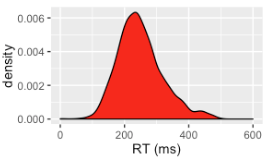

```{r setup2, include=FALSE}
knitr::opts_chunk$set(echo = TRUE, cache=TRUE)
```

# Inferential statistics: Introduction


**Preliminary code**

This code is needed to make other code below work:
```{r, message=F, error=F, warning=F}
library(ggplot2)
library(dplyr)

## loads transitions.txt from OSF project for Roberts, Torreira, & Levinson (2015) data
transitions <- read.delim(url("https://osf.io/4v8r7/download"))
```

<!-- TODO FUTURE: make solutions -->
<!-- **Note**: Most answers to questions/exercises not listed in text are in [Solutions](#infIntro-solns). -->

This chapter introduces core concepts from inferential statistics:

* Population versus sample

* The sample mean and its sampling distribution

* Confidence intervals

* The $t$ distribution

<!-- TODO future: write actual intro or at least make that list accurate -->

We assume you are familiar with:

* The `tapping` dataset, described [here](#tapdata)

* Basic probability

* Some data summarization and visualization techniques, ideally using `ggplot` and `tidyverse` packages such as `dplyr`.

These were described in earlier lectures that have yet to be turned into book chapters.

<!-- TODO future: update -->


## Population vs. sample

In an experiment, we are typically interested in **population** values of a parameter. For example, for the `tapping` dataset, we want to determine:

* $p_i$, $p_t$: the tapping rates when `syntax` = *intransitive* or *transitive*
    
* $p_i - p_t$: the difference between the rate of tapping in the two conditions.
    
However, we can only take a *sample* of size $n$ and make an inference about the population.  To estimate the two quantities above, we could use:

* The proportion of the $n$ observations which were tapped, when `syntax` = *intransitive* or *transitive*.
    
* The difference between these two observed proportions
    
This is much of what we do in statistical analysis: estimate quantities of interest, whose true values we will never actually know, based on a finite sample.

### Sample $\to$ population: high level

In inferential statistics, the general procedure is to use the sample to calculate *sample statistics*.  These sample statistics are used to estimate the *population values* of the parameters we actually care about. Ideally the sample statistics should be *unbiased estimators* of the population values, defined as:

* The more data we have, the closer the sample statistic gets to the population value

* In the limit of an infinite sample, the sample statistic **is** the population value.

For example:

* $\mu$ and $\sigma$ are often used to denote the population mean and standard deviation: the values we care about, but will never actually observe.  

* $\bar{x}$ and $s$ are often used to denote the sample statistics estimating $\mu$ and $\sigma$.  

* If you have $n=1000000000$, we expect $\bar{x}$ to be very, very close to $\mu$.

### Sampling distribution of the sample mean {#sdsm}

The most basic sample statistic is the *sample mean*, which is the average of $n$ observations:

\begin{equation*}
  \bar{x} = \frac{\sum^n_{i=0} x_i}{n}
\end{equation*}

To understand how the sample mean is related to the population mean, let's explore using simulations where we know the population value.

We can do this by:

1. Draw a sample of $n$ observations from a normal distribution with mean 0 and standard deviation $\sigma$ (using the `rnorm` command)

2. Calculate the sample mean using this sample, $\bar{x}$

3. Repeat (1)-(2) many times, and plot a histogram showing the distribution of sample mean values

(The code for this in [the .Rmd file](https://github.com/mlml/stats_book), but is hidden on this page.)

These plots show the histograms when the sample mean is calculated over 15 observations (left top: $n=15$) and over 50 observations (right top), varying the standard deviation $\sigma$ between 1 and 0.5.  The superimposed curve shows the normal distribution with $\mu=0$ and $\sigma =$ 1 or 0.5.
    
<!--- Code adapted from Johnson 2008 to recreate the figures ---> 

<div class="fold o">
```{r, include=FALSE}
set.seed(12) ## this is just inserted for pedagogical purposes to make sure you'll get the same results as seen here. 
central.limit <- function(n = 15, m = 1000, qq = FALSE, mn = 0, 
                         stdv = 1, xlow = -2, xhigh = 2) {
  means <- vector()
  
  for (i in 1:m) {
    data <- rnorm(n, mn, stdv)
    means[i] <- mean(data)
  }
  if (qq) {
    x = qqnorm(means)$x
    qqline(means)
    caption = paste("n=",n,", Correlation = ", signif(cor(means,x), 3))
    mtext(caption)
  } else {
    
    title <- paste("Sample size = ", n, " sigma = ", stdv)
    hist(means, xlim = c(xlow, xhigh), ylim = c(0, max(density(means)$y)), main = title, freq = F)
    plot(function(x) dnorm(x, mean=mean(means), sd=sd(means)), xlow, xhigh, add=T)
    plot(function(x) dnorm(x, mn, stdv), xlow, xhigh, add=T)
    caption <- paste("Standard error = ", signif(sd(means), 3))
    mtext(caption)
  }
}
```
</div>

```{r, echo=F, fig.width=6.5, fig.height=3.5, fig.align='center'}
par(mfrow=c(1,2))
central.limit(15)
central.limit(50)
```

---

```{r, echo=F, fig.width=6, fig.height=6, fig.align='center'}
par(mfrow=c(2,2))
central.limit(15)
central.limit(15, stdv=0.6)
central.limit(50)
central.limit(50, stdv=0.6)
```
        
(These figures replicate Fig. 2.4 from @johnson2008quantitative, using similar code to Johnson's.)

We see that the distribution of the sample mean gets narrower for larger $n$, and for smaller $\sigma$: the more observations in the sample, or the less variable the quantity is that we are measuring, the less variation there is in the mean value that we calculate based on the sample. 

> **Question**
>
> * Why is this, intuitively?
        

These simulations illustrate an important fact: **the sample mean is normally distributed** (for $n$ observations from a $N(\mu,\sigma)$ distribution), with mean $\mu$. It turns out that the standard deviation of the sample mean is $\frac{\sigma}{\sqrt{n}}$.

<!--- I think there was small index typo here: For an unbiased estimate of std dev we divide by (sample size - 1), however, we're starting at i = 0 to n so we have n + 1 samples. --->    

We can never observe $\sigma$ directly (this is why we're estimating it). However, we can make an unbiased estimator:
\begin{equation*}
  s = \sqrt{\frac{\sum^n_{i=1} (x_i - \mu)^2}{n - 1}}
\end{equation*}
and use it to compute the  *standard error* of the sample mean, defined as:
\begin{equation*}
SE = \frac{s}{\sqrt{n}}
\end{equation*}

The standard error is an unbiased estimator of $\frac{\sigma}{\sqrt{n}}$. (And so $\sqrt(n) SE$ is an unbiased estimator of $\sigma$.)  The standard error quantifies how much error there is, on average (across many samples) in our estimate of the population mean using $\bar{x}$.

Something to note here is that **error scales as the square root of the sample size**: the SE has a $\sqrt{n}$ in the denominator. This relationship will come up over and over in this course, and is the reason why collecting more data has diminishing returns. (Four times as much data is needed to halve the error, and so on.)

### Sampling from a non-normal distribution

What happens if we take the sample mean for observations from a non-normal distribution?  We can use the same simulation procedure, this time sampling from an `F distribution'---the one used for ANOVAs. (Again, see the [Rmd file](https://github.com/mlml/stats_book) for code.)

<!--- Adapted from Johnson 2008 --->
```{r, include=F}
set.seed(12) ## this is just inserted for pedagogical purposes to make sure you'll get the same results as seen here. 
central.limit <- function(n = 15, m = 1000, qq = FALSE, df1 = 6, 
                         df2 = 200, xlow = 0, xhigh = 2.5) {
  means <- vector()
  
  for (i in 1:m) {
    data <- rf(n, df1, df2)
    means[i] <- mean(data)
  }
  if (qq) {
    x = qqnorm(means)$x
    qqline(means)
    caption = paste("n=",n,", Correlation = ", signif(cor(means,x), 3))
    mtext(caption)
  } else {
    title <- paste("Sample size = ", n)
    hist(means, xlim = c(xlow, xhigh), main = title, freq = F)
    plot(function(x) dnorm(x, mean=mean(means), sd=sd(means)), xlow, xhigh, add=T)
    plot(function(x) df(x, df1, df2), xlow, xhigh, add=T)
    caption <- paste("Standard error = ", signif(sd(means), 3))
    mtext(caption)
  }
}
```

```{r, echo=F, fig.width=6.5, fig.height=3.5, fig.align='center'}
par(mfrow=c(1,2))
central.limit(10)
central.limit(50)
```

(These figures replicate Fig. 2.3 from @johnson2008quantitative, using similar code to Johnson's.)

As you can see, the distribution of the sample mean is normal, even though the actual random variable whose mean is being estimated is not normal. This illustrates the **central limit theorem**:^[More precisely, we are assuming the form of the CLT where the observations are independent and identically distributed. See e.g. [the Wikipedia page](https://en.wikipedia.org/wiki/Central_limit_theorem) for more details on variants of the CLT.] 

* For a large enough sample from a random variable with mean $\mu$ and standard deviation $\sigma$, the (sampling) distribution of the sample mean

    * is approximately normally distributed with mean $\mu$ and standard deviation of $\frac{\sigma}{\sqrt{n}}$
    
    * regardless of the population distribution

    <!-- * regardless of the population size -->


One example of this is our estimate of $p_t$ from $n$ samples for the tapping data. Even though the actual variable being measured (how many times does a participant tap?) is binomially distributed, our **estimate** of $p_t$ is normally distributed. 

The central limit theorem is a very important mathematical result which allows us to apply the same tools of inferential statistics to many different kinds of data.  Like gravity, it is so fundamental that it's easy to forget how much more complicated life would be without it.

### Exercises {-}

**Exercise 1**: 

Consider an imaginary dataset of measurements where participants say "hi" every time they hear a beep, and we measure the latency between the beep and the beginning of "hi".

There are 100 participants, each of whom is measured once.

The sample mean and standard deviation are:
    
* $m$ = 200 ms
    
* $s$ = 75 ms

<center>
{width=300}
</center>

* What is the standard error of the sample mean?

<!-- a. What's the standard error of the sample mean? -->

    + Hint: SE = $\frac{s}{\sqrt{n}}$
    
<!-- answer: 7.5 -->
    
* How many participants would we need in total to reduce the standard error by a factor of 2?

    a. 200 participants
    
    b. 400 participants
    
    c. 1000 participants

**Exercise 2**

This exercise uses the `transitions` dataset, described [here](#transitionsdata).

This dataset describes approximately 20,000 transitions between conversational turns in the Switchboard Corpus of telephone calls, and can be used to analyze what factors affect the duration of transitions.

Using the transitions dataset, and `summarise()` (from `dplyr`), create a dataframe with one column for each of:

* Mean transition duration (`dur`)
    
* Standard deviation of transition duration
    
* Number of observations
    
* Standard error of the mean transition duration
    
(Don't click unless you want to see the solution!)
<div class="fold s o">
```{r, message=FALSE}
## the transitions dataset was loaded at the beginning of this page

library(dplyr)
transitions %>% summarise(meanDur = mean(dur), n = n(), sd = sd(dur), se = sd/sqrt(n))
```
</div>


## Confidence intervals

An important additional measure of uncertainty in the sample mean, related to the standard error, is the *confidence interval*. Recall that the sample mean is normally distributed with mean $\mu$ and standard deviation of $\frac{\sigma}{\sqrt{n}}$ (the standard error of the sample mean, or *SE*).

In addition, 95% of the area in a normal distribution lies within 1.96 standard deviations of its mean:

```{r, echo=F, fig.align='center', fig.height=4, fig.width=4}
q_min <- -4
q_max <- 4

colorArea <- function(from, to, density, ..., col = col, dens=NULL){
  # adapted from https://stackoverflow.com/questions/27898931/how-to-shade-a-graph-using-curve-in-r
  y_seq <- seq(from, to, length.out = 500)
  d <- c(0, density(y_seq, ...), 0)
  polygon(c(from, y_seq, to), d, col = col, density = dens)
}

curve(dnorm(x), from = q_min, to = q_max, xlab = "", ylab = "", xaxt="n", yaxt="n")
axis(side = 1, at = c(-1.96, 0, 1.96))
colorArea(from = -1.96, to = 1.96, dnorm, col = "cadetblue3")
text(x = 0, y = 0.15, labels = "95%")
```

This motivates defining the 95\% *confidence interval* of the sample mean:

* (sample mean - 1.96$\times$SE, sample mean + 1.96$\times$SE)

(You'll often see "mean $\pm$ 2 standard errors", or "mean $\pm$ 2$\sigma$" used as "errorbars"; this is just because $1.96 \approx 2$.)


If we keep collecting samples, in the long run about 95% of these intervals would contain the true (population) mean within CI.

**Warning**: This does not mean that there is a 95% probability that the population mean lies within a given CI!  

This is a common misconception of what confidence intervals mean. 


#### Example {-}

Using the `transitions` dataset, let's look at the (sample) mean and 95\% confidence intervals of transition duration as a function of speaker gender:    

```{r, fig.align='center', fig.height=4, fig.width=4}
library(ggplot2)

transitions %>% group_by(sexB) %>%
  summarise(meanDur = mean(dur), se=sd(dur)/sqrt(n())) %>%
  ggplot(aes(sexB, meanDur)) +
    geom_point() +
    geom_errorbar(aes(ymin=meanDur-1.96*se, ymax=meanDur+1.96*se), width=0.1) +
    xlab("Speaker gender") +
    ylab("Mean transition duration (ms) +/- 95% CI")
```

**Q**: What does the errorbar here mean, exactly?

## $t$ distribution

We are usually interested in estimating not just means, but also $\sigma$'s. In particular, we're usually interested in $\mu/(\sigma/\sqrt{n})$: how far a mean is from zero, relative to the standard error of mean (a population value). For example, in the preceding plot, we are interested in how big the difference between male and female speakers is *relative to errorbar size*.  

We can't actually observe $\sigma$, and thus $\mu/(\sigma/\sqrt{n})$. Instead we have to use $s$, which is an unbiased estimator of $\sigma$:
<!-- --- meaning that its expected value is $\sigma$ for sufficiently large sample size ($n$): -->
\begin{equation*}
  s = \sqrt{\frac{\sum^n_{i = 1} \left(x_i - \mu\right)^2}{n - 1}}
\end{equation*}

While $\mu/(\sigma/\sqrt{n})$ is normally distributed, as the sample size becomes smaller, $s$ becomes more uncertain (note the $n-1$ in denominator), and our estimate of $\mu/(\sigma/\sqrt{n})$ is not normally distributed.  

To correct for this non-normal distribution, we use the *$t$ distribution*: this is the distribution of $m/(s/\sqrt{n})$, and is sensitive to sample size.  For a sample of $n$ observations, the estimated standard error of the mean ``follows a $t$ distribution with $n-1$ degrees of freedom'':

$$
SE \approx \frac{s}{\sqrt{n}} \sim t_{n-1}
$$

The $t$ distribution looks similar to a normal distribution, but has "fatter tails" for smaller sample sizes ($n < 30$):

```{r, echo=F, fig.align='center', fig.height=4, fig.width=5}
x <- seq(-4, 4, length.out = 1e3)

dfs <- c(30, 20, 5, 3)
mycols <- c("blue", "purple", "green", "red")
plot(dt(x, df=dfs[1]) ~ x, type='l', axes=F, xlab="", ylab="", lwd=1.5, col=mycols[1])
axis(1, at=seq(-4, 4, by=1), labels=seq(-4, 4, by=1))

for (i in 2:length(dfs))
  lines(dt(x, df=dfs[i]) ~ x, lwd=1.5, col=mycols[i])

lines(dnorm(x, mean=0, sd=1) ~ x, lwd=1.5, col="black")

legend(1.5, 0.35, legend=c("Z", rev(dfs)), col=c("black", rev(mycols)), lwd=2, bty="n", seg.len=0.5)
```
    
    
Once $n$ is larger than about 30, the $t$ distribution is very similar to a normal distribution, which is the 'Z' line.^[This fact will come in handy when we cover more complex regression models, where it can be difficult to calculate the correct degrees of freedom.]

### $t$-based confidence intervals  

In a normal distribution, 95% of the distribution is within 1.96 standard deviations from the mean.

This code shows how many standard errors from the mean the upper bound of the 95\% $t$-based CI is, as sample size increases: 
```{r}
alpha <- 0.05
n <- c(5, 15, 25, 50, 100, 500)

# two-sided t-distribution use 1 - alpha/2
1 - alpha/2
```

```{r}
cbind(n, qt(1 - alpha/2, n))
```
    
    
Because a $t$ distribution is a little wider than a normal distribution, 95\% confidence intervals based on the $t$ distribution are slightly larger than those based on a normal distribution.  Note that was $n$ gets large we approach 1.96, as seen with the normal distribution. This illustrates that for large enough samples (about $n>30$), the $t$ distribution is similar to the normal distribution.

When calculating errorbars (for plots, or to report in a paper), we usually should probably use $t$-based CI's, but it's easier to calculate CI's based on a normal distribution (also called `$z$-based'), and the difference is minimal as long as $n$ isn't too small.

#### Example: sample sizes in the `transitions` dataset {-}

For female (`F`) and male (`M`) speakers:
```{r}
    table(transitions$sexB)
```
    
suppose now we which to construct a plot showing the mean transition duration (ms) .

```{r, fig.align='center', fig.height=4, fig.width=4}
transitions %>% group_by(sexB) %>%
  summarise(meanDur = mean(dur), se=n()/sd(dur)) %>%
  ggplot(aes(sexB, meanDur)) +
    geom_point() + 
    xlab("Speaker sex") +
    ylab("Mean transition duration (ms) +/- 95% CI")
```

What critical value do we use if we wish to add 95% CIs in our plot using `geom_errorbar`? That is, how should we complete the following:

```{r, eval=F}
transitions %>% group_by(sexB) %>%
  summarise(meanDur = mean(dur), se=n()/sd(dur)) %>%
  ggplot(aes(sexB, meanDur)) +
    geom_point() + 
    geom_errorbar(aes(ymin=meanDur-_____*se, ymax=meanDur+_____*se), width=0.1) +
    xlab("Speaker sex") +
    ylab("Mean transition duration (ms) +/- 95% CI")
```

As discussed above, we should probably use 1.96; the same as in $Z$-based confidence intervals:

```{r, fig.align='center', fig.height=4, fig.width=4}
transitions %>% group_by(sexB) %>%
  summarise(meanDur = mean(dur), se=n()/sd(dur)) %>%
  ggplot(aes(sexB, meanDur)) +
    geom_point() + 
    geom_errorbar(aes(ymin=meanDur-1.96*se, ymax=meanDur+1.96*se), width=0.1) +
    xlab("Speaker sex") +
    ylab("Mean transition duration (ms) +/- 95% CI")
```    
    
However, for smaller samples the confidence intervals will be wider!


## Other reading

THe concepts in this chapter are covered to varying degrees of detail, with R examples, in many sources. Some for general audiences:

* @dalgaard2008introductory: Ch. 3

* @crawley2015statistics: Ch. 1, 4, 5

and some specialized for language scientists/psychologists, such as:

* @vasishth2016statistical

* @NavarroOnline: Ch. 10

* @vasishth2014introduction: Ch. 2


