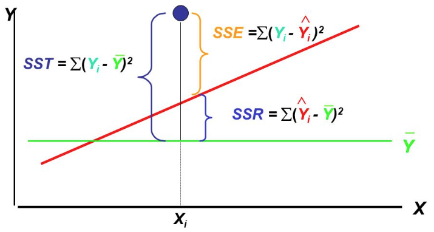

```{r setup3, include=FALSE}
knitr::opts_chunk$set(echo = TRUE, cache=TRUE)

library(languageR)
```


# Linear Regression

**Preliminary code**

This code is needed to make other code below work:
```{r, message=F, error=F, warning=F}
library(gridExtra) # for grid.arrange() to print plots side-by-side
require(languageR)
library(dplyr)
library(ggplot2)
library(arm)

## loads alternativesMcGillLing620.csv from OSF project for Wagner (2016) data
alt <- read.csv(url("https://osf.io/6qctp/download"))

## loads french_medial_vowel_devoicing.txt from OSF project for Torreira & Ernestus (2010) data
df <- read.delim(url("https://osf.io/uncd8/download"))
```
<!-- TODO later: just wrap this into actual text -->

<!-- Old links: -->
<!-- alt <- read.delim('datasets/alternatives.txt') -->
<!-- df <- read.delim('datasets/french_medial_vowel_devoicing.txt') -->


**Note**: Most answers to questions/exercises not listed in text are in [Solutions](#c2solns).

<!-- TODO FUTURE: move all answers to Solutions, since code folding doesn't happen  -->

This chapter introduces linear regression. The broad topics we will cover are:

1. Regression: general introduction

2. Simple linear regression

3. Multiple linear regression

4. Linear regression assumptions, model criticism, and interpretation

5. Model comparison

## Regression: General Introduction

First, what is "regression"?    @chatterjee2012regression define it as  "a conceptually simple method for investigating functional relationships among variables":

* The variable to be explained is called the *response*, often written $Y$
    
* The explanatory variables are called *predictors*, often written $X_1, X_2, \ldots$.
    
Here is an example of a study that uses regression analysis:

<center>

</center>

> **Questions**:
>
> * What is the response variable in this study?
>
> * What could be a predictor variable?

### Linear models

The relationship between variables is captured by a regression *model*:
\begin{equation*}
  Y = f(X_1, X_2, ..., X_p) + \epsilon
\end{equation*}

In this model, $Y$ is approximated by a function of the predictors, and the difference between the model and reality is called the *error* ($\epsilon$).

Throughout this book we will be dealing exclusively with *linear models* (including "generalized linear models", like logistic regression), where the model takes the form:

\begin{equation}
Y = \beta_0 + \beta_1 X_1 + \beta_2 X_2 + \cdots + \beta_p X_p + \epsilon
    (\#eq:linreg1)
\end{equation}

The $\beta$'s are called *regression coefficients*.

This turns out to be an extremely general class of model, which can be applied to a wide range of phenomena. Some important kinds of models that don't appear at first glance to fit Equation \@ref(eq:linreg1)  can be linearized into this form.

### Terminology

We will consider two broad types of regression in this book:

1. *linear regression*, where the response ($Y$) is a continuous variable.  An example would be modeling reaction time (`RTlexdec`) as a function of word frequency (`WrittenFrequency`) for [the `english` dataset](#engdata).

2. Later we will consider *logistic regression*, where the response ($Y$) is binary: 0 or 1.  An example would be modeling whether tapping occurs or not (`tapping`) as a function of `vowelDuration` and `speakingRate` in [the `tapping` dataset](#tapdata).

Regression with just one predictor is called *simple*, while regression with multiple predictors is called *multiple*. The two examples just given would be "simple linear regression" and "multiple logistic regression".

Predictors can be *continuous*, such as milk consumption, or *categorical*---also called "factors"---such as participant gender, or word type.

Certain special cases of linear models that are common go by names such as:

* *Analysis of variance*: continuous $Y$, categorical predictors. (Models variability between groups)

* *Analysis of covariance*: continuous $Y$, mix of categorical and continuous predictors.

We are not covering these cases in this book, but ANOVAs (and ANCOVAs) are widely used in language research, and you may have seen them before. ANOVAs can be usefully thought of as just a **special case** of regression, as discussed in @vasishth2011foundations, @levy2012probabilistic, @gelman2007data.  Once you understand linear regression well, understanding ANOVA analyses is relatively straightforward.


### Steps and assumptions of regression analysis

Regression analyses have five broad steps, as usefully discussed by @chatterjee2012regression:

1. Statement of the problem
    * Ex: Does milk consumption affect height gain?
    
2. Selection of potentially relevant variables
    * Ex: Height gain, daily milk consumption, age, and sex.
    
3. Data collection
    * Ex: data from an existing database.
    
4. Model specification & fitting
    * Ex: height gain = $\beta_0 + \beta_1 \cdot$ milk consumption $+ \beta_2 \cdot$ sex $+$ error
    
5. Model validation and criticism


It is important to remember that the **validity of a regression analysis depends on the assumptions of the data and model**.  

For example, if you are modeling data where $Y$ has a maximum value, fitting a simple linear regression (= a line) to this data doesn't make conceptual sense, a priori.  Here's an example using the `english` dataset:

```{r, fig.align='center', fig.height=4, fig.width=5}
library(languageR) ## makes the 'english' dataset available

ggplot(aes(x = Familiarity, y = CorrectLexdec), data = english) + geom_point(, alpha=0.1) + geom_smooth( method='lm')
```

Because `CorrectLexdec` has a maximum value of 30, fitting a line doesn't make sense---the predicted value when `Familiarity`=6 is above 30, but this is impossible given the definition of `CorrectLexdec`.
    
For now, we will not go into what the assumptions of linear regression are, and just assume that they are met.  After introducing simple and multiple linear regressions, we'll come back to this issue in Section \@ref(linear-regression-assumptions):

* What are the assumptions (of linear regression)?
    
* For each assumption, how do we determine whether it's valid?
    
* How much of a problem is it, and what can be done, if the assumption is not met?

Note that R almost never checks whether your data and model meet regression analysis assumptions, unlike other software (e.g. SPSS, sometimes).

## Simple Linear Regression

The simplest application of simple linear regression (SLR) is to model an association between two continuous variables. 

#### Example: `english` data, young participants only {-}

* $X$: `WrittenFrequency` (= predictor)

* $Y$: `RTlexdec` (= response)
    
```{r, fig.align='center', fig.height=3, fig.width=5, warning=FALSE}
young <- filter(english, AgeSubject=='young')

ggplot(young, aes(WrittenFrequency, RTlexdec)) +
  geom_point(size=0.5)
```

<!-- TODO later: when "previous chapters" put into book, add this back in: -->
<!-- In previous chapters, we have described this kind of association using a _correlation -->

One way to describe this kind of association which you may be familiar with is a _correlation_ coefficient which gives us two types of information about the relationship:

1. *direction*: $r = -0.434$ 
    * $\implies$ negative relationship 
    
2. *strength*: $r^2 = 0.189$ 
    * $\implies$ weak relationship ($0 \le r^2 \le 1$)

A simple linear regression gives a *line of best fit*:

```{r, fig.align='center', fig.height=3, fig.width=5}
ggplot(young, aes(WrittenFrequency, RTlexdec)) +
  geom_point(size=0.5) + 
  geom_smooth(method="lm", se=F)
```

which gives some information not captured by a correlation coefficient:

* Prediction of $Y$ for a given $X$
    
* Numerical description of relationship
    
Regression gives both types of information, and more.

### SLR: continuous predictor

The formula for simple linear regression, written for the $i^{\text{th}}$ observation, is:

\begin{equation}
  y_i = \underbrace{\beta_0}_{\text{intercept}} + \underbrace{\beta_1}_{\text{slope}} x_i + \epsilon_i
  (\#eq:linreg2)
\end{equation}

In this expression:

* $\beta_0, \beta_1$ are *coefficients*

* For the $i^{\text{th}}$ observation
    * $x_i$ is the value of the *predictor*

    * $y_i$ is the value of the *response*

    * $\epsilon_i$ is the value of the *error* (or *residual*)


This is our first linear model of a random variable ($Y$) as a function of a predictor variable ($X$).  The actual model, written not for individual observations, is written:

$$
  Y = \beta_0 + \beta_1 X + \epsilon
$$

That is, we use notation like $X$ for a variable, and notation like $x_5$ for actual values that it takes on.

For example, for [the `english` dataset](#engdata), with $Y$ = `RTlexdec` and  $X$ = `WrittenFrequency`:
    
```{r}
head(dplyr::select(english, WrittenFrequency, RTlexdec))
```

* $x_2$=`r as.numeric(english[2,'WrittenFrequency'])` (predictor value for second observation)

* $y_1$=`r as.numeric(english[1,'RTlexdec'])` (response value for first observation)

> **Question**
>
> * What is $y_5$?

### SLR: parameter estimation

To get a line of best fit, we want: $\beta_0$ and $\beta_1$, the *population values*.  Recall that we can't actually observe these (Sec.\@ref(sample-population)), so we obtain *sample estimates*, written $\hat{\beta}_0, \hat{\beta}_1$.

Once sample estimates are specified, Equation \@ref(eq:linreg2) gives *fitted values* for each observation, written $\hat{y}_i$:
$$
  \hat{y}_i = \hat{\beta}_0 + \hat{\beta}_1 x_i
$$

Note that there are no residuals in this equation---$\epsilon_i$ are again population values, which we can't observe. Our estimates of the residuals, given an estimated line of best it, are written $e_i$ (*error*):
$$
  e_i = y_i - \hat{y}_i
$$


This diagram shows the relationship between some of these quantities, for a single observation:

<center>
{width=600}
</center>

Our goal is to find coefficient values that minimize the difference between observed and expected values---the magnitudes of error ($|e_i|$), which are minimized by minimizing the squared errors ($e_i^2$).

We choose $\hat{\beta}_0$, $\hat{\beta}_1$ that minimize the sum of the $e_i^2$; these are called the *least-squares estimates*.

One useful property of the resulting regression line is that it always passes through the point (mean($X$), mean($Y$)).   A consequence is that SLR is easily thrown off by observations which are outliers in $X$ or $Y$ (why?).

#### Example {-}

Here is an example of fitting an SLR model in R, of reaction time vs. frequency for young speakers in the `english` dataset:

```{r}
young <- filter(english, AgeSubject == "young")
m <- lm(RTlexdec ~ WrittenFrequency, young)
```

The model output is:
```{r}
m
```

The interpretation of the two coefficients is:

* $\beta_0$: the predicted $Y$ value when $X = 0$
    ```{r}
    m$coefficients[1]
    ```
    
* $\beta_1$: predicted change in $Y$ for every unit change in $X$
    ```{r}
    m$coefficients[2]
    ```

The regression line is:
\begin{equation}
\hat{y}_i = \hat{\beta}_0 + \hat{\beta}_1 x_i
\end{equation}

In terms of the variables used in this example:
\begin{equation}
  \text{Predicted RTlexdec}_i = 6.625 - 0.037 \cdot \text{WrittenFrequency}_i
\end{equation}

> **Questions**:
>
> What is the predicted `RTlexdec` when:
>
> * `WrittenFrequency` = 5?
>    
> * `WrittenFrequency` = 10?

<!-- 6.44, 6.25 -->
    
### Hypothesis testing

The least-squared estimators are normally-distributed.  These are sample estimates, so we can also approximate the standard errors of the estimators:
\begin{equation*}
  SE(\hat{\beta}_0) \quad SE(\hat{\beta}_1)
\end{equation*}

and apply $t$-tests to test for significance and obtain confidence intervals (CI) for the coefficients.

In particular, we are testing the null hypotheses of no relationship:

* $H_0~:~\beta_1 = 0$

(and similarly for $\beta_0$).
    
We then apply a $t$-test, using test statistic:
\begin{align}
  t_1 &= \frac{\hat{\beta}_1}{SE(\hat{\beta}_1)} \\
  df &= n - 2 \nonumber
\end{align}
(where $n$ = number of observations).

The resulting $p$-value tells us how surprised are we to get a slope this far from zero ($\beta_1$) under $H_0$.  (With this high a standard error, given this much data.)

To see the results of these hypothesis tests in R:
```{r}
summary(lm(RTlexdec~WrittenFrequency, young))
```
The $t$-values and associated $p$-values are in the `Coefficients:` table, where the first row is for $\hat{\beta}_0$ and the second row is for $\hat{\beta}_1$.

> **Questions**:
>
> * Why does the column for the $p$-value say `Pr(>|t|)`?

Having the SEs of the coefficients also lets us compute 95\% confidence intervals for the least-squared estimators.  Going from the null hypothesis ($H_0$) above: if the 95\% CI of the slope ($\beta_1$) does not include 0, we can reject $H_0$ with $\alpha = 0.05$.

In R, you can get confidence intervals for a fitted model as follows:
```{r}
confint(lm(RTlexdec~WrittenFrequency, young))
```

Neither CI includes zero, consistent with the very low $p$-values in the model table above.

#### Example: small subset {-}

For the full dataset of `english` young speakers, it's a little silly to do hypothesis testing given how much data there is and the clarity of the pattern---the line of best fit has a tiny confidence interval.  Just for exposition, let's look at the line of best fit for a subset of just $n=100$ points:

```{r, fig.align='center', fig.height=3, fig.width=5}
set.seed(2903) # This makes the following "random" sampling step always give the same resuult
young_sample <- young %>% sample_n(100)

ggplot(young_sample, aes(WrittenFrequency, RTlexdec)) + 
  geom_point() + 
  geom_smooth(method="lm")
```

> **Questions**:
>
> * What does `geom_smooth(method="lm")` do?

In this plot, the shading around the line is the 95\% confidence interval.  "Can we reject $H_0$?" is equivalent to asking, "Can a line with 0 slope cross the shaded area through the range of $x$ (and going through (mean($X$), mean($Y$))?

### Quality of fit

Here is the model we have been discussing, plotted on top of the empirical data:

    
```{r, fig.align='center', fig.height=3, fig.width=5}
young <- filter(english, AgeSubject == "young")

ggplot(young, aes(WrittenFrequency, RTlexdec)) + 
  geom_point(size=0.25) + 
  geom_smooth(method="lm") + 
  theme_bw()
```

We often want a metric quantifying how well a model fits the data---the *goodness of fit*.

For simple linear regression, we can derive such a metric by first defining three quantities:

* *SST*: Total sum of squares

* <span style="color:blue">*SSR*</span>: Sum of squares due to regression

* <span style="color:orange">*SSE*</span>: Sum of squares due to error

<center>

</center>

(Source: slides from *Business Statistics: A First Course (Third edition)*)

<!-- TODO FUTURE: make own figure or get public domain figure -->

The fundamental equality is:
*SST* = <span style="color:blue">*SSR*</span> + <span style="color:orange">*SSE*</span>

Intuitively we want a measure of how much of SST is accounted for by SSR.  This is  $R^2$: the proportion of total variability in $Y$ accounted for by $X$:
\begin{equation}
  R^2 = \frac{SS_{\text{fit}}}{SS_{\text{total}}}
\end{equation}

$R^2$ always lies between 0 and 1, which can conceptually be thought of as:

* 0: none of the variance in $Y$ is accounted for by $X$
* 1: all of the variance `` ``

It turns out $R^2$ is also the square of (Pearson's) correlation, $r$.

#### Example {-}

Here is the SLR model fitted to a subset of 100 data points, repeated for convenience:

```{r}
set.seed(2903)

d <- english %>% filter(AgeSubject=="young") %>% sample_n(100)
summary(lm(RTlexdec~WrittenFrequency, d))
```

In the model table, note the values of the sample statistic under  `t value` and its significance in the `Pr(>|t|)` column in the `WrittenFrequency` row, as well as of the correlation statistic `Multiple R-squared`.

This is a hypothesis test for Pearson's $r$ for the same data, checking whether it is significantly different from 0:

```{r}
cor.test(d$WrittenFrequency, d$RTlexdec)
```

Note that $t$, $p$, and $r$ (the square root of `Multiple R-squared`) are exactly the same.  Thus, fitting a simple linear regression and conducting a correlation test give us two ways of finding the same information.

### Categorical predictor

Simple linear regression easily extends to the case of a binary $X$ (a *factor*).

#### Example {-}

* `english` data

* Predictor: `AgeSubject`
    
* Response: `RTlexdec`
    
Everything is the same as for the case where $X$ is continuous, except now we have:

* $x_i = 0$: if `AgeSubject == "old"`
    
* $x_i = 1$: if `AgeSubject == "young"`
    
The regression equation is exactly the same as Equation \@ref(eq:linreg2):

$$
  y_i = \beta_0 + \beta_1 x_i + \epsilon_i
$$

Only the interpretation of the coefficients differs:

* $\beta_0$: **mean** `RTlexdec` when `AgeSubject == "old"` (since $x_i = 0 \iff$ `AgeSubject == "old"`)
    
* $\beta_1$: **difference in mean** `RTlexdec` between `young` and `old`
    
Hypothesis tests, $p$-values, CIs, and goodness of fit work exactly the same as for a continuous predictor.    

#### Example {-}

Suppose we want to test whether the difference in group means is statistically significantly different from 0:

```{r, fig.align='center', fig.height=4, fig.width=3}
english %>% ggplot(aes(AgeSubject, RTlexdec)) +
  geom_boxplot() + 
  stat_summary(fun.y="mean", geom="point", color="blue", size=3) +
  theme_bw()
```

> **Question**: 
>
> * What goes in the blanks?

```{r, eval=F}
m1 <- lm(_____ ~ _____, english)
summary(m1)
```


<!-- ```{r} -->
<!-- m1 <- lm(RTlexdec ~ AgeSubject, english) -->
<!-- summary(m1) -->
<!-- ``` -->

Note the $t$ and $p$-values for `AgeSubjectyoung`, we'll need them in a second.

### SLR with a binary categorical predictor vs. two-sample $t$-test

Conceptually, we just did the same thing as a two-sample $t$-test---tested the difference between two groups in the value of a continuous variable. Let's see what the equivalent $t$-test gives us:

```{r}
t.test(RTlexdec ~ AgeSubject, english, var.equal=T)
```
(The `var.equal` option forces the $t$-test to assume equal variances in both groups, which is one assumption of linear regression.)

You should find that both tests give identical $t$ and $p$-values.  So, a $t$-test can be thought of as a special case of simple linear regression.

#### Bonus: Linear vs. smooth regression lines

We have forced an SLR fit in the plots above using the `method='lm'` flag, but by default `geom_smooth` uses a *nonparametric smoother* (such as LOESS, the `geom_smooth` default for small samples):

```{r, fig.align='center', fig.height=3, fig.width=7, message=FALSE}
young <- filter(english, AgeSubject=='young')

set.seed(2903)
young_sample <- young %>% sample_n(100)

day7_plt1 <- ggplot(young_sample, aes(WrittenFrequency, RTlexdec)) + 
  geom_point(size=0.5) +
  geom_smooth(method="lm") + 
  ggtitle("Linear regression line and 95% CI")

day7_plt2 <- ggplot(young_sample, aes(WrittenFrequency, RTlexdec)) + 
  geom_point(size=0.5) +
  geom_smooth() + 
  ggtitle("Smooth regression line and 95% CI")

grid.arrange(day7_plt1, day7_plt2, ncol = 2)
```


Note the differences in the two plots:

* Linear/nonlinear

* CI widths related to distance from mean, versus **amount of data nearby**

(Hence "**L**ocal" in LOESS.)


## Multiple Linear Regression

In *multiple linear regression*, we use a linear model to predict a continuous response with $p$ predictors ($p>1$):

$$
  Y = \beta_0 + \beta_1 X_i + \beta_2 X_2 + \cdots + \beta_p X_p + \epsilon
$$

Each predictor $X_i$ can be continuous or categorical.

#### Example: RT ~ frequency + age {- #ex1}

For [the `english` dataset](#engdata), let's model reaction time as a function of word frequency and participant age.  Recall that in addition to the word frequency effect, older speakers react more slowly than younger speakers:


```{r, fig.align='center', fig.height=4, fig.width=4}
english %>% ggplot(aes(AgeSubject, RTlexdec)) + 
  geom_boxplot() + 
  stat_summary(fun.y="mean", geom="point", color="blue", size=3) +
  theme_bw()
```

The response and predictors are:

* $Y$: `RTlexdec`
    
* $X_1$: `WrittenFrequency` (continuous)
    
* $X_2$: `AgeSubject` (categorical) (0: `old`, 1: `young`)

Because $p=2$, the regression equation for observation $i$ is    
$$
  y_i = \beta_0 + \beta_1 x_{i1} + \beta_2 x_{i2} + \epsilon_i
$$
where $x_{ij}$ means the value of the $j^{\text{th}}$ predictor for the $i^{\text{th}}$ observation.

To fit this model in R:

```{r}
m2 <- lm(RTlexdec~WrittenFrequency+AgeSubject, english)
```

Summary of the model:
```{r}
summary(m2)
```

This model tells us that the least-squares solution for the regression line is:
$$
  \texttt{RTlexdec} = \underbrace{6.846}_{\beta_0} + \underbrace{(- 0.037)}_{\beta_1} \cdot \texttt{WrittenFrequency} + \underbrace{(- 0.221)}_{\beta_2} \cdot \texttt{AgeSubject} + \text{error}
$$

> **Questions**: 
>
> * What RT does the model predict for an observation with `WrittenFrequency`=5 and `AgeSubject`='old'?

<div class="fold s o">
```{r}
6.846 + (-0.037 * 5) + (-0.221 * 0)
```
</div>

Note that in this MLR model, the interpretation of each coefficient is:

* $\beta_0$: predicted value when all predictors = 0
    
* $\beta_1$, $\beta_2$: change in a predictor **when others are held constant**

For example, the difference between old and young speakers in RT is 0.221, when word frequency is held constant.

### Goodness of fit metrics

With $R^2$ defined as for simple linear regression, in terms of sums of squares, the exact same measure works to quantify goodness of fit of a multiple linear regression:
$$
  R^2 = \frac{SS_{\text{fit}}}{SS_{\text{total}}}
$$
sometimes called *multiple $R^2$*.

An alternative to $R^2$ when there's more than one predictor (MLR) is *adjusted $R^2$*, defined as:
$$
  R^2 = 1 - \frac{SS_{\text{fit}}/(n - p - 1)}{ SS_{\text{total}}/(n - 1) }
$$
where $p$ is the number of predictors and $n$ is the number of observations.

In this expression, the sum-of-squares term can be thought of as a ratio comparing the amount of variance explained by two models: the "full" model (the one with $p$ predictors) and the "baseline" model (the one with just the intercept).  Each model's sum of squares is scaled by its degrees of freedom; intuitively, this gives a measure of how much variance is explained **given the number of predictors**. (We expect that if you throw more predictors in a model, more variance can be explained, just by chance.)

The adjusted $R^2$ measure only increases if the $p$ additional predictors improve the model more than would be expected by chance.  

* **Pro**: Adjusted $R^2$ is more appropriate as a metric for comparing different possible model---unlike "multiple $R^2$", adjusted $R^2$ doesn't automatically increase whenever new predictors are added.  

* **Con**: Multiple $R^2$ is no longer interpretable as "fraction of the variation accounted for by the model".

R reports both adjusted and non-adjusted versions, as seen in the model summary above.

### Interactions and Factors

The models we have considered so far assume that each predictor affects the response **independently**.  For example, in [the example above](#c2ex1) (`RT ~ frequency + age`), our model assumes that the slope of the frequency effect on RT is the same for old speakers as for young speakers.  This looks like it might be approximately true:
```{r, fig.align='center', fig.height=3, fig.width=5}
ggplot(english, aes(WrittenFrequency, RTlexdec)) + 
  geom_point(size=0.5) + 
  geom_smooth(method="lm", se=F) +
  facet_wrap(~AgeSubject)
```
in that there seems to be a similarly negative slope for both groups.  That is, a model of this form seems approximately correct:
$$
  Y = \beta_0 + \beta_1 X_1 + \beta_2 X_2 + \epsilon
$$
($\epsilon$ = error).

Here is a (fake) example where the independence assumption is definitely not true:

* $Y$: Job performance (continuous)
    
* $X1$: Training (categorical)
    
* $X2$: Autonomy (categorical)
    
```{r, echo=F, fig.align='center', fig.height=3, fig.width=6}
jp <- c(2.6, 2.4, 3.4, 4.5)
training <- c("Low training", "Low training", "High training", "High training")
autonomy <- c("Low autonomy", "High autonomy", "Low autonomy", "High autonomy")

fake.df <- data.frame(training, autonomy, jp)
fake.df$training <- relevel(fake.df$training, ref = "Low training")
fake.df$autonomy <- relevel(fake.df$autonomy, ref = "Low autonomy")

ggplot(fake.df, aes(x = training, y = jp, shape = autonomy, linetype = autonomy, group = autonomy)) + 
  geom_point() +
  geom_line() +
  ylab("Job performance") + 
  xlab("") +
  guides(shape=guide_legend(title = NULL),
         linetype=guide_legend(title = NULL)) + 
  theme_bw() 
```

The effect of training on job performance is larger for high-autonomy participants. In this case, we say there is an *interaction*  between training and autonomy: the value of one predictor modulates the effect of the other.  This interaction is modeled by adding an extra term to the regression equation:
$$
  Y = \beta_0 + \beta_1 X_1 + \beta_2 X_2 + \beta_3 X_1 X_2 + \epsilon
$$
which is the *product* of the two terms.  Note that
$$
\beta_2 X_2 + \beta_3 X_1 X_2 = (\beta_2 + \beta_3 X_1) X_2
$$
so the interaction coefficient $\beta_3$ modulates the slope of $X_2$: depending on the value of $X_1$, $X_2$ has a different effect on $Y$.

#### Example {-}

Returning to [the example above](#c2ex1), suppose we'd like to know how much the slope of `WrittenFrequency` does actually differ between old and young speakers, and whether the difference is statistically significant ($\alpha = 0.05$). 

```{r, fig.align='center', fig.height=3, fig.width=5}
english %>% ggplot(aes(WrittenFrequency, RTnaming)) + 
  geom_point(size=0.5) + 
  geom_smooth(aes(group=AgeSubject, color=AgeSubject), method="lm", se=F)
```

  `X1:X2` means "interaction between `X1` and `X2`, and the notation used in R for interactions is `X1*X2`, which expands automatically to `X1 + X2 + X1:X2`.  (The non-interaction terms are sometimes called *main effects*.)  Note that in R these are equivalent:

```
lm(RTnaming ~ WrittenFrequency * AgeSubject, english)
lm(RTnaming ~ WrittenFrequency + AgeSubject + WrittenFrequency:AgeSubject, english)
```

To fit a model including an interaction between frequency and age:

```{r}
m3 <- lm(RTnaming ~ WrittenFrequency * AgeSubject, english)
```

In the summary of this model, of interest is the `WrittenFrequency:AgeSubjectyoung` row, which is the interaction effect:
```{r}
summary(m3)
```

We see that there is indeed a significant interaction between `WrittenFrequency` and `AgeSubject`.

> **Questions**:
>
> * What does it mean that this coefficient is positive? 
>
> * For this regression model including an interaction, what is the model for an observation with `WrittenFrequency=3` and `AgeSubject=='old'`? [Solution](#c2sol1).
>
> * What is the model for an observation with `WrittenFrequency=3` and `AgeSubject=='young'`? [Solution](#c2sol2).

### Plotting interactions

In general, making plots is indispensable for interpreting interactions.  It is possible, with practice, to interpret interactions from the regression table, but examining a good plot is usually also necessary and much faster.

In later chapters we will cover how to actually visualize model predictions---exactly what the model predicts for different combinations of predictor values. You can usually get a reasonable approximation of this by making the relevant empirical plot, such as:

```{r, fig.align='center', fig.height=3, fig.width=5}
english %>% ggplot(aes(WrittenFrequency, RTnaming)) +
  geom_smooth(method='lm', aes(color=AgeSubject)) +
  xlab('Log written frequency') +
  ylab('Naming RT in log(s)')
```

It is often better to use empirical plots to visualize interactions---even though, strictly speaking, you are not plotting the model's predictions.

* **Pros**: Empirical plots are more intuitive, and if you have a robust effect it should probably show up in an empirical plot.

* **Cons**: Empirical plots don't show actual model predictions, and in particular don't control for the effects of other predictors.

### Categorical factors with more than two levels

We are often interested in categorical predictors with more than two levels.  For example, for the [Dutch `regularity` data](#dregdata), we might wonder whether the size of a verb's morphological family size is affected by what auxiliary it takes in the past tense.
```{r, fig.align='center', fig.height=4, fig.width=5}
regularity %>% ggplot(aes(Auxiliary, FamilySize)) + 
  geom_boxplot() + 
  stat_summary(fun.y="mean", geom="point", color="blue", size=3)
```
The relevant variable, `Auxiliary`, has three levels.  Let's see how this kind of variable is dealt with in a regression model.

#### Exercise {-}

1. Fit a regression model predicting `FamilySize` from `Auxiliary`.

2. What does the intercept ($\beta_0$) represent?

3. What do the two coefficients for `Auxiliary` ($\beta_1$, $\beta_2$) represent?

Hint: Compare $\beta$ coefficients with group means, which you can check using `summarise()` from `dplyr`.

Solution to (1):
<div class="fold s o">
```{r}
m4 <- lm(FamilySize ~ Auxiliary, regularity)
summary(m4)
```
</div>

Solution to (2): The value of `FamilySize` when `Auxiliary`="hebben".


Solution to (3): The predicted difference in `FamilySize` between `Auxiliary`="zijn" and "hebben", and between `Auxiliary`="zijnheb" and "hebben".


### Releveling Factors

It's often useful for conceptual understanding to change the ordering of a factor's levels. For the `regularity` example, we could make `zijn` the base level of the `Auxiliary` factor:
```{r}
regularity$Auxiliary <-relevel(regularity$Auxiliary, "zijn")

m5 <- lm(FamilySize ~ Auxiliary, regularity)
summary(m5)
```

> **Questions**:
>
> * What is the interpretation of the intercept and the two `Auxiliary` coefficients in this new model?

## Linear Regression Assumptions

Up to now, we have discussed regression models without worrying about the assumptions that are made by linear regression, about your data and the model.  We will cover six main assumptions, the first four have to do with the form of the model and errors:

1. Linearity

2. Independence of errors

3. Normality of errors

4. Constancy of errors (*homoscediasticity*)

followed by two assumptions about the predictors and observations:

5. Linear independence of predictors

6. Observations have roughly equal influence on the model

We'll discuss each in turn.


Our presentation of regression assumptions and diagnostics is indebted to Chapters 4, 6 and 9 of @chatterjee2012regression, where you can find more detail.

### Visual Methods

Visualization is crucial for checking model assumptions, and for data analysis in general.  A famous example illustrating this is *Anscombe's quartet*: a set of four small datasets of $(x,y)$ pairs with:

* The same mean and variance for $x$ 
    
* The same mean and variance for $y$
    
* A correlation($x$, $y$) = 0.816
    
* The same regression line ($y = 3 + 0.5\cdot x$)
    
in each case---and yet the datasets show qualitatively different patterns, as can be seen by plotting $y$ against $x$:
<center>    
    
</center>

(Source: unknown, but definitely taken from somewhere)

<!-- TODO FUTURE: find or fix -->

With more than one predictor it becomes  difficult to check regression assumptions by just plotting the data, and visual methods such as *residual plots* (presented below) are crucial.

### Assumption 1: Linearity

The first assumption of a linear regression model is that the relationship between the response ($Y$) and predictors ($X_i$) is... linear.

While obvious, this assumption is very important: if it is violated, the model's predictions can be in serious error.

The linearity assumption can be partially checked by making a scatterplot of $Y$ as a function of each predictor $X_i$.  It is hard to exhaustively check linearity for MLR, because nonlinearity might only become apparent when $Y$ is plotted as a function of several predictors.

#### Example {-}

Consider relative pitch, intensity, and duration in [the `alternatives` dataset](#altdata).

We can make *pairwise plots* of these variables using the `pairscor.fnc()` function `languageR`, to see if any of these variables might be a function of the other two.
    
```{r, fig.align='center', fig.height=5, fig.width=5}
pairscor.fnc(with(alt, cbind(rpitch, rintensity, rduration)))
```

> **Questions**: 
>
> * Is this the case?

Let's examine the relationship between realtive duration and relative intensity more closely:
```{r, fig.align='center', fig.height=3, fig.width=5}
alt %>% ggplot(aes(rduration, rintensity)) + 
  geom_point()
```

We can try to fit a line to this data, but if we compare to using a nonlinear smoother, it seems clear that the relationship is not linear:
```{r, fig.align='center', fig.height=3, fig.width=5, message=FALSE}
alt %>% ggplot(aes(rduration, rintensity)) + 
  geom_point() + geom_smooth(col='red', se=F) +
  geom_smooth(method="lm", col="blue", se=F)
```

In particular, it looks like there is a quadratic trend.  This means that we can in fact fit a linear regression, we just need to include coefficients for both `rduration` and its square, like so:

```{r}
mq <- lm(rintensity ~ rduration + I(rduration^2), alt)
summary(mq)
```

We will cover more nonlinear functions of predictors in [a later chapter](#nonlinear-effects). The important point here is that a model with just `rduration` as a predictor would have violated the linearity assumption, but a model with both `rduration` and `rduration^2` as predictors doesn't (arguably).

### Assumption 2: Independence of Errors {#c2ioe}

All regression equations we have considered contain an *error* or *residual* term: $\epsilon_i$ for the $i^{\text{th}}$ observation.  A crucial assumption is that these $\epsilon_i$ are **independent**: knowing the error for one observation shouldn't tell you anything about the error for another observation.

Unfortunately, violations of this assumption are endemic in realistic data.  The simplest example is in time series, or longitudinal data---such as pitch measurements taken every 10 msec in a speech signal.

> **Questions**:
>
> * Can you think of why this might be the case?

In linguistics and psycholinguistics, violations of the independence assuption are common because most datasets include multiple observations per participant or per item (or per word, etc.).  Crucially, violations of the independence assumption are often *anti-conservative*: CIs will be too narrow and $p$-values too small if the lack of independence of errors is not taken into account by the model.

Some solutions to these issues:

* [**Paired-t-tests**](#paired-t-test), where applicable (binary predictor; two measures per participant)
    
* **Mixed-effects regression** (more general solution, major focus later this term)
    
Until we cover mixed-effects regression, we will be getting around the fact that the independence-of-errors assumption usually doesn't hold for linguistic data, in one of two ways:

1. Selectively using datasets where this assumption **does** hold, such as `regularity`.

2. Analyzing datasets where this assumption does **not** hold, such as `tapping` or `english`, using analysis methods that do assume indepedence of errors (such as linear regression), with the understanding that our regression models are probably giving results that are "wrong" in some sense.

### Assumption 3: Normality of Errors

The next major assumption is that the errors $\epsilon_i$ are normally distributed, with mean 0 and a fixed variance.  This assumption is impossible to check directly, because we never observe the true *errors* $\epsilon_i$, only the *residuals* $e_i$.  The residuals are no longer normally distributed (even if the errors are), because some observations will be more influential than others in determining the fitted responses $\hat{y}_i$ when fitting the least-squares estimates of the regression coefficients. 

#### Example {-}

```{r, fig.align='center', fig.height=3, fig.width=7}
young <- filter(english, AgeSubject=='young')

set.seed(2903)
young_sample <- young %>% sample_n(100)

ggplot(young_sample, aes(WrittenFrequency, RTlexdec)) + 
  geom_point(size=0.5) +
  geom_smooth(method="lm") + 
  ggtitle("Linear regression line and 95% CI")

```

The width of the confidence interval increases for points further from (average of `WrittenFrequency`, average of `RTlexdec`), because these points are more influential, causing the variance of the residuals to increase---thus, the variance is not constant.

In order to correct for non-normality, the residuals are transformed in a way which accounts for the different influence of different observations (see e.g. @chatterjee2012regression 4.3), to *studentized* or *standardized residuals*.^[The studentized and standardized residuals, or "externally studentized" and "internally studentized" residuals (in @chatterjee2012regression), differ slightly in how they estimate the error variance:  a leave-one-out estimate versus an estimate using all observations. This difference shouldn't matter much except when certain observations are highly influential or in small datasets.]  (In R, by applying `rstudent` or `rstandard` to a fitted model.)  

In general, we **check assumptions about errors by examining the distribution of  standardized residuals**.  This is because **if** the normality of errors assumption holds, **then** the standardized residuals will be normally distributed with mean 0 and fixed variance.  So if they are not, we know the normality of errors assumption does not hold.  (If they are, it's not a guarantee that the normality of errors assumption holds, but we hope for the best.)

#### Example {- #c2ex2}


<!-- TODO future: add halfrhyme to dataset appendix chapter and cross-ref -->

This is data from an experiment we have not discussed, called `halfrhyme`.  Let's  abstract away from what the variables actually mean, and just think of them as $Y$ and $X$:
```{r, warning=FALSE}
data <- read.delim("datasets/halfrhyme.txt")
ggplot(aes(x=cohortSize, y=rhymeRating),  data=filter(data, conditionLabel=='bad')) +
  geom_point() + geom_smooth(method='lm') + 
  geom_jitter() + xlab("X") + ylab("Y")
```

The distribution of the standarized residuals for the regression of $Y$ as a function of $X$ is:

```{r, message=FALSE}
data.sub <- filter(data, conditionLabel=='bad' & !is.na(cohortSize))
mod <- lm(rhymeRating ~ cohortSize, data=data.sub)
data.sub$resid <- rstandard(mod)
ggplot(aes(x=resid), data=data.sub) + geom_histogram() + xlab("Residual (standardized)")
```
 
> **Questions**:
> 
> * Why do the residuals have this distribution?

This example illustrates probably the most common source of non-normal residuals: a highly non-normal distirbution of the predictor or response.

#### Effect and Solution

Non-normality of residuals is a pretty common violation of regression assumptions.  How much does it actually matter?   @gelman2007data (p. 46) argue "not much", at least in terms of the least-squares estimates of the regression line (i.e., the regression coefficient values), which is often what you are interested in.  

However, non-normality of residuals, especially when severe, can signal other issues with the data, such as the presence of outliers, or the predictor or response being on the same scale. (Example: using non-log-transformed word frequency as a predictor.)  Non-normality of residuals can often be dealt with by **transforming the predictor or response** to have a more normal distribution (see Sec. \@ref(transforming-to-normality)). 

Non-normality of residuals can also signal other errors, such as an important predictor missing.

#### Exercise {-}

1. Using the `english` data, plot `RTlexdec` as a function of `WrittenFrequency`, and add a linear regression line.

<div class="fold s o">
```{r, fig.align='center', fig.height=4, fig.width=5}
ggplot(english, aes(x = WrittenFrequency, y = RTlexdec)) + 
  geom_point(size = 0.5) + 
  geom_smooth(method = "lm", se=F)
```
</div>

2. Do you think the residuals of this model are normally distributed? Why/why not?

3. Now plot a histogram of the standardized residuals of the mode. Does the plot confirm your first impressions?

```{r, eval=F}
m8 <- lm(RTlexdec ~ _______, english)
m8.resid.std <- rstandard(______)
hist(______, breaks = 50)
```

<div class="fold s o">
```{r, fig.align='center', fig.height=3, fig.width=8}
day9_plt1 <- ggplot(english, aes(WrittenFrequency, RTlexdec)) + 
  geom_point(size=0.5) + 
  geom_smooth(method="lm", se=F)

m8 <- lm(RTlexdec~WrittenFrequency, english)
m8.resid.std <- rstandard(m8)

day9_plt2 <- ggplot(data.frame(m8.resid.std), aes(x = m8.resid.std)) + 
  geom_histogram(bins = 50)

grid.arrange(day9_plt2, day9_plt1, ncol = 2)
```
</div>

4. Now add `AgeSubject` to the model, and plot a histogram of its standardized residuals. What has changed? Why so?

<div class="fold s o">
```{r, echo=F, fig.align='center', fig.height=3, fig.width=8}
day9_plt3 <- ggplot(english, aes(WrittenFrequency, RTlexdec, color = AgeSubject)) + 
  geom_point(size=0.5) + 
  geom_smooth(method="lm", se=F)

m9 <- lm(RTlexdec ~ WrittenFrequency + AgeSubject, english)
m9.resid.std <- rstandard(m9)
day9_plt4 <- ggplot(data.frame(m9.resid.std), aes(x = m9.resid.std)) + 
  geom_histogram(bins = 50)

grid.arrange(day9_plt4, day9_plt3, ncol = 2)
```
</div>

This exercise shows one reason that examining the residual distribution is useful.  If we didn't already know what the missing predictor was, the non-normality of the residual distribution gives us a way to look for an explanatory variable.  (Look at observations in each mode of the distribution, see what they have in common.)

### Assumtion 4: Constancy of Variance

*Homoscedasticity* is one of the trickier regression assumptions to think about: the assumption that $\epsilon_i$ is normally distributed with the same variance, across all values of the predictors.  

For example, in our example modeling reaction time as a function of subject age and word frequency, it is assumed that the amount of variability in reaction time is similar for old speakers and young speakers, for high frequency words and young speakers, for observations of high frequency words for old speakers, and so on. 

In [the example above](#c2ex2) from the `halfrhyme` data, the homoscedasticity assumption is violated: lower values of $\hat{y}$ show higher variance in the residuals.

In this case, the model shows *heteroscedasticity*.
    
**If** homoscedasticity holds, **then** the standardized residuals are uncorrelated with the predictor values, and with the fitted values, and there should be a constant spread (variance) of residual values (y-axis) for each fitted or predictor value (x-axis). Thus, it is common to plot (standardized) residuals  versus fitted values and versus predictors. (The fitted values-residuals plot is one of the diagnostic plots that shows up if you `plot(mod)` in R, where `mod` is a fitted model.)  The desired pattern is a flat line, with the same variance for different x-axis values.

For the `halfrhyme` data, the fitted value-residuals plot looks like:

```{r, message=FALSE}
data.sub <- filter(data, conditionLabel=='bad' & !is.na(cohortSize))
mod <- lm(rhymeRating ~ cohortSize, data=data.sub)
data.sub$resid <- rstandard(mod)
data.sub$fitted <- fitted(mod)
ggplot(aes(x=fitted, y=resid), data=data.sub) + geom_point() + geom_smooth() + xlab("Fitted values") + ylab("Standardized residuals")
```    

There is greater variance for higher fitted values, indicating heteroscedacticity.

#### Effect and Solution

In general, estimates of least-squares coefficients in the presence of heteroscedasticity are unbiased, but standard errors will be under- or over-estimated.  This means that confidence intervals will be too narrow/wide and $p$-values too low/high.

Heteroscedasticity is endemic in some types of data, such as from lexical statistics (@baayen2008analyzing, p. 35).  In other types of data, such as economic data, heteroscedasticity is so common that dealing with it is a primary concern in statistical analysis.  Heteroscedasticity is discussed less frequently than other regression assumptions for linguistic data, but it is unclear whether this is because heteroscedasticity is less common than in other types of data or just has not been focused on by language scientists.

<!-- I don't know (MS) whether heteroscedasticity is actually less common in linguistic data than in other kinds of data, or whether it's just not something that language scientists have focused on.  Certainly it is discussed less frequently than other regression assumptions. -->

<!-- Morgan: Do you want to leave this part (^^^) in here ??? -->
    
One can often correct for heteroscedasticity by using various transformations of the response and predictors to get better estimates (@chatterjee2012regression, Ch. 4).  For example, in the `halfrhyme` example, it turns out that a stronger effect of $X$ on $Y$ (lower $p$-value) can be detected once variance is stabilized.

### Interim summary

* **Linearity**

    * Serious violation if not met.
    
    * Fit data with non-linear trend (e.g. quadratic)
    
    * Transformed predictor/response to normality (e.g. log-transform)
    
* **Independence of error**:

    * In linguistic data: use mixed-effects regression^[Or another method that accounts for non-independence of errors, such as repeated measures ANOVA.]
    
* **Normality of errors**:

    * Not too serious violation if not met, but may signal issues with model/data
    
    * Remove outliers; transform $X$/$Y$ to normality
    
* **Constancy of variance**:

    * Not commonly checked in linguistic data
    
    * Leads to uncertain regression estimates
    
    * Transform predictor/response to normality


### Transforming to Normality

Normality of the distribution of the response and predictors ($Y$ and $X_i$) is **not** an assumption of linear regression.  This is a common misconception, perhaps because normality is an assumption of other basic statistical inference tools, such as $t$-tests.  

However, there is still good reason to be circumspect if $Y$ or $X_i$ are not normally distributed, because this can often lead to violations of regression assumptions. This is why it is recommended to transform the predictors and response to normality to fix violations of the linearity, normality of errors, and homoscedasticity assumptions.   Because non-normality of $Y$ or $X_i$ can easily lead to violations of regression assumptions, it is sometimes recommended to transform them to normality just to be safe. This makes it less likely that a regression assumption will be violated, but also changes the interpretation of the transformed variable, which may make it harder to interpret the model's results.

For linguistic data, *logarithmic* transformations are often useful when working with skewed distributions, because many kinds of linguistic data are roughly *log-normally* distributed, meaning the log-transformed variable is normally distributed. Some examples:

* Lexical statistics (e.g. lexical frequency, probability)
    
* Reaction times (e.g. naming latencies)
    
* Duration measures in phonetics (syllable, phrase durations)

Other transformations besides log are also used: reaction times are sometimes inverse or inverse-log-transformed (1/RT, log(1/RT)), and durations are sometimes square-root-transformed.

#### Example: Distribution of raw vs. log lexical frequency {-}

```{r, fig.height=3, fig.width=8, fig.align='center', message=F}
english$WrittenFrequency_raw <- exp(english$WrittenFrequency)
english$WrittenFrequency_log <- english$WrittenFrequency

day10_plt1 <- ggplot(english, aes(x = WrittenFrequency_raw)) + 
  geom_histogram() + 
  xlab("Raw written Frequency")
day10_plt2 <- ggplot(english, aes(x = WrittenFrequency_log)) + 
  geom_histogram() + 
  xlab("Log written Frequency")

grid.arrange(day10_plt1, day10_plt2, ncol = 2)
```

R note: ggplot functions such as `scale_x_log10()` can be used to plot data in its raw units on a log scale, which is often more interpretable. Ex:
```{r message=F}
 ggplot(english, aes(x = WrittenFrequency_raw)) + geom_histogram() + scale_x_log10() +
  xlab("Written Frequency (per million words)") + annotation_logticks(sides='b')
```

#### Exercise {- #c2ex3}

Consider the raw and log frequency measures for the `english` dataset, for young speakers:
```{r}
english$WrittenFrequency_raw <- exp(english$WrittenFrequency)
english$WrittenFrequency_log <- english$WrittenFrequency

young <- filter(english, AgeSubject=="young")
```


1. Plot `RTnaming` as a function of raw written frequency, and of log written frequency, with a green  LOESS (smooth) regression line added to each plot (using  `geom_smooth(color='green')`).

<div class="fold s o">
```{r, message=FALSE, fig.align='center', fig.height=3, fig.width=8}

plt5 <- ggplot(young, aes(WrittenFrequency_raw, RTnaming)) + 
  geom_point(size=0.5) + 
  xlab('Raw written Frequency') + 
  geom_smooth(se=F, color="green")

plt6 <- ggplot(young, aes(WrittenFrequency_log, RTnaming)) + 
  geom_point(size=0.5) + 
  xlab('Log written Frequency') + 
  geom_smooth(se=F, color="green")
grid.arrange(plt5, plt6, ncol = 2)
```
</div>

2. Is the linearity assumption met in each case?

<!-- The point here is that the linearity assumption isn't met when $Y$ is untransformed word frequency, or at least it's unclear, whereas the assumption looks safe for log-transformed $Y$. -->

### Assumption 5: Linear Independence of Predictors

A crucial assumption of linear regression is that the predictors are *linearly independent*, meaning it isn't possible to write one predictor as a linear function of the others.  If you can do so, it's impossible to disentangle the effect of different predictors on the response. For example, temperatures in farenheit and centigrade are related by a linear function (F = $9/5$C + 32), so F and C are linearly dependent.

Another way of thinking of linear dependence is that in a linear regression where you predict one predictor as a function of the others, the $R^2$ would be 1.
Linear dependence of predictors will either give a model error or a weird model output  if you fit a linear regression in R, because the math to find least-squares estimates of coefficients doesn't work out if there is linear dependence: there is no longer a unique optimal solution. (For example, if the slope of F and C in a model were $\beta_1 = 2$ and $\beta_2 = 0$, then a different model using slopes of 0 and $10/9$ would also work.)^[In technical terms: the *design matrix* $X$ (where each column is the values of predictor $i$, across all observations) is not *full rank*, and the matrix $X^T X$, which is used to find the least-squares regression coefficient estimates, is *singular* (alternatively, there is a *singularity*)  Even if you don't care about the math of linear regression, it is useful to know that when you encounter these terms in R output it usually means some variable can be perfectly predicted from the others, and this is a problem.]  

#### Exercise {-}

Define a new variable in the `english` dataset that is the average of `WrittenFrequency` and `Familiarity`, then fit a linear regression of `RTlexdec` as a function of this new variable, `WrittenFrequency`, and `Familiarity`.  What looks odd in the model output?

### Collinearity 

Full linear dependence of predictors is usually a sign that something is conceptually wrong with your data, or your model structure.  In the farenheit/celsius example, it doesn't make conceptual sense to have both as predictors of anything.

However, it is very common for there to be **partial** dependence between predictors---that is, $0 < R^2 < 1$ when you regress one predictor on the others. This is called *multicollinearity*, or just *collinearity*.^[Note that you can have $R^2<1$ even when one predictor is completely predictable from other predictors---as long as this dependence is not a linear function.  Sometimes it does not make conceptual sense to have two predictors related in this way in a model (e.g. VOT and log(VOT)), while in other settings it does (e.g. linear and quadratic terms for the same variable).]  Collinearity is ubiquitous in lingusitic data, and can significantly affect the estimates and interpretations of regression coefficients---particularly when collinearity is "high" (say, $|R|>0.8$) However, (high) **collinearity is not a violation of the assumptions of linear regression**! 

This figure may be useful to get an intuitive sense of what collinearity is, if you think of X1-X4 as four predictors which affect Y, and may be highly interrelated (right figure) or independent (left figure).
    
 

(Source: http://www.creative-wisdom.com/computer/sas/collinear_stepwise.html)

There can be collinearity among several predictors---hence the term "multicollinearity"---where one predictor is a linear function of several others. 

#### Exercise {-}

Suppose we are trying to predict the duration of the first vowel of every word in a dataset of conversational speech, using these four predictors:

1. log(speaking rate)

2. log(# of syllables in the word)

3. log(duration of word)

4. log(first syllable duration)

where "speaking rate" is defined as "syllables per second".

Why are these predictors linearly dependent?

#### Exercise {-}

<!-- > **Questions**:  -->
<!-- > -->
<!-- > * Is `RTlexdec` affected by a word's familiarity (`Familiarity`) for young speakers? -->

Let us simulate a small-scale experiment ($n=25$), using data from young speakers in the `english` dataset.  We measure `RT`, take `Familiarity` norms from a previous study, and would like to control for the following variables:

* `WrittenFrequency`
    
* `LengthInLetters`

Because both are expected to correlate with `Familiarity`, and to affect `RT`. 

We first examine whether there is collinearity among predictors, then assess whether familiarity affects lexical decision RT.

```{r, message=FALSE, fig.align='center', fig.height=5, figh.wdith=5}
young <- filter(english, AgeSubject == "young")
set.seed(2903)
d <- sample_n(young, 25)

pairscor.fnc(dplyr::select(d, RTlexdec, Familiarity, WrittenFrequency, LengthInLetters))
```

> **Questions**: 
>
> * What correlations are present in the data? Is there collinearity among predictors?

Now, fit a model of just familiarity on RT:
```{r}
m.fam <- lm(RTlexdec ~ Familiarity, d)
summary(m.fam)
```

This model finds a highly significant effect of word familiarity on RT.

> **Questions**:
>
> * What is the interpretation of this model---what relationship is it capturing from the grid of plots above?

Now, 
```{r}
m.fam_freq <- lm(RTlexdec ~ Familiarity + WrittenFrequency + LengthInLetters, d)
summary(m.fam_freq)
```

This model finds that **none** of the three variables significantly affect RT

> **Questions**:
>
> * Why has the `Familiarity` effect changed between the two models? (Examine both the coefficient estimates and SEs.)
>
> * How is it possible that none of the three variables significantly affect RT, but together they do predict half the variation in RT ($R^2 = 0.54$)?

This kind of situation is called a *credit assignment problem*: we can tell that some combination of predictors **together** affects the response, but not whether an **individual** predictor does, after controlling for other predictors.  

#### Effects of collinearity

In general, collinearity increases Type II error: the probability of concluding a predictor has no effect on the response, when it actually does.  Collinearity does not in general affect the actual values of coefficient estimates, just their standard errors.^[However, when standard errors are high, the coefficient estimates themselves are by definition very uncertain, so in this sense collinearity "affects" coefficient values.]  

Importantly, **collinearity is a property of the data**---not a violation of model assumptions.  To the extent that an effect is "missed" (a Type II error) in the presence of collinearity, this is because of the structure of the data.  In the example above, it makes intuitive sense that it is harder to detect a "real" effect of `Familiarity` when `frequency` is added as a predictor, because of the correlation between `Familiarity` and `frequency`.

Because collinearity isn't a violation of model assumptions, high collinearity cannot be diagnosed using diagnostic plots, such as those considered for Assumptions 1-4 above.  

#### Diagnosing Collinearity    

How can one then detect collinearity, and decide if it could be affecting (the standard errors of) regression coefficients?

Some warning signs that there may be substantial collinearity in your data (@chatterjee2012regression, 9.4):

* **Unstable coefficients**: large changes in values of the $\hat{\beta}_i$ when predictors/data points are added/dropped.

* **Nonsensical coefficients**: signs of $\hat{\beta}_i$ don’t conform to prior expectations.

* **Unexpected non-significance**: values of $\hat{\beta}_i$ for predictors expected to be important (e.g. from EDA) have large SEs, low $t$-values, and high $p$-values. 

These diagnostics all follow from the fact that when data is highly collinear, a linear relationship between predictors **almost** holds, so there are many regression coefficient estimates that give models **almost** as good as the least-squared estimates.

The degree of collinearity can be quantified using the *condition number* (`collin.fnc` in `languageR`), applied to the design matrix (where each column = values of one predictor, across the dataset).  For example, for `frequency` and `AoA` in the example above, the condition number is:
```{r, warning=FALSE}
library(languageR)
collin.fnc(dplyr::select(d, Familiarity, WrittenFrequency, LengthInLetters))$cnumber

```

As a rule of thumb, condition numbers can be interpreted as (@baayen2008analyzing, p. 200, citing @belsley1980regression):
    
* CN < 6: "no collinearity"
        
* CN < 15: "acceptable collinearity"
        
* CN > 30: "potential harmful collinearity"
        
#### Is collinearity a problem?

There are two philosophies here.  

The first is represented by @chatterjee2012regression and @baayen2008analyzing: (high) collinearity **is** a problem---it causes unstable coefficient estimates, increases Type II error, and can slow down or foil model fitting.  Therefore, it should be somehow dealt with, for example by changing the predictors included in the model ("residualizing" or dimensionality reduction strategies such as "principal components").

The second is represented by  @gelman2007data and @levy2012probabilistic: collinearity **is not** a problem---the issues above reflect a lack of information in your data, and how hard it is to detect effects of these variables based on this dataset.  Therefore, you should either fit the model with your original predictors (which acknowledges the lack of information), or collect more data.
    
While we think there is real merit to the second view, there
are certainly (very common) circumstances in which it is appropriate to take steps to decrease collinearity.  Most common: centering all predictor variables decreases collinearity, without any loss of information.  "Residualizing" one predictor on another is generally not a good idea, because it complicates the interpretation of the regression coefficients in unintended ways [@wurm2014residualizing]. 


### Assumption 6: Observations 

Two linear regression assumptions about **observations** are that they are:

1. Equally **reliable**

2. Roughly equally **influential**

The first assumption is hard to check in practice, and we won't consider it further.  The second assumption is important: observations should have "a roughly equal role in determining regression results and in influencing conclusions" (@chatterjee2012regression, p. 88).  This is because our goal in statistical analysis is usually to make inferences about **population** values of parameters (like the slope of a line of best fit), abstracting away from our finite sample. If certain observations are much more influential than others, they skew the regression results to reflect not the population, but the particular sample we happened to draw.

For example, consider the relationship between raw and log-transformed word frequency, and naming latency, in [the `english` dataset](#engdata). (The same data as  in [this example above](#c2ex3), but now fitting a simple line of best fit in each case.)

```{r, message=FALSE, fig.align='center', fig.height=3, fig.width=8, echo=FALSE}

plt7 <- ggplot(young, aes(WrittenFrequency_raw, RTnaming)) + 
  geom_point(size=0.5) + 
  xlab('Raw written Frequency') + 
  geom_smooth(method='lm')

plt8 <- ggplot(young, aes(WrittenFrequency_log, RTnaming)) + 
  geom_point(size=0.5) + 
  xlab('Log written Frequency') + 
  geom_smooth(method='lm') 
grid.arrange(plt7, plt8, ncol = 2)
```

When raw frequency is used as the predictor (left plot), the handful of "extreme" observations with frequency above 25000 have a much greater effect on the slope of the line than other observations, resulting in larger confidence intervals. 

Often, a non-normally distributed response or predictors leads to some points influencing the model much more than others, and the problem can be fixed by transforming to normality---as for the word frequency example (right plot).  After log-transforming frequency, removing the seven most extreme X values hardly affects the fitted line.
 
The presence of highly-influential observations can lead to either Type I or Type II errors: the influential observations might  be responsible for a spurious result, or they might obscure a pattern that would be clear if the influential observations were excluded.

This isn't always the case, though---often, some points are inherently more influential than others (say, a couple participants with behavior very different from others), and we need to decide how to proceed in fitting and interpreting the model.

### Measuring Influence 

*Cook's distance* is a metric of how influential an observation is in a given model, defined as the product of two terms:

1. The (squared) standardized residual of the observation

2. A measure of the *leverage* of this observation---how much it affects the fitted values ($\hat{y}_i$)

Cook's distance (CD) is roughly **how much the regression coefficients change** when the model is fitted with all data except this observation. Data points with significantly higher CD than other points are highly influential, and should be flagged and examined as potential outliers.
    
#### Example {-}

Let's take a sample of the young-speaker subset of [`english`](#c2engdata) and tweak it, to get an intuition of what it means for observations to have high influence.

```{r, fig.align='center', fig.height=3, fig.width=5}
set.seed(2903)
young_subset <- filter(english, AgeSubject=="young") %>% 
  sample_n(100)

# Tweak data to illustrate point 
young_subset[young_subset$Familiarity>6,]$RTnaming <- 6.35

ggplot(young_subset, aes(Familiarity, RTnaming)) +
  geom_point(size=3) + 
  geom_smooth(method="lm", se=F)
```

> **Questions**: 
>
> * Which points do you think have high influence on the model relating `Familiarity` and `RTnaming`?

Let's check our intuition by coloring the points according to their CD values:
<div class="fold o">
```{r, message=FALSE, fig.height=3, fig.width=9, fig.align='center'}
m <- lm(RTnaming ~ Familiarity, young_subset)
young_subset$CD <- cooks.distance(m)

p3 <- ggplot(young_subset, aes(Familiarity, RTnaming)) + 
  geom_point(size=3, aes(color=CD)) + 
  geom_smooth(method="lm")

p4 <- qplot(young_subset$CD)

grid.arrange(p3, p4, ncol = 2)
```
</div>

Indeed, two points are outliers in terms of Cook's distance.  We expect to get a very different regression line by removing these two points (why?):

```{r, fig.height=3, fig.width=8, fig.align='center'}
young_subset2 <- filter(young_subset, CD < 0.4)

p5 <- ggplot(young_subset2, aes(Familiarity, RTnaming)) +
  geom_point(size=3) + 
  geom_smooth(method="lm")

grid.arrange(p5, p3, ncol = 2)
```

After removal of these two outliers, the regression line has negative slope instead of flat slope.

### Outliers

Highly influential points are one example of *outliers*. It is also possible for points to have extreme values of the predictor or response, and yet not be highly influential.  There are different philosophies on how to detect outliers (visual inspection versus numeric measures), and what to do with them.  At a minimum:

* During data analysis, potential outliers should be flagged, examined, and considered for exclusion.

* Note what effect excluding outliers **would** have on the analysis.

* Report how outliers were dealt with, and ideally what effect they have on the analysis, in any write-up.

<!-- We may return later to different strategies for detecting and dealing with outliers.   -->

In many cases inspection of gross outliers will reveal data points that should be clearly excluded, such as a participant who always gave the same response, or data coding errors that cannot be corrected. In other cases the decision is more subjective.

### Regression assumptions: reassurance

<!-- We have just spent quite a while discussing assumptions that are made by linear regression models (and one assumption that isn't made, but is important anyway---multicollinearity).   -->

It may seem a bit daunting that there are so many ways for a regression model to **not** be appropriate.
<!-- it is risky to  to actually fit a model to your data.   -->
It is important to take a step back, and remember: 
<!-- Some reassurance:  -->
when doing data analysis, you should just satisfy the assumptions of the statistical tool being used as best you can, and then  **fit and report your model anyway**.  You should not fit regression models blindly, and it's important to be aware of the assumptions being made by these models, and their limitations.  But the more you learn about regression (or any statistical technique), the easier it is to become paralyzed with fear by everything that could be wrong with your data.    Keep in mind the dictum of George Box: "Essentially, all models are wrong, but some are useful."  That is, every model is just that: a **model** of reality, that is only as useful as the insight it can offer about the questions of interest.  Often, minor violations of model assumptions don't affect the qualitative conclusions you can draw from the model.


## Model Comparison

So far in our discussion of regression, we have assumed that the form of the model is given: we already know what predictors will be used, and what terms will be included in the model.  In practice, with real data this is usually not clear---it is necessary to choose among several possible models of the same data, that differ in which terms they include. Choosing between models is called *variable selection* (or *model selection*). In order to perform variable selection, we need a way to perform *model comparison*: comparing two or more candidate models to assess which one is "better", in the sense of how well it fits the data relative to its expressive power (e.g. number of predictors).

We wish to compare models of the same dataset, with:

* Same response ($Y$)

* Different sets of predictors ($X_i$)

Model comparison techniques differ on whether they can compare "nested" models only, or both nested and "non-nested" models.

### Nested model comparison

Two models are *nested* if one is a subset of the other, in terms of the set of predictors included.

For example, these two models of `RT` (in the `english` dataset) are nested:

\begin{align*}
   \quad M_1 ~:~ Y &= \beta_0 + \beta_1 \cdot \texttt{WrittenFrequency} + \epsilon\\
   \quad M_2 ~:~ Y &= \beta_0 + \beta_1 \cdot \texttt{WrittenFrequency} + \beta_2 \cdot \texttt{Familiarity} + \epsilon
\end{align*}

$M_2$ is called the *full* or *superset* model, and $M_1$ the *reduced* or *subset* model.

To compare these two models, we wish to perform a hypothesis test of:
$$
H_0 : \beta_2 = 0
$$

More generally, we wish to compare two nested models:

* $M_1$: predictors $X_1, ..., X_q$
    
* $M_2$: predictors $X_1, ..., X_p$ (where $q < p$)
    
By performing this hypothesis test:

$$
H_0~:~\beta_{p + 1} = \beta_{p + 2} = \cdots = \beta_q = 0
$$
    
We fit both models, and obtain a sum of squared residuals for each: $RSS_1$, $RSS_2$, which serves as a measure of how well the model fits the data.  The RSS of a regression model can be scaled by $n-p-1$, where $p$ is the number of predictors in the model, to give a measure of how well the model fits the data **given the sample size and number of predictors**:
$$
RSS/(n-p-1)
$$
In addition, the difference in RSS values between two nested models, with $q$ and $p$ predictors ($p>q$), can be scaled to give a measure of how much RSS has gone down, **relative to what's expected** given the additional predictors:
$$
(RSS_1 - RSS_2)/(p-q)
$$

Thus, this test statistic:
$$
F = \frac{(RSS_1 - RSS_2)/(p - q)}{RSS_2 / (n - p - 1)}
$$
gives a measure of how much the unexplained variance is reduced in the full model, with respect to the reduced model. Intuitively, $R$ divides how much effect "dropping" the $q$ extra predictors has on explained variance.  Note that $RSS_2$ will always be smaller than $RSS_1$, since adding predictors to a model can't give a **worse** fit to the data. What our hypothesis test checks is: does the superset model fit the data **significantly** better than the subset model, given the added complexity?

It turns out that this test statistic follows an $F$ distribution (under the null hypothesis above) with $p-q$, $n-p$ degrees of freedom, written $F_{p-q,n-p}$.  So, we can perform hypothesis testing using an [$F$-test](https://en.wikipedia.org/wiki/F-test), which may be familiar if you have seen ANOVAs.

#### Example {- #c2ex1}

This model comparison addresses the question: does adding `AgeSubject` and `LengthInLetters` to `m1` significantly reduce its unexplained variance?

```{r}
m1 <- lm(RTlexdec ~ WrittenFrequency, english)
m2 <- lm(RTlexdec ~ WrittenFrequency + AgeSubject + LengthInLetters, english) 
anova(m1, m2)
```

The highly significant $F$-test means that adding these two variables does significantly improve the model. 

**Practical notes**: 

* In experimental literature (at least in linguistics), "model comparison" is often used as shorthand for "nested model comparison via an F test" when comparing two linear regressions, because this is the most common way to do so.  We will sometimes use this shorthand as well.

* The results of such a hypothesis test are usually reported in parentheses, like "Subject age and the word's length in letters together affect RT beyond word frequency $(F(2, 4564) = 3663, p<0.0001)$".

> **Questions**:
>
> * What are the reduced model and full model in the $F$ test reported at the bottom of every linear regression's output?
>
> ```{r}
> summary(m2)
> ```
>
> Hint: fit `m0 <- lm(RTlexdec ~ 1, english)` and compare to `m2`.

### Non-nested model comparison

In non-nested model comparison, one model isn't a subset of the other.  For example, the two models `RT ~ Frequency` and `RT ~ Familiarity` would be non-nested.

Non-nested models can no longer be compared using sums-of-squares (using an $F$ statistic). Instead, a very different approach is used: *information criteria*.  Instead of testing the hypothesis that certain model coefficients are zero, information criteria compare models based on two general goals:

1. Fit the data as well as possible

2. Have as few predictors as possible ("parsimony")
    
Different information criteria measures combine model likelihood ($L$) and number of predictors ($p$; the fewer the better) into a single value, of which the most common are:

* Akaike information criterion (AIC):

$$ AIC = 2p - 2 \log(L)$$

* Bayesian information criterion (BIC)

$$ BIC = p\log(n)  - 2 \log(L) $$

To apply either criterion, you calculate its value for each model in a set of candidate models, and pick the model with the lowest value.

Note that information criteria can be used to compare models regardless of whether they are nested or non-nested.


#### Example {- #c2ex4}

```{r}
m1 <- lm(RTlexdec ~ WrittenFrequency, english) 
m2 <- lm(RTlexdec ~ WrittenFrequency + AgeSubject, english)
m3 <- lm(RTlexdec ~ WrittenFrequency + AgeSubject + LengthInLetters, english)
m4 <- lm(RTlexdec ~ WrittenFrequency + LengthInLetters, english)
```

Using AIC and BIC to compare the models:

```{r}
AIC(m1, m2, m3, m4)
```

```{r}
BIC(m1, m2, m3, m4)
```

By AIC, we would choose `m3`, while by BIC we would choose `m2`.  This illustrates a couple of points:

* Different model selection criteria don't necessarily give the same answer.

* BIC tends to choose more parsimonious models than AIC.


### Variable selection {#c2varselect}

Now that we have seen some methods to compare models with different sets of predictors, we can turn to variable selection: how to decide what predictors to keep in a given model.

There is no single best way to do variable selection, out of context---each method has pros and cons, and what method to use depends on the goals of your study.  Your goal could be:

1. **Prediction** (estimating $Y$ for unseen data as accurately as possible)

2. **Explanation** (choosing the right model from one of several possible pre-specified choices)

3. **Exploratory** study

In #1 and #2, our higher-level goal is generalization about "the world" (unseen data). In #3, we are interested primarily in the data we have, and don't claim that our results generalize to the world.  We'll assume going forward that our goal is #1 or #2---many studies in language sciences are in fact exploratory, but at present this isn't a goal that leads to publication.

<!-- My (MS) impression is that inference of coefficient values is usually the goal in language sciences---we are usually interested in accurately determining the values of some parameters of interest, of which null-siginficance hypothesis testing is one part ("is the parameter zero?").  But, the choice of #2 over #1 may just be convention.   -->
<!-- TODO future: uncomment and flesh this out --> 
<!-- In other fields, prediction is seen as more important, and indeed there is a debate within the stats-for-language-sciences literature on which of #1 and #2 to prioritize, by default (REFS).  --> 

<!-- The choice of whether to prioritize (1) or (2)  has consequences for which variable selection method to use, but the issues are complex.  For example: roughly speaking, AIC tends to perform better for prediction, while BIC performs better for inference in the sense of choosing  -->
<!-- TODO Morgan: references for the last couple sentences -->

It is important to know that different variable selection methods result in different final models, appropriate for different goals, because  most papers that report variable selection simply say what they did, without justification.  It is up to the reader to think, what might the final model be if a different variable selection method were used?

There are three components of any variable selection method:

1. How models are compared (e.g. $F$ test on nested models, AIC)

2. How the quality of a single model is evaluated

3. How it's decided which of a set of models to choose, based on #1 and #2.

We'll consider a couple methods here, and cover others in later chapters.

#### Method 1: Nested Model Comparison

As noted above, "model comparison" is often used as shorthand for "comparison of nested models using F tests", when referring to linear regressions.

#### Exercise {-}

Which model of `m1`, `m2`, `m3` (from [the example above](#c2ex4)) would you choose based on nested model comparison ($F$ test)?

Note: `anova(x,y,z)` can be used as shorthand when `x`, `y`, `z` are nested models, and so on (`anova(w,x,y,z)`...).

#### Method 2: Stepwise Variable Selection

A common type of variable selection uses "choose automatically" for Component 3 above (how do we decide which model to prefer).  In *stepwise* variable selection, we decide whether to add or drop terms based on any model comparison procedure (Component 1): AIC, BIC, $F$ test with $p<0.05$, etc.

There are various flavors of stepwise model selection, such as  *forwards*, where you start with an empty model (intercept only) and add terms, and *backwards*, where you start with a full model and drop terms. 

#### Example: Stepwise backwards selection using AIC {-}

This is what the `step` function in R does by default.

1. Start with the complete regression model (all possible predictors) and obtain AIC

2. At each "step" we try all possible ways of removing one of the predictors, and whichever yields the lowest AIC value is kept.

3. Repeat steps 1-2 until we end up with a model with lower AIC value than any of the other possible models that you could produce by deleting one of its predictors.

Stepwise model selection is very popular, probably because it is easy to do using statistical software.  It can be helpful to select among a huge set of predictors as a first pass, but has serious drawbacks.
    
#### Exercise: 25 potential predictors {- #c2tfpp}

Fit the same model with 25 potential predictors to two random halves of [the `english` data](#c2engdata), then perform stepwise backwards selection:

```{r}
## split the English data in half, randomly:
set.seed(2903)
english.1 <- english %>% sample_n(round(nrow(english)/2))
english.2 <- english[!(row.names(english) %in% row.names(english.1)),]

## fit full model to each half-dataset
m1 <- lm(RTlexdec ~ (WrittenFrequency + Familiarity + AgeSubject + LengthInLetters + FamilySize)^3, english.1)
m2 <- lm(RTlexdec ~ (WrittenFrequency + Familiarity + AgeSubject + LengthInLetters + FamilySize)^3, english.2)

## trace=0 suppresses ouput
m1.stepped <- step(m1, trace=0)
m2.stepped <- step(m2, trace=0)

## the two resulting models
summary(m1.stepped)
summary(m2.stepped)

```

Compare the two resulting models:

* How similar or different are the resulting terms in the model, and coefficient values?

* Why is the degree of (non-)similarity a problem?

----

In general, fully automatic model selection procedures are **dangerous**: they can easily find spurious effects, because automatically dropping terms with high $p$-values leads to inflation (= lower values) of significances for remaining terms.  Stepwise procedures can also (to a lesser extent) miss true effects.   Some statisticians recommend that automatic model selection should never be used at all, as it is simply too easy and too dangerous.  At a minimum, automatic model selection procedures should never be used **alone** for variable selection---that is, in the absence of another method, such as careful exploratory data analysis.  Despite this, stepwise procedures are widely used in language research, and you should critically examine any model arrived at in this way.^[For example: are there terms that should have been included, based on previous work---regardless of the result of a model comparison?  Are there higher-order interactions with borderline significance, that could be spuriously included due to automated selection?]

#### Method 3: @gelman2007data

@gelman2007data (p. 69) suggest a holistic approach to variable selection, that takes common sense into account in evaluating model quality (Component 2 above), in addition to quantitative model comparison (Component 1):

1. Include all predictors that, **for substantive reasons**, are expected to be important (e.g. speech rate when modeling vowel duration).

2. For predictors with large effects, consider interactions as well.

3. Now decide whether to exclude predictors, one at a time:

    * Not significant, coefficient has expected sign: Consider leaving in.
    
    * Not significant, wrong sign: Remove.
    
    * Significant, wrong sign: Think hard if something's wrong.
    
    * Significant, right sign: Keep in.
    
This approach requires you to have a sense of what the "right" and "wrong" sign of different coefficients are, either for substantive reasons (previous work suggests an effect direction), or from exploratory data analysis.  If your sense of "right" and "wrong" for a given model coefficient is based **purely** on EDA, it's important to remember that you may be simply modeling this dataset well (goal = exploratory analysis) rather than obtaining results that generalize to unseen data (goal = prediction or explanation).

#### Exercise: Phrase medial devoicing in European French {- #c2ex5}

This dataset is described in [the appendix](#devdata). We are interested in whether function words are shorter than content words---considering just words which are a consonant-vowel sequence---after controlling for the consonant and vowel identities (since different Cs/Vs are intrinsically longer than others) and how fast the speaker is speaking. 

In terms of the variables in this dataset:

* Is there is an effect of `func` on `syldur`...

* ... after controlling for `c1`, `v`, and `speechrate`?

**Part 1**: Model comparison

Use (nested) model comparison to compare these three models:

1. `syldur~(speechrate+c1+v)^2`

2. `syldur~(speechrate+c1+v)^2+func`

3. `syldur~(speechrate+c1+v)^2*func`

> **Questions**:
>
> * Which model ends up being chosen, and what do you conclude about the research question?

<div class="fold s o">
```{r}
#model comparison
m1 <- lm(syldur~(speechrate+c1+v)^2, df)
m2 <- lm(syldur~(speechrate+c1+v)^2+func, df)
m3 <- lm(syldur~(speechrate+c1+v)^2*func, df)
anova(m1, m2, m3)
```
```{r}
summary(m2)
```
</div> 

**Part 2**: Stepwise backwards selection

Apply stepwise backwards model selection to this model:

* `syldur~(speechrate+c1+v+func)^2`

using `step`.  


<div class="fold s o">
```{r}
#Backwards selection
m = lm(syldur~(speechrate+c1+v+func)^2, df)
summary(step(m, trace=0))
```
</div>


> **Questions**:
>
> * Which model ends up being chosen, and what do you conclude about the research question?
> 
> * What would be different about your answer to the research question using stepwise backwards selection versus nested model comparison? Why?

**Part 3**: Gelman & Hill's method

This method requires more domain specific knowledge, so we'll walk through it together.

First, all four possible predictors are included as main effects---they are all expected to affect vowel duration for substantive reasons:

```{r}
# G&H
m1 <- lm(syldur~speechrate+c1+v+func, df)
summary(m1)
```

Every predictor has a significant effect. Let's suppose that `speechrate` in particular has a large effect (we'll discuss soon how to assess effect size).  We thus consider interactions with speech rate:

```{r}
m2 <- lm(syldur~speechrate*(func+c1+v), df)
summary(m2)
```

There seems to be a significant interaction with preceding consonant, in particular preceding /k/ means less duration decrease with increasing rate.  There isn't an immediately obvious explanation for this interaction, so it's not "wrong sign", and it's fine to leave in the model.
<!-- This makes sense, because in languages with "short lag" stops (like French p/t/k), duration of these stops depends minimally on speech rate.   -->
<!-- So, we flag the `speechrate:c1` term for inclusion. -->

<!-- TODO future: include reference here and make more understandable if not a phonetician -->

`func` also has a large effect, and is of primary interest, so we consider its potential interactions:

```{r}
m3 <- lm(syldur~func*(speechrate+c1+v), df)
summary(m3)
```

There's a significant `func`:`c1` interaction. It's not clear what is the "right" or "wrong" sign here, but since `func` is of primary interest, it is prudent to  include this term in the model, in case it's controlling for something that might otherwise spuriously give a significant `func` effect.

Our final model is then:
```{r}
m4 <- lm(syldur~speechrate+c1+func+speechrate:c1+func:c1, df)
summary(m4)
```

> **Questions**:
>
> * What do you conclude about the research question, based on the final model?
>
> * What does the signifcant `func`:`c1` interaction mean for the research question?  (Does the effect of `func` have the same direction regardless of `c1`?)

### Interpretability issues

A crucial aspect of interpreting regression model results is being able to interpret and compare coefficient values.

Consider this model for [the `english` data](#c2engdata):

```{r}
m6 <- lm(RTlexdec ~ WrittenFrequency + LengthInLetters + AgeSubject, english)
summary(m6)
```

Two issues make the coefficients difficult to interpret:

1. The **intercept value** is not interesting or meaningful

    * Predicted response when all $X$ are 0.
    
    * What does `WrittenFrequency`=0, `LengthInLetters`=0 mean?

2. **Coefficient values aren't comparable**, because predictors are on different scales.

    * Change of 1 in `AgeSubject` covers 100\% of the data, while change of 1 in `WrittenFrequency` only covers part of the data.
    
    * We need comparable coefficient values to help assess *effect size*.
    
#### Solutions

We can address these two issues by transforming predictors before fitting the model. There are two common ways to *standardize* predictors, considering for now just continuous predictors and binary factors (no multi-level factors):

1. *z-score*: subtract mean (center) and divide by standard deviation
    
    * This measure is similar to Cohen's $d$ for binary predictors (which we'll discuss soon)
    
    * `scale()` function in R
    
2. Alternative method (@gelman2007data §4.2):

    * Continuous predictors: center and divide by **2** SD.
    
    * Binary predictors: transform to have mean 0 and difference of 1 between values (i.e. -0.5/0.5 for balanced data)
    
    * Interpretation of "unit change of 1" is similar for continuous and binary predictors $\implies$ can compare effect sizes.
    
    * Use `rescale()` in the `arm` package.
    
Method 2, while less standard, has advantages discussed by @gelman2007data, and we'll use it going forward.

New interpretations of coefficients:

* **Intercept**: predicted $Y$ when all predictors are held at mean value
    
* **Main effect** coefficients for continuous predictors: predicted change in $Y$ when predictor changed by 2 SD, with other predictors held at **mean** values.
    
* **Main effect** coefficients for binary predictors: difference between the two levels. (Which is the same as 2 SD.)

**Practical notes**: 

* When you report standardization of variables in a paper, report the information needed to replicate what you did---not the same of particular software package or function used. For example, you'd write "continuous variables were standardized by centering and dividing by two standard deviations", not "continuous variables were standardized using the `rescale()` function in the `arm` package". The latter kind of report is common and unhelpful.

* "Rescaling", "rescaled variables" etc. are **not** standard terminology, and should not be used in any write-up.  Instead, refer to "standardized" variables, defining at some point what "standardized" means.

#### Example {-}

Model of `RTlexdec` as a function of `WrittenFrequency`, `LengthInLetters`, `AgeSubject`, using raw and standardized predictors:

Before standardizing:

```{r}
summary(m6)
```

After standardizing:

```{r}
english2 <- mutate(english,
       WrittenFrequency = rescale(WrittenFrequency),
       LengthInLetters  = rescale(LengthInLetters),
       AgeSubject       = rescale(AgeSubject))
m7 <-  lm(RTlexdec ~ WrittenFrequency + LengthInLetters + AgeSubject, english2)
summary(m7)
```

Interpretations of coefficients in the  model using standardized predictors:

* `(Intercept)` row: Mean RT at mean $X_i$, for both old and young participants

* `WrittenFrequency`, `LengthInLetters` rows: Predicted change between mean($X_i$) and lower or upper bound of $X_i$'s range

* `AgeSubject` row: Difference in group means between young and old participants

> **Questions**:
>
> * How do these interpretations differ from the coefficient interpretations for the model using raw predictors (`m6`)?
>
> * What is the relative importance of the three predictors for predicting reaction time?

### Interim recipe: building a multiple linear regression model

Caveat: there is no single recipe for building a regression model of a dataset to address a research question!   Nonetheless, here is one possible recipe, which we have given as part of linear regression project directions in classes.^[Note that this recipe explicitly includes exploratory data analysis, which may not be appropriate depending on your analytic philosophy or conventions in your subfield.]

1. **Preliminaries**

    * State the problem (what are the goals of this analysis?)
    
    * Select the reponse(s) and relevant predictors

    * Continuous variables: center and scale, possibly transform to normality
    
    * Categorical variables: center / choose coding scheme

2. **Do EDA**:

    * What patterns are there that "should"" come out in a statistical model?
    
    * Identify potential outliers

    * (if applicable) Possible interactions? By-subject, by-item plots.
    
3. **Choose models to fit**, based on steps 1-2

4. **Fit candidate model(s)**

5. **Model criticism**

    * Assess linearity assumption
    
    * Examine distribution of (standardized) residuals
    
    * Examine plots of residuals against fitted values, predictors
    
    * Look for influential points
    
    * Check for collinearity
    
    * (Other steps possible---especially checking model *robustness*---but not covered in this book.)
    
6. **Revise**: Based on step 5, possibly:

    * Exclude some data
    
    * Transform the predictor and/or response
    
    * Then re-fit the model (Step 4)
    
7. **Iterate**: repeat Steps 4-6 until model criticism is satisfactory

    * (0--2 iterations)

## Solutions {#c2solns}

### Multiple Linear Regression Solutions

**Q**: What does it mean that this coefficient is positive? 

**A**: The effect of `WrittenFrequency` is closer to zero (= less negative) for younger speakers.

#### Regression equation 1 {- #c2sol1}

\begin{equation*}
  \text{Predicted } \texttt{RTlexdec} = \underbrace{6.552}_{\hat{\beta}_0} + (\underbrace{-0.011}_{\hat{\beta}_1} \cdot 3) + (\underbrace{-0.365}_{\hat{\beta}_2} \cdot \underbrace{0}_{\texttt{AgeSubject=='old'}}) + (\underbrace{-0.005}_{\hat{\beta}_3} \cdot 3 \cdot \underbrace{0}_{\texttt{AgeSubject=='old'}}) = 6.519
\end{equation*}

#### Regression equation 2 {- #c2sol2}

\begin{equation*}
  \text{Predicted } \texttt{RTlexdec} = \underbrace{6.552}_{\hat{\beta}_0} + (\underbrace{-0.011}_{\hat{\beta}_1} \cdot 3) + (\underbrace{-0.365}_{\hat{\beta}_2} \cdot \underbrace{1}_{\texttt{AgeSubject=='young'}}) + (\underbrace{-0.005}_{\hat{\beta}_3} \cdot 3 \cdot \underbrace{1}_{\texttt{AgeSubject=='young'}}) = 6.139
\end{equation*}

### Linear Regression Assumptions Solutions

**Q**: Is this the case?

**A**: It looks like `rintensity` and `rpitch` have a roughly linear relationship, while the relationships between `rpitch` and `rduration` as well as between `rduration` and `rpitch` are nonlinear.

---

**Q**: Why do the residuals have this distribution?

**A**: The distribution of $Y$ is highly right-skewed: there is a lot of data with $Y \approx 1$, and a long tail of data with $Y \in [2,5]$ (examine `hist(data$rhymeRating)`).  As a result, the fitted line is near $Y=1$ for most values of $X$, so the residuals also have a right-skewed distribution: points with $Y \approx 1$ correspond to residuals near the mode, and other points correspond to residuals in the right tail.  In short, the residual distribution is highly skewed because the distribution of the response ($Y$) is highly skewed.

---

**Q**: Is the linearity assumption met in each case?

**A**: No (left), Yes (right).  The linearity assumption isn't met when $Y$ is untransformed word frequency --- or at least it's unclear -- whereas the assumption looks safe for log-transformed $Y$.

---

### Model Comparison Solutions

<!-- TODO: future -->
<!-- #### Solutions to [25 potential predictors](#c2tfpp) exercise: {-} -->

<!-- TODO ^^ -->

**Q**: What are the reduced model and full model in the $F$ test reported at the bottom of every linear regression's output?

**A**: The full model is the model you fitted in the linear regression.  The reduced model is the model including only an intercept.  For example, in this model:
```{r}
m2 <- lm(RTlexdec ~ WrittenFrequency + AgeSubject + LengthInLetters, english) 
summary(m2)
```

The $F$ test is for the comparison with the model `m0 <- lm(RTlexdec ~ 1, english)`.

---

**Q**:  Which model of `m1`, `m2`, `m3` (from [the example above](#c2ex4)) would you choose based on nested model comparison ($F$ test)?

**A**: Model 3 > Model 2 > Model 1

---

**Q**:  How do these interpretations differ from the coefficient interpretations for the model using raw predictors (m6)?  What is the relative importance of the three predictors for predicting reaction time?

**A**:

* Original model: change in RT per change of 1 in word frequency

* New model: change in RT per change of 2 SD in word frequency

The interpretation of the `LengthInLetters` coefficient is:

* Original model: change in RT for each additional letter in the word

* New model: change in RT per change of 2 SD word length (in letters)

The interpretation of the `AgeSubject` coefficient is the same in the two models.  Although `AgeSubject` is a two-level factor in one model and a centered numeric variable in the other model, the regression coefficient captures the difference between the two levels (old and young speakers) in each case.

The relative importance of the three predictors follows from the magnitudes of the coefficients in the model using standardized predictors: `AgeSubject` > `WrittenFrequency` > `LengthInLetters`.

<!-- TODO: future -->

<!-- #### Solutions to [Phrase medial devoicing](#c2ex5) exercise questions: -->

<!-- PART1: -->

<!-- **Q**: Which model ends up being chosen, and what do you conclude about the research question? -->

<!-- **A**: TODO -->

<!-- PART2:  -->

<!-- **Q**: Which model ends up being chosen, and what do you conclude about the research question? -->

<!-- **A**: TODO -->

<!-- **Q**: What would be different about your answer to the research question using stepwise backwards selection versus nested model comparison? Why? -->

<!-- **A**: TODO -->

<!-- PART3: -->

<!-- **Q**: What do you conclude about the research question, based on the final model? -->

<!-- **A**: TODO -->

<!-- **Q**:  What does the signifcant `func`:`c1` interaction mean for the research question?  (Does the effect of `func` have the same direction regardless of `c1`?) -->

<!-- **A**: TODO -->

<!-- [^1]: The studentized and standardized residuals, or "externally studentized" and "internally studentized" residuals (in @chatterjee2012regression), differ slightly in how they estimate the error variance:  a leave-one-out estimate versus an estimate using all observations. This difference shouldn't matter much except when certain observations are highly influential or in small datasets. -->

<!-- [^2]: In technical terms: the *design matrix* $X$ (where each column is the values of predictor $i$, across all observations) is not *full rank*, and the matrix $X^T X$, which is used to find the least-squares regression coefficient estimates, is *singular* (alternatively, there is a *singularity*)  Even if you don't understand the math of linear regression, it is useful to know that when you encounter these terms in R output it usually means some variable can be perfectly predicted from the others, and this is a problem. -->

<!-- [^3]: Note that you can have $R^2<1$ even when one predictor is completely predictable from other predictors---as long as this dependence is not a linear function.  Sometimes it does not make conceptual sense to have two predictors related in this way in a model (e.g. VOT and log(VOT)), while in other settings it does (e.g. linear and quadratic terms for the same variable). -->

<!-- [^4]: However, when standard errors are high, the coefficient estimates themselves are by definition very uncertain, so in this sense collinearity "affects" coefficient values. -->

<!-- [^5]: For example: are there terms that should have been included, based on previous work---regardless of the result of a model comparison?  Are there higher-order interactions with borderline significance, that could be spuriously included due to automated selection? -->
