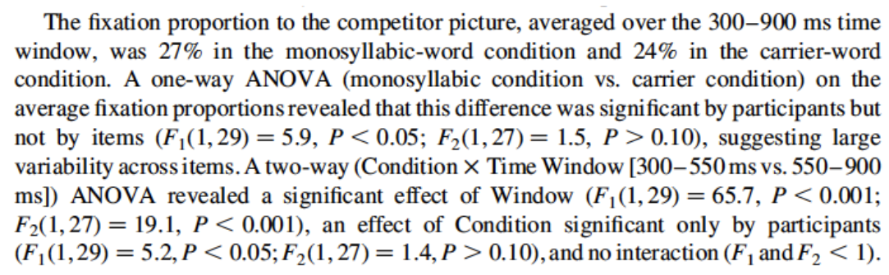

```{r setup7, include=FALSE}
knitr::opts_chunk$set(echo = TRUE, cache=TRUE)
```


# Linear mixed models

**Preliminary code**

This code is needed to make other code below work:

```{r, message=F, error=F, warning=F}
library(ggplot2)
library(dplyr)
library(arm)
library(languageR)
library(Hmisc)


## loads givennessMcGillLing620.csv from OSF project for Wagner (2012) data
givenness <- read.csv(url("https://osf.io/q9e3a/download"))

## define numeric versions of factors, for convenience
givenness <- mutate(givenness,
                    conditionLabel.williams = rescale(conditionLabel),
                    npType.pronoun = rescale(npType),
                    npType.pron = rescale(npType),
                    voice.passive = rescale(voice),
                    order.std = rescale(order),
                    stressshift.num = (as.numeric(stressshift) - 1))
                    

## make non-mixed-effect model prediction for examples below (just one prediction per
## level of conditionLabel)
newdata <- data.frame(conditionLabel.williams=sort(unique(givenness$conditionLabel.williams)))

mod1a <- lm(acoustics ~ conditionLabel.williams, data=givenness)

newdata$pred <- predict(mod1a, newdata=newdata)

newdata$conditionLabel <- factor(levels(givenness$conditionLabel))


## loads halfrhymeMcGillLing620.csv from OSF project for Harder (2013) data
halfrhyme <- read.csv(url("https://osf.io/37uqt/download"))

## need to do this because the relDuration variable is only defined when conditionLabel is 'voice'
halfrhyme <-  subset(halfrhyme, conditionLabel=='voice')
```

<script src="js/hideOutput.js"></script>


**Note**: Answers to some questions/exercises not listed in text are in [Solutions](#c6solns)

## Mixed-effects models: Motivation

Data analysis can be split into two parts: exploratory (EDA), and confirmatory (CDA).^[This distinction is discussed, along with an introduction to EDA and motivation for its importance in data analysis, in a lecture that has not yet been turned into a chapter of this book. Until it is, this section just assumes you have read about EDA and CDA somewhere, such as the first sections of @behrens1997principles.  Tukey's original manifesto for combining EDA and CDA [@tukey1980we] is still valuable.]
<!-- TODO FUTURE: add link to EDA/CDA discussion when done -->
In this book, EDA always accompanies CDA. But the ultimate goal of a study of linguistic data is  usually **confirmatory data analysis**: we want to make generalizations about units drawn from a population, based on finite data.  As such, we want our statistical analysis techniques---such as regression models---to generalize to new data, not just describe the sample we happened to draw.

A key assumption of regression models, which [we discussed](#c2ioe) in the context of linear regression, is *independence of errors*. When we fit a regression model of $Y$ as a function of some predictors, it is assumed that the "errors" for each observation---how off the model's prediction is, after taking predictor values into account---are independent.  That is, knowing how off the model is for observation 1 doesn't tell us anything about how off it is for observation 10, and so on.

However, at least for linguistic data, usually the **unit** over which we want to generalize is not observations; it is some higher-level grouping, such as participants, "items", sentences, and so on.  We usually take more than one observation per unit level [@baayen2008mixed]:

* Multiple observations per participant (since we've already paid them to do the experiment)

* Multiple observations per item (because designing items is time-consuming)

and so on.

But in general, observations from within a unit level do not have independent errors!  For example, in a study of lexical decision reaction time as a function of participant age and word frequency (such as the `[english` dataset](#engdata)), certain participants will be characteristically fast (low RT), compared to other participants of the same age---perhaps  because they just had coffee, are highly motivated to finish the experiment, or some other reason. Similarly, errors won't be independent from multiple observations of the same word. Certain words will just take longer to recognize, beyond the effect of word frequency---such as (orthographically) longer words, or words less familiar to an undergraduate participant population.

Grouping by one or more units, or *grouping factors*, is the norm in linguistic data---as well as in most data from behavioral sciences.

We discussed many different assumptions made by regression models in the [linear regression chapter](#linear-regression-assumptions), but the independence-of-errors assumption is particularly crucial.  Let's see a few examples of what can happen when grouping by unit is not taken into account.
  
### Simpson's paradox

<center>

</center>
Source: [https://hlplab.wordpress.com/2011/05/31/mixed-models-and-simpsons-paradox/](https://hlplab.wordpress.com/2011/05/31/mixed-models-and-simpsons-paradox/)

This data is from a study examining the relationship between a language's geographic distance from a fixed point ($X$) and its phonological diversity ($Y$).  Languages are grouped into families (the "grouping factor"), because related languages will have very similar values of $X$ and $Y$, for reasons not of interest here.  Of interest is how $X$ affects $Y$---after accounting for family differences.

Without taking grouping into account, the relationship between $X$ and $Y$ would look negative.  However, once grouping is taken into account, we can see that the relationship between $X$ and $Y$ is actually positive, within language families.  (In addition, there is a negative relationship between a family's mean $X$ and mean $Y$.)  

That is: we would make the **opposite conclusion** if grouping information were not taken into account.  This situation, where a trend is reversed or disappears within groups compared to across groups, is called *Simpson's paradox*.  A famous example related to graduate admissions at UC Berkeley is described [here](http://vudlab.com/simpsons/), with useful visualizations.

Simpson's paradox is an extreme example, where the actual effect direction is flipped.  More commonly, not taking grouping into account can result in Type I errors (spurious effects) or Type II errors (missing an effect that is really there):

<!-- TODO FUTURE: actual examples (simulated) -->

* Type I error: A couple items drive an otherwise null effect
    
* Type II error: Consistent effect within items, but not in pooled data

In a future version of these notes there will be actual illustrative examples, but for now one can see these possibilities by mentally adjusting the Simpson's paradox example shown above:

* Type I: Keep all green points where they are; move points of all other colors so they have y-axis value of 0.5

* Type II: Move each cluster of points vertically so it's centered at y-axis = 0.5.

In technical terms, Type I errors can result from non-independence of errors because the *degrees of freedom* assumed by the model are wrong.  Intuitively, $n$ different observations from the same item should not count as $n$ independent pieces of information about how a property of items (like word frequency) affects the response---as $n$ different observations all from different items would count.

### Repeated-measure ANOVAs

One technique for analyzing grouped data is *repeated measure ANOVAs* (RM-ANOVA).  We will not discuss how to do RM-ANOVA's, but they are widely used.^[See for example: @johnson2008quantitative, Sec. 7.8 of [this tutorial](https://www.sas.upenn.edu/~baron/from_cattell/rpsych/rpsych.html) (by Jonathan Baron and Yuelin Li), [these notes](https://people.umass.edu/bwdillon/LING609/Lectures/Section3/Lecture21.html) by Brian Dillon, many other tutorials online.]  For experimental linguistics in particular, especially psycholinguistics, RM-ANOVAs were the norm for statistical analysis from the mid 1970s to the early 2010s.  Thus, some context is helpful. 

An RM-ANOVA analysis assumes (relatively) equal sample size in different levels of the same grouping factor (e.g. same number of observations per participant), and that there is a single grouping factor (e.g. participants **or** items).  The most common case for linguistic data is to have two or more grouping factors, such as participant and item.  The analyst carries out one RM-ANOVA per grouping factor: separate "by-participant" and "by-item" RM-ANOVAs.^[Grouping factors are often called *random factors* in RM-ANOVA analyses.] Each RM-ANOVA results in an $F$ statistic value, often called *F1* ("by-participant") and *F2* ("by-item"). F1 and F2 are combined into a single statistic, *minF*.  In practice, the by-participant and by-item RM-ANOVAs are often computed and interpreted without considering minF, as in the example below.


Here is a sample RM-ANOVA analysis report (from @salverda2003role):

<center>

</center>

Note that the report discusses significance "by participant" versus "by item", referring to the F1 and F2 RM-ANOVA results for the same effect.
   
RM-ANOVA is a perfectly fine methodology for analyzing grouped data, especially for relatively simple experiments with balanced designs.  Statistical power will be lower than for an equivalent mixed model, but ideally power should be high anyway in a simple experiment.  Some discussion of RM-ANOVAs, including contextualization with respect to mixed models, is given by @barr2013random; @baayen2008analyzing, Sec. 7.2.1; @baayen2008mixed.^[Mixed models have become (by 2017) sufficiently popular that many language scientists, including journal article reviewers, think that an analysis of grouped data that doesn't use mixed models is somehow "incorrect" or "not standard".  It is important to remember that there is always more than one valid way to analyze the same data.  Mixed models are often appropriate for analyzing grouped data, but simpler methods---such as RM-ANOVA or even paired $t$ tests---may also be suitable in many cases, especially for simple statistical analyses where a mixed model may be overkill.]

Mixed-effects regression models, or *mixed models*, are another way of analyzing grouped data. Mixed models are much more powerful than RM-ANOVA, and have become the standard for analyzing grouped data in many areas of language sciences, as well as other fields.  The advantages of mixed models over RM-ANOVAs for analyzing grouped data include:

* More than one grouping unit can be included in the same model

* Unequal number of observations per level is OK

* **Explicitly model variability** among levels of the same grouping factor

    * Ex: By participant variability ("individual differences")
  
    * This means the analyst can explore and test questions about the variability itself (as opposed to effects averaging across participants, etc.), which is not possible using RM-ANOVA, or other methods we've covered so far.

    
## Linear mixed models 1: One grouping factor, random intercepts

We will introduce each part of mixed models through a series of examples, using just one predictor ($X$) to keep things simple.

We start with the simplest case of mixed models---where there is variability between groups just in the value of the intercept.   This first example uses the [`givenness` dataset](#givedata), taking into account by-participant variability (grouping factor = `participant`).

First, some notation:

* $n$: number of observations.
    
* The grouping factor is `participant`.

    * There are $J$ levels/groups (i.e., $J$ participants) 
    
    * Observation $i$ is in group $j[i]$ ($j[i] \in \{1, \ldots, J\}$)

* The response is `acoustics` ($Y$)

    * $y_i$: value for the $i^{\text{th}}$ observation

* There is a single predictor,`conditionLabel.williams` ($X$)

    * $x_i$: value for the $i^{\text{th}}$ observation
    
    * 0.5 = *Williams*, -0.5 = *Contrast*
   
   
(Italics are used to refer to levels of a factor, like *Williams* for the `conditionLabel` factor.)

We first consider a simple linear regression model *without* by-participant variability ([Model 1A](#c6model1A)), then introduce the first mixed model ([Model 1B](#c6model1B)).

### Model 1A: Simple linear regression {#c6model1A}

The model for simple linear regression is:

$$
y_i = \beta_0 + \beta_1 x_i + \epsilon_i, \quad i = 1, 2,..., n
$$

The errors are assumed to be normally distributed (and independent):
$$
\epsilon_i \sim N(0, \sigma^2)
$$
    
This model assumes the same slope and intercept for **all groups** (i.e., all participants), as schematized here:
```{r, echo=FALSE, fig.height=4, fig.width=5, fig.align='center'}
ggplot(aes(x=conditionLabel, y=acoustics), data=givenness) + 
  geom_jitter(alpha=0.1) + 
  geom_line(aes(x=conditionLabel,y=pred, group=1), size=2,  data=newdata) +
  xlab("Condition")
```
The same `acoustics` value is predicted for all observations in each condition, regardless of which participant an observation comes from.

To fit and summarize this model:
```{r}
mod1a <- lm(acoustics ~ conditionLabel.williams, data = givenness)
summary(mod1a)
```

Since the data is grouped by participant (and item), this model violates the **independent errors assumption** of linear regression.  Participants might differ in:
    
  1. The mean value of `acoustics`
    
  2. The effect of ``conditionLabel.williams``

Our goal in fitting the model is to assess whether there's an effect of `conditionLabel.williams`, beyond individual differences:
$$
H_0\,:\,\beta_1 = 0
$$
  
Either type of differences between participants could lead to falsely rejecting or accepting $H_0$.

Mixed models deal with non-independence of errors by using two types of coefficients:
   
  1. *Random effects*: Coefficients which vary between groups
   
  2. *Fixed effects*: Coefficients which don't vary between groups 

Fixed effects are basically what we have referred to as "regression coefficients" in the linear regression and logistic regression models covered in previous chapters.

The next two models we consider have two different kinds of random effects:
   
  * [Model 1B](#c6model1b): Intercept varies between participants
   
  * [Model 1C](#c6model1c): Intercept and slope vary between participants

### Model 1B: Random intercept only {#c6model1b}

This model makes predictions as in Fig. \@ref(fig:mod1bFig1): one line per participant, differing in intercept but not in slope.

The regression model for a simple linear regression with a *random intercept* is:

$$
y_i = \beta_0 + \alpha_{j[i]} + \beta_1 x_i + \epsilon_i, \quad i = 1, 2, ..., n
$$
$\alpha_{j[i]}$ is the random intercept, which captures the offset of group $j[i]$ from the grand mean ($\beta_0$).  The random intercept values for different participants are assumed to be normally distributed:
$$ 
\alpha_j \sim N(0, \sigma^2_s), \quad j = 1, 2, ..., J
$$
where $\sigma_s$ captures the amount of between-participant variation in the intercept value.
   
The errors $\epsilon_i$ are still assumed to be normally distributed, as in a non-mixed-effects linear regression:
$$ 
\epsilon_i \sim N(0, \sigma^2_e), \quad j = 1, 2, ..., n
$$
where we now write the error variance as $\sigma_e$ (instead of $\sigma$), to distinguish it from $\sigma_s$.

This regression equation implies different models of how $Y$ depends on $X$, for different participants.  For example, for participant \#5:

$$
Y = \beta_0 + \alpha_5 + \beta_1 X+ \epsilon
$$
where $(\beta_0 + \alpha_5)$ is the value of the intercept for participant 5.

The model "across participants", or "for an average participant", is: 
$$
Y = \beta_0 + \beta_1 X + \epsilon
$$
Here, the intercept is $\beta_0$: the overall intercept, averaged across participants.  This model is identical to Model 1A---simple logistic regression, without random effects.

What is the same in both models is the slope of $X$ (and the variance of the error term).

Fitting Model 1B means estimating:    

1. The *fixed effect coefficients*:

      * $\beta_0$: grand mean
 
      * $\beta_1$: slope of `conditionLabel.williams`
 
2. The *variance components*:
 
      * $\sigma^2_s$: variability of intercept offset across participants
 
      * $\sigma^2_e$: residual error variance 
   
#### Detour: Fitting linear mixed-effects models {-}

We will use the `lme4` package for fitting (**l**inear) **m**ixed **e**ffects models, which is  the most widely-used R package for such models. `lme4` is both widely used and frequently updated.  (Because of the latter, it's important to cite the exact version of `lme4` used when reporting a mixed-effects model in a paper. The version of lme4 used to fit models in this chapter is `r packageVersion("lme4")`.) See @bates2014fitting for the mathematical details of fitting these models.

Functions in this package fit mixed models by maximizing either:

* *maximum likelihood* (*ML*), which gives biased variance component estimates, or

* *restricted ML* (*REML*), which gives unbiased variance component estimates, and is typically the default

The difference between ML and REML only matters for small sample sizes.  Technically you must use ML fits for model comparison to make sense, and if you try to compare two `lme4` models using `anova()` in R, the models will automatically be re-fit using ML before comparing (as of 2018).^[More precisely: to compare two models with different fixed-effect terms, using any likelihood-based method (such as a LR test or AIC), the models must be fitted using maximum likelihood [@faraway2016extending; @zuur2009extensions].  See [here](https://stats.stackexchange.com/questions/116770/reml-or-ml-to-compare-two-mixed-effects-models-with-differing-fixed-effects-but) for some discussion.]

#### Fitting Model 1B

We fit the mixed model described above using the `lmer` function (from the `lme4` package):
```{r}
mod1b <- lme4::lmer(acoustics ~ conditionLabel.williams + (1|participant), data = givenness)
```
where `(1|participant)` is `lme4` notation for a by-participant random intercept (`1` means "intercept", `|participant` means "grouped by participant").

**Note**: You do **not** need to write `lme4::lmer` in general, just `lmer`. The notation `lme4::lmer` is used here to make sure we use the `lmer` function from the `lme4` package, rather than the redefined version of `lmer` from the `lmerTest` package discussed in Sec. \@ref(c6sattapprox).

The model's output is:
```{r}
summary(mod1b)
```

Under `Random effects`:
    
  * $\hat{\sigma}^2_s = 0.089$ :  estimated **by-participant variability** in the intercept.
    
  * $\hat{\sigma}^2_e = 0.558$: estimated **residual error** variance 

Under `Fixed effects`: estimates of the fixed-effect coefficients:

  * $\hat{\beta}_0 = -0.71$: intercept
    
  * $\hat{\beta}_1 = 0.326$: slope

#### Interpretation

The model predicts that for an "average participant", the relationship between condition and `acoustics` is:  
$$
\texttt{acoustics = -0.71 + 0.326 x conditionLabel.williams}
$$

Because the random intercepts are normally distributed, we expect (approximately) 95% of participants to have intercepts within $2 \sigma_s$ of the overall intercept, $\beta_0$.  Thus, the model predicts that  95% of participants in the population have intercepts between -1.309 and -0.113:

* lower bound: $\hat{\beta}_0 - 2 \cdot \hat{\sigma}_s = -0.71 - 2 \cdot 0.299 = -1.309$
    
* upper bound: $\hat{\beta}_0 + 2 \cdot \hat{\sigma}_s = -0.113$

(In addition, $\approx$ 95% of observations are predicted to have an error between -1.5 and 1.5, $=\pm 2 \cdot \hat{\sigma}_e$.)

We can compare the residual error (how much variance is "left over") in the simple linear regression Model (1A) and the random-intercept model (1B):

* Model 1A: $\hat{\sigma}^2_e = 0.803$^[This is the "Residual standard error" in the R summary of the model output (`summary(mod1a)`).]
    
* Model 1B: $\hat{\sigma}^2_e = 0.558$

The residual error variance is much smaller in the random-intercept model.  This is because in the random-intercept model, the error of the simple linear regression model has been partitioned into **participant-level** error and **observation-level** error, captured by $\sigma_s$ and $\sigma_e$.  Intuitively, some error has been "given" to the participant level. 

Note that the **fixed-effect** coefficients $\hat{\beta}_0$ and $\hat{\beta}_1$ (the "intercept" and "slope") are nearly the same in Model 1A and Model 1B.  

> **Questions**:
>
> * What does this mean? (That the fixed-effect coefficients are the same in the predictions made by Model 1A and Model 1B?)

#### By-participant predictions

Although the random effects $\alpha_1, ..., \alpha_J$ aren't fitted parameters, we can extract the following from the model:

* Estimates of the random effects, the "best linear unbiased predictors" (or *BLUPs*)

* Standard errors of the BLUPs
    
This allows us to extract the model predictions for each participant:
```{r}
ranef(mod1b)$participant # ranef() found in library(lme4), library(arm)
```

```{r}
se.ranef(mod1b)$participant # se.ranef found in library(arm)
```

These values might be useful if you are interested in which participants have particularly high or low baseline values of your dependent variable, for example.

A simpler way to get predictions is to just use `predict(yourmodel, newdata = dataframeToPredictFor)`.

(`predict` is a useful function in general, which also works with `lm` and `glm`.)

For example:
```{r mod1bFig1, fig.align='center', fig.width=5, fig.height=5, fig.cap="Predictions for each participant from Model 1B."}
## MODEL 1B: random intercept only
mod1b <- lme4::lmer(acoustics ~ conditionLabel.williams + (1|participant), data=givenness)

## set up a dataframe for which the model should predict new values: 
## each level of conditionLabel, for each participant.

## it's easiest to understand this if we first refit a version of mod1b using the *factor* version of conditionLabel (rather than the numeric conditionLabel.williams version)

mod1b.1 <- lme4::lmer(acoustics ~ conditionLabel + (1|participant), data=givenness)

## set up a dataframe to predict values for: one row per participant/cond label pair
newdata <- data.frame(expand.grid(conditionLabel=unique(givenness$conditionLabel),
                                  participant=unique(givenness$participant)))

## get the predicted value for each case
newdata$pred <- predict(mod1b.1, newdata=newdata)

## plot the model's prediction for each participant:
ggplot(aes(x=conditionLabel, y=pred), data=newdata) + 
  geom_line(aes(x=conditionLabel,y=pred, group=participant)) + 
  xlab("Condition") + 
  ylab("Model prediction")
```

We can also get 95% CIs, as in the example in Sec. \@ref(c6extraexamples).

Let's compare the predictions made by Model 1A (simple linear regression) and <span style = "color:red">Model 1B</span> (random intercept), for each participant:
    
```{r mod1cFig1, fig.align='center', fig.cap="Model 1A shown in black, Model 1B shown in red."}
## get the same predictions but for model 1. first fit a version with the factor for conditionlabel:

mod1a.1 <- lm(acoustics ~ conditionLabel, data=givenness)

newdata$pred.mod1a <- predict(mod1a.1, newdata=newdata)

ggplot(aes(x=conditionLabel, y=acoustics), data=givenness) + 
  geom_jitter(alpha=0.1) + 
  geom_line(aes(x=conditionLabel,y=pred, group=participant), color='red', data=newdata) +
  geom_line(aes(x=conditionLabel,y=pred.mod1a, group=participant), lty=2, data=newdata) +
  xlab("Condition") + 
  ylab("Model prediction") + 
  facet_wrap(~participant)
```

Model 1A always makes the same prediction---the black line---which moves vertically for different participants (red lines).


To get a sense of what the random-intercept model is doing, we can compare the predicted intercept (participant $i$: $\hat{\beta}_0 + \hat{\alpha}_{j[i]}$) with the empirical mean for each participant:
```{r, fig.align='center', fig.height=4, fig.width=4}
## empirical mean acoustic values by participant
df <- givenness %>% group_by(participant) %>% summarise(meanAcoustics=mean(acoustics))

## participant random effects
df2 <- ranef(mod1b)$participant
df$modPred <- fixef(mod1b)[1] + df2[match(df$participant, rownames(df2)),1]

ggplot(aes(x=meanAcoustics, y=modPred), data=df) + 
  geom_point() + 
  geom_abline(lty=2) + 
  xlab("Partic. empirical mean") + 
  ylab("Partic. predicted intercept")
```

The predicted intercepts are closer to the grand mean than the empirical values, a phenomenon called *shrinkage*, because the (absolute value of the) random intercepts are "shrunk" from the empirical means.  Why?

* The predicted value (random effect) is a weighted average of the participant's (empirical) mean and the grand mean.
    
* More observations $\implies$ greater weight given to empirical mean
    
Shrinkage improves generalization of the model to data from new participants. But importantly, it also means that BLUPs are **not the fitted values** for each participant.  They are *intentionally* not near the empirical means.  In contrast, the fixed-effect coefficients ($\hat{\beta}_0, \hat{\beta}_1$) should be close to the values you'd estimate from empirical data.

Chapter 12 of @gelman2007data discusses these points.

## Linear mixed models 2: One grouping factor, random intercepts and slopes {#c6lmm2}

[Model 1B](#c6model1B) allowed the intercept to differ by participant---each participant's "baseline" is different.  In addition, the **slope** of an effect could differ by participant, which is captured in a mixed model by a *random slope* term.  Fig. \@ref(fig:mod1cFig1) shows what the predictions from this kind of model would look like.
<!-- one line per participant, and each line has a different height and slope. -->

<!-- TODO VANNA: add reference here to first figure in 3.2, which can be thought of as schematic for Model 1C. MORGAN: I'm not sure where you want me to put that. Model 1C hasn't been introduced yet so it might be out of place to say something like "See [this figure] for a schematic of Model 1C" -->

For the `givenness` example used for Models 1A-1B, there turns out to be no detectable by-participant variation in the slope of `conditionLabel.williams`---see extra examples in Sec. \@ref(c6extraexamples).  Thus, we use a different dataset, [`halfrhyme`](#halfdata), where there is clear by-participant variation.

<!-- To load this data: -->
<!-- ```{r} -->
<!-- halfrhyme <- read.csv("datasets/halfrhyme2.csv") -->

<!-- ## you need to do this because the relDuration variable is only defined when conditionLabel is 'voice' -->
<!-- halfrhyme <-  subset(halfrhyme, conditionLabel=='voice') -->
<!-- ``` -->


We have not discussed this dataset's interpretation, and you can just think of $Y$ and $X$ as arbitrary variables if it's helpful.


We will fit a model with:

* Response ($Y$): `rhymeRating`

* Fixed effect ($X$): `relDuration` (of vowel)
    
* Random effects:

    * By-participant intercept
    
    * By-participant random slope of `relDuration`
    
As in Models 1A and 1B, there is a single grouping factor: `participant`.


From the empirical data, it does look like participants might vary in both the intercept and the slope of the `relDuration` effect:
```{r, warning=FALSE, fig.align='center'}
halfrhyme$participant <- as.factor(halfrhyme$participant)

ggplot(aes(x=relDuration, y=rhymeRating), data=halfrhyme) +
  geom_smooth(method='lm', se=F, size=0.75) +
  geom_point(size=0.1) + 
  facet_wrap(~participant) + 
  theme(legend.position='none') + 
  xlab("relDuration")
```


### Model 1C {#c6model1c}

The  model for a simple linear-mixed effects regression with a random intercept and random slope for a single grouping factor is:

$$
y_i = \beta_0 + \alpha_{j[i]} + (\beta_1 + \gamma_{j[i]}) x_i + \epsilon_i, \quad 1, 2, ..., n
$$
As in previous models:

* $\beta_0$, $\beta_1$ are the fixed effects (intercept and slope)

* Errors are normally distributed:
$$\epsilon_i \sim N(0, \sigma^2_e), \quad i = 1, ..., n$$

For random effects:

* $\alpha_{j[i]}$ is the **random intercept** term, which has the same interpretation as in Model 1B.
    
* $\gamma_{j[i]}$ is the **random slope** term, which captures how much each participant's slope (for $X$) differs from the "average" slope across participants ($\beta_1$).
    
The by-participant offsets in intercept and in the slope of $X$ are normally distributed: 
\begin{align*}
  \alpha_j &\sim N(0, \sigma^2_{p,0}), \quad j = 1, ..., J \\
  \gamma_j &\sim N(0, \sigma^2_{p,1})
\end{align*}

Fitting Model 1C means estimating:

* Fixed-effect coefficients: $\beta_0, \beta_1$
    
* Variance components: 

    * Random effect variances $\sigma^2_{p,0}, \sigma^2_{p,1}$
        
    * Error variance $\sigma^2_e$
        
### Fitting Model 1C

To fit the model:
```{r}
mod1c <- lme4::lmer(rhymeRating ~ relDuration + (1 + relDuration || participant),  
 data=halfrhyme)
```
where  `(1 + relDuration||participant)` is `lme4` notation for:

* Random intercept (`1` means "intercept")

* Random slope of `relDuration` (random effects go to the left of the "pipe" symbol `|`)

* Grouped by participant (grouping factor goes to the right of the pipe)

* The random intercept and slope are **uncorrelated**---indicated by the double pipe `||`. (We'll discuss this further when we introduce [correlated random effects](#random-effect-correlations).)

`(1 + relDuration||participant)` is read "uncorrelated by-subject random intercept and by-subject random slope".

The model's output is:
```{r}
summary(mod1c)
```

The fixed effect coefficients, and the by-participant and `Residual` rows of "Random effects" have the same interpretation as for the random-intercept-only model (Model 1B).  What is new is the random slope variance (second row of "Random effects"), which is estimated to be $\hat{\sigma}^2_{p,1} = 4.482$.

The interpretation of this "random slope" term is:

* $\hat{\sigma}_{p,1}$ = 2.12: degree of variability among participants in the slope of `relDuration`
    
* $\approx 95\%$ of participants (in the population) have slope of `relDuration` **between -1.51 and 6.96**
    
    * $=\hat{\beta}_1 \pm 2 \cdot \hat{\sigma}_{p,1}$

> **Questions**:
>
> * How much variability is there in participants' intercept values?

Again, we can use `ranef()` or `predict()` to get by-participant model predictions, using the estimated random effects (BLUPs).

To get model predictions for each participant, and visualize them:
```{r, fig.align='center', fig.height=5, fig.width=5, cache=TRUE, fig.cap="Predictions for each participant from Model 1C."}
## get model predictions for mod1c for each participant

## first, set up a prediction frame, say from min to max values of relDuration in the data, for each participant
newdata <- data.frame(
    expand.grid(
      relDuration=seq(min(halfrhyme$relDuration), 
                      max(halfrhyme$relDuration), by=0.01),
      participant=unique(halfrhyme$participant)
      )
    )

## get the predicted value for each case
newdata$pred <- predict(mod1c, newdata=newdata)

## plot the model's prediction for each participant:
ggplot(aes(x=relDuration, y=pred), data=newdata) + 
  geom_line(aes(x=relDuration,y=pred, group=participant)) + 
  xlab("relDuration") +
  ylab("Predicted rhymeRating")

```

Plot model predictions and empirical data for each participant:
```{r, fig.align='center', warning=F}
ggplot(aes(x=relDuration, y=pred), data=newdata) + 
  geom_line(aes(x=relDuration,y=pred, group=participant)) +
  geom_point(aes(x=relDuration,y=rhymeRating),data=halfrhyme, alpha=0.5, size=1) + 
  ylim(1,7) +
  xlab("relDuration") + 
  ylab("Predicted rhymeRating") + 
  facet_wrap(~participant) 
```

## Linear mixed models 3: Two grouping factors

Often in linguistic data, there is more than one grouping factor. Some common cases: 

1. Laboratory experiments: both participants **and** items are sampled from larger populations.^[Not accounting for by-item variability was famously termed the "language-as-fixed-effect fallacy" by @clark1973language.]

2. Corpus data: both speakers/authors **and** words are sampled from larger populations.

We will focus on the participant/item case (#1) for exposition. 

Most experiments have clear by-participant and by-item variability.  In RM-ANOVA analyses, this is dealt with by fitting two separate "by-participant" and "by-item" models, an awkward solution that can lower statistical power. In mixed-effects models, it is possible to account for both kinds of variability simultaneously, by including by-participant and by-item random effects. 

This is a case of *crossed* random effects: multiple grouping factors, which vary independently. (As opposed to "nested" random effects, such as by-school variability and by-participant within school.)  Crossed random effect structure is necessary to model even simple linguistic experiments.  The facility of fitting crossed random effects in `lme4` makes it well-suited for modeling linguistic data.^[In many other fields where mixed models are used (e.g. education, ecology), crossed random effects only come up in complex designs. This is why `lme4` is particularly well-suited for modeling linguistic data---in part as a result of collaboration between its primary architect, the statistician Doug Bates, and the psycholinguist R. Harald Baayen.  Many mixed-model software packages assume only one grouping factor, or nested grouping factors.]

We introduce crossed random effects for the same case as in Models 1A and 1B: `acoustics ~ conditionLabel.williams`, for the `givenness` data.

### Model 2A: By-participant and by-item random intercepts {#c6model2A}

The model for this case is:

\begin{equation*}
  y_i = \beta_0 + \alpha_{par, j[i]} + \alpha_{item, k[i]} + \beta_1 x_i + \epsilon_i
\end{equation*}

The fixed effects ($\beta_0$, $\beta_1$) and errors ($\epsilon_i \sim N(0,\sigma_e)$) are as in previous models.

The random effects are:

* $\alpha_{par, j[i]}$: by-participant random intercept

* $\alpha_{item, k[i]}$: by-item random intercept

The random intercepts are assumed to be normally distributed:
\begin{align*}
  \alpha_{par, j[i]} &\sim N(0, \sigma^2_{par}), \quad j = 1,..., J \\
  \alpha_{item, k[i]} &\sim N(0, \sigma^2_{item}), \quad j = 1,..., K \\
\end{align*}
where $\sigma^2_{par}$ and $\sigma^2_{item}$ quantify the degree of variability among participants and items in the intercept value.

> **Questions**:
>
> * What is the interpretation of each random intercept in this example? For example, what do $\alpha_{par,2}$ and $\alpha_{item,5}$ mean?

#### Fitting Model 2A

To fit this model:
```{r}
mod2a <- lme4::lmer(acoustics ~ conditionLabel.williams + (1|participant) + (1|item), data=givenness)
```

The model's output is:
```{r}
summary(mod2a)
```

> **Questions**: 
>
> * Is there more variability among participants or items?
>
> * This pattern is common in laboratory experiments.  Why?

#### Exercise 1 {-}

Based on your understanding of the mixed models presented so far (1B, 1C), you should be able to answer these questions.  

* In Model 2A:

    * 95\% of subjects have intercepts between \_\_\_\_\_ and \_\_\_\_\_
    
    * 95\% of items have intercepts between \_\_\_\_\_ and \_\_\_\_\_
    
* What is the residual error for these three models, fit with the same fixed effects (`acoustics ~ conditionLabel.williams`):

    * Model 1A (simple linear regression) (fit `mod1a`, then `summary(mod1a)`)
    
    * Model 1B (by-participant random intercept)
    
    * Model 2A (by-participant and by-word random intercept)
    
* Why does the pattern you see make sense?

## Evaluating LMMs

### Hypothesis testing

In non-mixed models, we see a test statistic and $p$-value for each term in the regression model, corresponding to the hypothesis test that the term is different from zero.

We might expect to see a test statistic and $p$-value for each random-effect and fixed-effect term in a mixed model, but we don't.  For example, in Model 2A:
```{r}
summary(mod2a)
```

* Under `Random effects`, there are no test statistics or $p$-values.

* Under `Fixed effects`, there are test statistics but no $p$-values.

How can we assess whether a fixed-effect or random-effect term contributes **significantly** to a mixed-effects model?

This turns out to be a contentious question, for practical and philosophical reasons---especially for fixed effects, which we usually care about more.^[The short version of "practical" is: if we want to use a $t$ test to calculate the significance of fixed effects---as we did for regression coefficients in a non-mixed-effects linear regression---it is unclear what the degrees of freedom should be, because it's unclear how many independent pieces of information $n$ observations from the same group level (e.g., from a single participant) give: somewhere between 1 (because they're all from 1 participant) and $n-1$ (the answer in linear regression).  The short version of "philosophical" is: mixed-effects models can be thought of as Bayesian models, and in Bayesian statistics $p$-values are not a meaningful concept.]  Some (technical) discussion is given [here](https://bbolker.github.io/mixedmodels-misc/glmmFAQ.html#why-doesnt-lme4-display-denominator-degrees-of-freedomp-values-what-other-options-do-i-have).

The upshot is that there are several ways to calculate $p$-values, which vary along an axis from "more approximate, but faster to compute" to "exact, but very time consuming to compute".  

In the opinion of one author (Morgan), any method in Sec. \@ref(c6fixedp) more complex than "Use $t$ statistic" is probably fine---and as usual, if how you calculate significance matters much to the conclusion you make, you probably shouldn't put much stock into the effect anyway.  However, it's good to be aware of the issues, not least because other researchers (including reviewers) think it is important to use a more precise method.

### Significance of a random effect term

Hypothesis testing for random effects turns out to follow a similar logic to testing the effect of multiple terms in a logistic regression model, where we used a likelihood ratio test, as in Sec. \@ref(c4lrt).

For a large enough dataset, the difference in deviance between a model with and without $k$ random effect terms approximately follows a $\chi^2$ distribution with $df=k$.  This means we can use a likelihood ratio test to assess whether these terms significantly contribute.

#### Example {-}

Does the by-item random intercept in Model 2A significantly contribute to model likelihood?

```{r}
mod2a <- lme4::lmer(acoustics ~ conditionLabel.williams + (1|participant) + (1|item), data=givenness)
mod2a.1 <- lme4::lmer(acoustics ~ conditionLabel.williams + (1|participant), data=givenness)

anova(mod2a, mod2a.1, test='Chisq')
```

Thus, `acoustics` differs significantly between items ($\chi^2(1)=10.49, p=0.0012$).

Note that this method doesn't work for testing the significance of a random effect in a model with just **one** random effect, such as Model 1B, because the models being compared are not of the same type (one is a mixed model and one isn't, so the likelihoods are not directly comparable).  In this case we can instead use an "exact restricted likelihood ratio test", implemented as `exactRLRT()` in the `RLRsim` package.  This is not a common case.
    
### Significance of fixed effects {#c6fixedp}

Several options are available for calculating $p$-values for fixed effect terms, including the following, listed in increasing order of precision/computation time:

1. Use $t$ statistic / Wald test
    
2. Likelihood ratio test
    
3. Satterthwaite approximation (`lmerTest`)
    
4. Parametric bootstrap
    
We show an  example of how to do each, with some discussion.

#### $t$-statistic

The first method is simply to assume that the $t$-statistic for a coefficient---its estimated value divided by its standard error---follows a normal distribution (equivalent to assuming high $df$), and calculate a two-sided Wald test on $|t|$.  For example, for $t=-2.03$, the $p$-value would be:
```{r}
2*(1-pt(abs(-2.03), df=1000))
```

This is not a good way to get a $p$-value---it's very approximate. However, it has a useful corollary: observing that 95% of a $t$ distribution with high $df$ has $|t|<2$ gives a simple **rule of thumb**: fixed effects with $|t|>2$ are (roughly!) significant at the $p<0.05$ level.

Thus, if $|t|$ is much larger than 2 (say $|t|>4$), the effect is highly significant and you don't need to bother using a more exact method to get a $p$-value.

In the literature, $|t|>2$ is sometimes used as a rough "is this term significant?" criterion, without comment.

#### Likelihood ratio tests

This works exactly like testing the significance of 1+ random effect terms.  You fit a model with and without 1+ fixed-effect terms, and compare them with a likelihood ratio test using the `anova()` command.  For large enough datasets, the difference in deviance between the two models follows a $\chi^2$ distribution under the null hypothesis that the fixed-effect coefficients (for the omitted predictors) are zero.

For example, to test whether `conditionLabel.williams` significantly contributes to Model 2A, using an LR test:
```{r}
mod2a <- lme4::lmer(acoustics ~ conditionLabel.williams + (1|participant) + (1|item), data=givenness)
 
mod2a.1 <- lme4::lmer(acoustics ~ 1+ (1|participant) + (1|item), data=givenness)
 
anova(mod2a, mod2a.1)
```
There is a significant effect of `conditionLabel.williams` ($\chi^2(1)=20.1$, $p<0.001$).


#### Satterthwaite approximation {#c6sattapprox}

An option which gives a reasonably good $p$, in reasonable computation time, is using the *Satterthwaite approximation* to compute (approximately correct) $df$ for each fixed-effect coefficient, which is then used to conduct a two-sided $t$ test.  This method has become popular due in part to its handy implementation in the `lmerTest` package, which redefines the `lmer` command to calculate these $df$ and $p$-values, and add them to the standard `lmer` output.

For example, re-running Model 2A with `lmerTest`:
```{r, message=F, warning=F}
library(lmerTest)

mod2a <- lmer(acoustics ~ conditionLabel.williams + (1|participant) + (1|item), data=givenness)
summary(mod2a)
```

We recommend (in 2018) calculating $p$-values for fixed-effect terms in linear mixed models using the Satterthwaite approximation, as an easy and reasonably accurate option.


**Notes**:

* After loading `lmerTest`, your `lmer` models will take about twice as long to run.  This is only an issue if you are fitting complicated models or analyzing large datasets.

* If you want to use the `lme4` of `lmer` **after** loading `lmerTest`, you use `lme4::lmer`.  (For example, to run a model that doesn't take twice as long.)

#### Parametric bootstrap

*Parametric bootstrapping* (PB) is a very accurate method for calculating p-values, which also takes a very long time.  One useful implementation of PB is in the `afex` package; for more general PB computations the `bootMer()` function of `lme4` can be used.

Roughly, what PB is doing is simulating many new datasets from your model, assuming a given fixed effect coefficient is set to **zero** (but all other coefficients are kept at their fitted values).  It then fits the original model to each of the new datasets, resulting in a distribution of values for the fixed-effect coefficient of interest.  The proportion of these re-fitted models where the coefficient (which **should** be zero) is as large or larger than the original estimate of the coefficient's value (the first time you ran the model, on the real data) is the p-value.  This is a very direct implementation of the meaning of Type 1 error ("how often would I wrongly conclude the coefficient was at least this large, if I redid the experiment many times?"). 

Thus, PB effectively needs to re-run your model `nsim` times, and the higher `nsim` is, the more accurate the p-values are.  Here's an example for Model 2A, with `nsim = 1000`:
```{r, cache=TRUE, message=FALSE}
library(afex)
mod2a.pb <- mixed(acoustics ~ conditionLabel.williams + (1|participant) + (1|item), args_test = list(nsim=1000), data=givenness, method="PB")
```

This takes a couple minutes on a laptop. Results:

```{r}
mod2a.pb
```

The $p$-value is very small in this model, similar to  when the Satterthwaite approximation is used, but now it is only 0.001.  The true p-value is probably much lower than 0.001, but 0.001 is the lowest value we can get using `nsim = 1000`.  (Why?)  

You can try running with `nsim = 1000000` to get a more accurate $p$ value while you do something else for a couple hours.

### Evaluating goodness of fit

As for all regression models, we would like a measure of goodness-of-fit for linear mixed-effects models (LMMs). However, there is no simple measure for LMMs with the same properties of $R^2$ for linear regression, including interpretability as "proportion of variation explained."  This is because in LMMs there is more than one kind of variation that can be "explained":

* Residual variation: error in each observation

* Variation among speakers in intercept

* Variation among speakers in the slope of $X$

* etc.

Thus, capturing "goodness of fit" for LMMs requires more than one measure. @snijders2011multilevel give useful discussion.


That said, one simple and common recipe is just to take the squared correlation of an LMM's predictions ($\hat{y}_i$) with the observations ($y_i$), and call this "$R^2$".  

This measure means "amount of variability accounted for by the model in this dataset", without distinguishing between fixed and random effect terms.  Thus, $R^2$ is often rather high for LMMs, simply because much variability in the data comes down to by-participant and by-item variability---even if the model would not actually have much predictive power on new data  (*unseen* participants or items).

For models we have considered so far of `givenness ~ conditionLabel.williams`:

* Model 1A:
```{r}
cor(predict(mod1a), givenness$acoustics)^2
```
    
* Model 1B:
```{r}
cor(predict(mod1b), givenness$acoustics)^2
```
    
* Model 2A:
```{r}
cor(predict(mod2a), givenness$acoustics)^2
```

$R^2$ increases with the number of random-effect terms.  This makes sense as a measure of goodness-of-fit for this dataset: more variability in the data is "explained"---as being due to participant or item variability, as opposed to noise.  It does not make sense if $R^2$ is viewed as a measure of predictive power: the three models have almost identical fixed-effect coefficients ($\hat{\beta}_0$, $\hat{\beta}_1$), meaning they will make near-identical predictions for unseen data!
    
## Linear mixed models 4: Multiple predictors

So far we have considered four types of linear mixed-effects models: 

* Linear regression, no random effects ([Model 1A](#c6model1A))
    
* By-participant random intercept ([Model 1B](#c6model1B))
    
* By-participant random intercept and slope ([Model 1C](#c6model1C))
    
* By-participant and by-item random intercepts ([Model 2A](#c6model2A))

all with a single predictor.
    
We now turn to LMMs with multiple predictors:

* [Model 3A](#c6model3A): random intercepts only
    
* [Model 3B](#c6model3B): random intercepts + slopes

We fit Models 3A and 3B to the same data, to demonstrate LMMs with multiple predictors (= "multiple fixed effects").

* Data: [`givenness`](#givedata)

* Response: `acoustics`

* Fixed effects:

    1. `conditionLabel.williams`
    
    2. `npType.pron`
    
    3. `voice.passive`
    
    4. `order`
    
    5. `conditionLabel:npType` (interaction)


These fixed effects are one possible set one could arrive at via exploratory data analysis to analyze the data with the goal of testing whether the Williams effect exists (see [dataset description](#givedata)).  The `conditionLabel.williams` term is of primary interest.

<!-- FOR LING 620: it used to say "These fixed effects are one possible set you could have arrived at via exploratory data analysis in Mini Project 1." -->

We will denote the fixed-effect coefficients for (1)--(5) as $\beta_{\texttt{conditionLabel}}$, and so on.

### Types of predictors

For fitting and interpreting mixed models, it is important to think of predictors in terms of their *level*.  A predictor which describes something about participants (e.g. participant gender) is *participant-level*, a predictor which describes a property of items (e.g. word frequency) is *item-level*, and so on.  Participant-level predictors are sometimes called "between-participant", because they do not vary within participants, while a predictor that varies within participant is "within-participant" (and similarly for "between-item", etc.). (We will not use within/between-X terminology, but you may be familiar with it, and it's widely used in the literature.)   A predictor which has a different value for every observation---that is, varies within item and participant---is called *observation-level*.

For the `givenness` data:

* Every item appears in two conditions (*Williams*, *contrast*) and two NP types (*pronoun*, *full NP*).

* Every item has **one** voice (*active* or *passive*)

* Thus, `voice` is an item-level predictor

* All other predictors vary within participants and items $\implies$ observation-level predictors:

    + `conditionLabel.williams`, `order`, `npType.pron`
  
    + `conditionLabel:npType` (if both `A` and `B` are observation level, so is `A:B`---why?)


* There are no participant-level predictors.

### Model 3A: Random intercepts only {#c6model3A}

This "intercepts only" model includes by-participant and by-item random intercepts, as well as the fixed effects described above.  To fit the model:
```{r}
## Model 3A: multiple predictors, by-item and by-partic random effects
## (p-values from lmerTest)
library(lmerTest)
mod3a <- lmer(acoustics ~ conditionLabel.williams*npType.pron + voice.passive + order.std + (1|participant) + (1|item), data=givenness)
```

The model's output is:
```{r}
library(lmerTest)
summary(mod3a)
```

Comparing significances and directions of the fixed effects, Model 3A is mostly similar to a model without the random intercepts:
```{r}
summary(lm(acoustics ~ conditionLabel.williams*npType.pron + voice.passive + order.std, data=givenness))
```

With one exception: the `order` effect, which has smaller effect size and is no longer significant in the mixed model.  To see why, note how items were presented in the experiment:
```{r, fig.align='center'}
ggplot(data=givenness, aes(x=as.factor(item), y=order)) + 
  geom_point(position=position_jitter(w=0.2, h=0.2)) + 
  xlab("Item")
```

Items were presented in four blocks---something that isn't accounted for unless the regression model allows for by-item variability.
<!-- FOR LING 620: we didn't account for in our earlier model (in MP 1).  -->
Not accounting for such variability in the multiple linear regression model leads to a spurious `order` effect. 

In this case, the random effects in the mixed model are simply accounting for information we forgot to include in the fixed-effects-only model. (We could have included "block" as a factor.)  But more generally, one useful function of random effects is to account for by-participant and by-item variability **beyond sources included as predictors in the model**---either because you don't know what these sources are (the usual case), or because you forgot to include them (this example).  Doing so helps avoid spurious effects.

    
#### Bonus: Thinking through model predictions {-}

Thinking through mixed-model predictions is confusing at first, but very useful.  Once you understand "simple" models like this one, it isn't hard to generalize to more complex models.

A couple examples of the predictions the model makes:

1. Model prediction for an "average subject and average item":
\begin{align*}
  y_i &= \hat{\beta}_0 + \hat{\beta}_{\texttt{clabel}} \cdot \texttt{clabel}_i + \hat{\beta}_{\texttt{npType}} \cdot \texttt{npType}_i + \\
  &\hphantom{{}={======}} \hat{\beta}_{\texttt{order}} \cdot \texttt{order}_i + \hat{\beta}_{\texttt{clabel:npType}} \cdot \texttt{clabel}_i \texttt{npType}_i
\end{align*}

(Where `clabel` is an abbreviation for `conditionLabel`.)

This looks exactly like you'd expect given the model's fixed effects formula (`clabel + npType + order + voice + clabel:npType`), except that there is no term for `voice`.  This is because `voice` is an item-level predictor, so for an "average item", there is no voice effect---the average is over both *active* and *passive* voice items.


2. Model prediction for Subject 5, item 2 (where `voice` = passive for this item):

\begin{align*}
  y_i &= \left( \hat{\beta}_0 + \alpha_5 + \delta_2 + 0.5 \cdot \hat{\beta}_{\texttt{voice}} \right) + \\
  &\hphantom{{}={======}} \hat{\beta}_{\texttt{clabel}} \cdot \texttt{label}_i + \hat{\beta}_{\texttt{npType}} \cdot \texttt{npType}_i + \hat{\beta}_{\texttt{order}} \cdot \texttt{order}_i + \\
  &\hphantom{{}={======}} \hat{\beta}_{\texttt{clabel:npType}} \cdot \texttt{clabel}_i \texttt{npType}_i
\end{align*}

In this equation, the "intercept" is:
$$
\left( \hat{\beta}_0 + \alpha_5 + \delta_2 + 0.5 \cdot \hat{\beta}_{\texttt{voice}} \right)
$$
this is the **predicted mean value for this participant and item**: the grand mean, with offsets for this participant, this item, and this `voice` value.
    
Interpretation aside:  because `voice` is item-level, the by-item random intercept is not the offset from the grand mean.  It is the offset of item 2 among `voice` = passive items. 


### Model 3B: Random intercepts and all possible random slopes {#c6model3B}

[Model 3A](#c6model3A) had random intercepts (by-participant and by-item) only. We now add "all possible random slopes".  What this means is:

* By-participant random slopes for all predictors that vary within participants (i.e. not participant-level predictors)

* By-item random slopes for all predictors that vary within items (i.e. not item-level predictors)

For example, suppose that the model included a predictor for participant gender.  This predictor estimates the difference between male and female participants. The effect of this predictor cannot vary within participants---each participant has only one value of gender, so it doesn't make sense to estimate "difference between male and female for participant 3".  Thus, there can be no by-participant random slope term. More generally, there can be no by-participant random slopes for participant-level predictors.

By similar logic, there can be no by-item random slopes for item-level predictors.

Thus,  the current model could include:

* By-participant random slopes for all predictors

* By-item random slopes for all predictors **except `voice`**.

However, for simplicity we leave out the random slope for `order`.  The fixed-effect term is not significant, and we don't care about the $\hat{\beta}_{\texttt{order}}$ estimate anyway.  (We will [discuss motivation](#adding-a-random-slope) for which random slope terms to include, soon.)
    
Technical note: we are again using "uncorrelated" random effects, denoted by the double-pipe (`||`) symbol. (We will discuss what this means [soon](#random-effect-correlations) as well.)

To fit the model:
```{r}
## Model 3B
mod3b <- lmer(acoustics ~ conditionLabel.williams*npType.pron + voice.passive + order.std +
                     (1 + conditionLabel.williams*npType.pron + voice.passive || participant)  +
                     (1 + conditionLabel.williams*npType.pron || item), data=givenness)
```

In the model formula:

* `(1 + conditionLabel.williams*npType.pron + voice.passive || participant)` are the by-participant random effects

* `(1 + conditionLabel.williams*npType.pron || item)` are the by-item random effects.

The model output is:
```{r}
summary(mod3b)
```

Compare to the results of Model 3A:
```{r}
summary(mod3a)
```

Comparing the model with random slopes (3B) to the model without random slopes (3A):
    
* Fixed-effect coefficient values are similar
    
* $t$ values for coefficients which were significant ($|t| >> 2$) are still high.
    
This means there are solid overall effects (of `conditionLabel`, `npType`, and their interaction), after accounting for between-item and between-participant variability.

Note that the $t$ value for `npType` is much lower in Model 3B (6.1 versus 12.8)---though still highly significant.  This lower $t$ value is OK, and in fact a good thing, as explained in Sec. \@ref(more-on-random-slopes). 


### Assessing variability 

Random slopes capture variability among participants or items in the size of an effect.  Thus, we can test whether participants/items significantly differ in an effect by performing model comparison of models with and without the random slope term.  
<!-- (This is needed for Mini Project 2.) -->

The random slope variances for `conditionLabel.williams` in Model 3B are:

```{r, echo=FALSE}
vc <- VarCorr(mod3b)
parSlopeVar <- as.numeric(attr(vc$participant.1, "stddev"))^2
itemSlopeVar <- as.numeric(attr(vc$item.1, "stddev"))^2
```
* By-participant: `r parSlopeVar`
    
* By-item: `r itemSlopeVar`

These are both very small (corresponding to $\sigma =$ `r sqrt(parSlopeVar)` and 0), compared to the fixed effect coefficient for `conditionLabel.williams`---in fact, no variability among items is detected.  But let's check whether there is significant by-participant and by-item variability anyway, as an example.


By participant:
```{r}
## model comparisons to check whether conditionLabel.williams variability 
## by-participant

mod3b.no.partic.slope <- update(mod3b, . ~ . - (0+conditionLabel.williams|participant))
anova(mod3b, mod3b.no.partic.slope)
```
Thus, there is no significant by-participant variability in the Williams effect ($\chi^2(1)=0.09$, $p=0.75$)

By item:
```{r}
## by-item
mod3b.no.item.slope <- update(mod3b, . ~ . - (0+conditionLabel.williams|item))
anova(mod3b, mod3b.no.item.slope)
```
So there is also no significant by-item variability in the Williams effect ($\chi^2(1)=0$, $p=1$)

For the sake of this example, let's calculate the predicted Williams effect (`conditionLabel.williams` slope) for each participant anyway:

```{r, fig.align='center', warning=F, message=F, fig.height=5, fig.width=5}
## examine distibution of participant clabel.wiliams coefficents:
participantRanefs <- ranef(mod3b)$participant

## fixed effect for conditionLabel
beta <- fixef(mod3b)[['conditionLabel.williams']]

## each participant's offset 
offsets <- participantRanefs$conditionLabel.williams

participantEffects <- (beta + offsets)

ggplot(aes(x=participantEffects), data=data.frame(participantEffects=participantEffects)) +
  geom_histogram() + 
  xlim(0,0.4) + 
  geom_vline(aes(xintercept=0),lty=2) + 
  geom_vline(aes(xintercept=beta),color='red') + 
  xlab("Predicted participant Williams Effect coeffs")
```
In this plot, the red line is the fixed effect coefficient value---the overall effect, across participants---and the dotted line is at 0. Thus, there is a clear Williams effect (red line far from zero), but minor by-participant variability.  Participants differ in the **magnitude** but not **direction** of the Williams effect.


## More on random slopes

Random slopes are crucial to using mixed models, but can be confusing to use and interpret. 

### What does adding a random slope term do?

To see why random slopes are so important, let's consider an example where (unlike Model 3B) there is significant by-participant variability in an effect: the `halfrhyme` example used in [Model 1C](#c6model1c).

As a reminder, this model predicts `rhymeRating` with a fixed effect of `relDuration`, and a by-participant random intercept and random slope of `relDuration`.

Let Model 1D be the same model, without the random slope:
```{r}
## Model 1D: half-rhyme data model of 1 var, with by-partic random intercept only
mod1d <- lmer(rhymeRating ~ relDuration + (1 | participant), data=halfrhyme)
```

To get a sense of what a random slope does, we compare the two models:

* Model 1D: By-subject **random intercept** (only)
    
* Model 1C: By-subject **random intercept**, **random slope** of `relDuration`
    
(We ignore by-item variability.)

The intercept-only model:
```{r}
summary(mod1d)
```

models `rhymeRating` as a linear function of `relDuration`, with the **same slope** for every participant.  Thus, every participant's data is contributing to estimating one number: $\beta_1$, the slope for `relDuration`.   (Setting aside estimating the intercept terms: $\beta_0$ and random intercepts.)

The intercept + slope model:
```{r}
summary(mod1c)
```
models `rhymeRating` as a linear function of `relDuration`, with a **different slope** for every participant.  Thus, every participant's data is contributing to estimating two numbers: $\beta_1$, and the offset of that participant's slope from $\beta_1$.  Intuitively, this results in the model being less certain about the **overall** slope ($\beta_1$).  

We can see the result by comparing the `relDuration` fixed-effect rows for the two models:

| Model | Estimate | Std. Error | $t$ value|
|-------|----------|------------|----------|
| Intercept-only | 2.66 | 0.21 | 3.99 |
| Intercept + slope | 2.72 | **0.78**  | 3.49 |

Both models show similar estimated slopes ($\hat{\beta}_1$) for `relDuration`.  But the intercept + slope model has a much larger standard error for this effect, resulting in a smaller $t$ value, and a less significant effect. (Recall that higher $|t|$ $\implies$ more significant.)

### Discussion: Adding a random slope {#adding-a-random-slope}

It makes sense that the standard error of the `relDuration` fixed effect goes up when a random slope is added: the model detects significant variability among participants in the effect of `relDuration`, which makes it less sure of the **overall** effect of `relDuration`.

This is a good thing, from the perspective of not finding spurious effects.  In general, participants (and items) will differ in the effect of a given predictor, $X$.  Thus, if a by-participant (or item) random slope for $X$ is not included, we are underestimating the uncertainty in the fixed effect for $X$, and can easily falsely conclude there is a significant effect---for example, based on a subset of participants who show large effects.  In general, not including a random slope for $X$ is anti-conservative (for evaluating whether the fixed-effect coefficient of $X$ is 0)---it **increases Type I error**.

Similar logic holds for by-item random slopes, and so on: whenever the effect of a predictor $X$ could vary among levels of a grouping factor $Z$, it is anti-conservative to not include a by-$Z$ random slope for $X$.  This issue is discussed at length by  @barr2013random.

On the other hand, adding a random slope for $X$ also **increases Type II error**---that is, lowers power to detect a non-zero (fixed) effect of $X$.  This is especially true if there is little by-participant variability in the effect of $X$.  This issue is emphasized by @bates2014fitting and @matuschek2017balancing.

These points seem to imply that adding random slopes can be both good (lower Type I error) and bad (higher Type II error). What practical advice can be given on when to include a given random slope term?  The more general issue is: how do we decide on a random effect structure?  This usually means, what random slope terms (and correlation terms---see below) should we include in our model?

This is a **model selection** problem (with respect to random effect terms)---and as we saw when discussing model selection for fixed effects in the context of multiple linear regression (Sec. \@ref(lm-model-comparison)), there is no "best" answer.  What model selection procedure you use depends on the goals of your analysis. There are two broad perspectives:

* **Perspective 1** (@barr2013random advice): include random slope(s) for any fixed effect coefficient you care about

    * Ideal: "Maximal" random effect structure, meaning all possible random effect terms (modulo issues with model convergence)
    
    * Guards against *Type 1 errors*
    
* **Perspective 2** (@bates2014fitting advice): only include random slopes that contribute significantly to model likelihood, using a likelihood ratio test

    * (a.k.a. random effect terms "justified by the data")
    
    * Guards against *Type II errors*
    
Type I and Type II error always trade off in model selection.  Thus, there is no "correct" answer---it depends on whether you care more about Type I and Type II error.  No consensus exists on how to arrive at a random-effect structure, and this is a major issue for users fitting these models in practice, since often the "maximal" random effect structure is too complex for the data, and leads to fitting issues.

Still, a few guidelines can be given:

1. It is crucial to **consider** random slope terms for all fixed effects of interest for your research questions---either by including them in the model (Perspective 1), or testing whether they should be added (Perspective 2). Otherwise, you run the risk of seriously inflated $p$-values.

2. If a random slope for an interaction is included, it is crucial to include the corresponding random slopes for all subsets of the interaction---for the same reason that you must include all subset of an interaction as fixed effects. (For example, a by-participant `X:Y` random slope $\implies$ by-participant `X` and `Y` random slopes must be included.)

3. It is not as important to consider random slope terms for fixed effects not of interest, such as those included as controls. 

4. It is not as important to consider random slope terms for fixed effects which do not reach significance in an intercepts-only model.  Adding these random slopes will often have little effect on estimates of other fixed effects.

5. Only so many random slope terms can be properly estimated, given the size and structure of your dataset. Thus, it's important to prioritize random slopes you **must** consider (#1 and #2).

#### Extended exercise: LMM with random slopes {-}

See the Appendix, Sec. \@ref(c6extendedexercise).

## Random effect correlations {#random-effect-correlations}

In examples so far, we have always used "uncorrelated" random effects, written using the `||` notation in `lme4`.  For example, in Model 1C, the random effect term is `(1 + relDuration.std || participant)`.

Uncorrelated random effects assume that there is no relationship between different random-effect terms for the same grouping factor. In Model 1C, it is assumed that there is no relationship between

1. a participant's offset from the overall intercept (random intercept)
    
2. a participant's offset from the overall slope of `relDuration` (random slope)

If there were a relationship between (1) and (2), it would take the form of a positive or negative **correlation**---hence the name "uncorrelated random effects".
    
> **Questions**:
>
> * What would it mean, intuitively, if there were a strong positive relationship ("positive correlation") between (1) and (2)?  ("Participants who ____ also have a higher ____.")

To see whether this assumption is realistic, we can examine the prediction of Model 1C for each subject:


```{r, fig.align='center', fig.height=5, fig.width=4}
## model predictions by-subject for Model 1C:
newdata <- data.frame(
    expand.grid(relDuration=seq(
      min(halfrhyme$relDuration), max(halfrhyme$relDuration), by=0.01),
                participant=unique(halfrhyme$participant)))

## get the predicted value for each case
newdata$pred <- predict(mod1c, newdata=newdata)

## plot the model's prediction for each participant:
ggplot(aes(x=relDuration, y=pred), data=newdata) + 
  geom_line(aes(x=relDuration,y=pred, group=participant)) + 
  xlab("relDuration") + 
  ylab("Predicted rhymeRating")
```

A relationship between the height of a line (= random intercept) and its slope (= random slope) doesn't jump out, but we can check this more carefully by plotting the relationship between each participant's offsets for the intercept and the `relDuration` slope:

```{r, fig.align='center', fig.height=4, fig.width=5}
mod1c.ranefs <- ranef(mod1c)$participant
pairscor.fnc(mod1c.ranefs)
```

This plot suggests there may be a weak positive correlation ($r = 0.28, p = 0.13$): participants who rate half-rhymes better (higher `rhymeRating`) may also have a larger effect of the acoustic cue (`relDuration`) on their rating.  Alternatively, this may be a spurious correlation, not significantly different from no correlation.  We can test whether there's evidence for a "real" correlation between participants' slopes and intercepts by including this term in the mixed model.


### Model 1E: **Correlated** random slope & intercept

The regression model is now:

\begin{equation*}
  y_i = \beta_0 + \alpha_{j[i]} + \left(\beta_1 + \gamma_{j[i]}\right) x_i + \epsilon_i, \quad i = 1, ..., n
\end{equation*}

Where the random effects are:

* $\alpha_{j[i]}$: random intercept coefficient
        
* $\gamma_{j[i]}$: **random slope** coefficient

and the random intercept and slope follow a multivariate normal distribution: 

\begin{equation*}
\begin{pmatrix}
  \alpha_j \\
  \gamma_j
\end{pmatrix} 
\sim
N \left( 
\begin{pmatrix}
  0 \\
  0
\end{pmatrix}, 
\begin{pmatrix}
  \sigma_{s,0} & \rho \\
  \rho & \sigma_{s,1}
\end{pmatrix}
\right), \quad j = 1, ..., J
\end{equation*}

where:

* $\sigma_{s,0}$ is the amount of by-subject variability in the intercept
    
* $\sigma_{s,1}$ is the amount of by-subject variability in the slope of `relDuration`
    
* $\rho$ is the  **correlation between random intercept and random slope**, across participants.
    
The parameters estimated in this model are:

1. Two fixed-effect coefficients:

    * $\beta_0$

    * $\beta_1$
    
2. Four variance components:
    
    * Random intercept: $\sigma^2_{s,0}$
        
    * Random slope (of `relDuration`): $\sigma^2_{s,1}$
        
    * Correlation between them: $\rho$ 
        
    * Residual error variance: $\sigma^2_e$
    
$\rho$ is the only new parameter in this model, compared to Model 1C.  The only difference between the two models is:

* Model 1C assumes that $\rho=0$

* Model 1E fits $\rho \in (-1,1)$

In R, the "single pipe" notation (`|`) is used for correlated random effects. 

To fit Model 1E:
```{r}
mod1e <- lmer(rhymeRating ~ relDuration + (1 + relDuration | participant), data=halfrhyme)
```

Note the syntax:

* Correlated random effects: `(1 + A + B | participant)` 
    
* Uncorrelated random effects: `(1 + A + B || participant)`

Recall that the formula for Model 1C was:
```{r, eval=FALSE}
mod1c <- lmer(rhymeRating ~ relDuration + (1 + relDuration || participant), data=halfrhyme)
```

The new model's output is:
```{r}
summary(mod1e)
```

We see a positive correlation term under `Random effects`/`Corr` ($\rho = 0.82$)---the direction guessed from the scatterplot of the Model 1C random effects.

We can repeat that plot using the random effects from Model 1E, to see the relationship predicted by this model between participant offsets for intercept and `relDuration` slope:
```{r, fig.align='center', fig.height=4, fig.width=5}
mod1e.ranefs <- ranef(mod1e)$participant
pairscor.fnc(mod1e.ranefs)
```


A strong relationship is predicted---compare to the plot for [Model 1C](#c6model1c). It seems that the weak positive correlation observed in that plot hinted at a much stronger relationship that is detected by including a correlation term.  To evaluate whether this correlation is significantly different from zero, we can do a model comparison:


    
```{r}
anova(mod1c, mod1e)
```
    
There is a significant improvement in model likelihood ($\chi^2(1) = 7.0$, $p=0.008$), meaning there is a significant positive correlation between participants' random intercepts and (`relDuration`) slopes.

Despite the correlation term, the fixed effects for the two models (with and without this term) are very similar:
```{r}
## model 1C (no correlation)
summary(mod1c)$coefficients
## model 1E (correlation)
summary(mod1e)$coefficients
```
in terms of both coefficient estimates and standard errors.      

The variance components differ somewhat: $\rho > 0$ for Model 1E (obviously), and in addition the `relDuration` random slope is larger.

        
### Dicussion: Adding a correlation {#c6discuss} 

Comparing Model 1C to Model 1E:  the **fixed-effect** coefficients are very similar, while the **random effects** change to some extent.  The model with a correlation term is slightly "better" in terms of likelihood (significant increase), as a result of change in the random effects.

Empirically, this often happens when random-effect correlation terms are added to a model, at least when all predictors have been centered and are orthogonal: adding correlation terms can lead to a significantly better model fit, but has little effect on the fixed-effect estimates, which are usually what we are interested in.

This observation turns out to matter a lot in practice, by the following logic.  Including (or at least considering) random **slope** terms is very important, [for reasons described above](#adding-a-random-slope). However, "maximal random effect structure" [@barr2013random]---meaning all possible random slopes, and all possible correlations between random effect terms---often leads to a model that will not converge (or does so very slowly), because the number of terms to be estimated grows quadratically with the number of fixed-effect predictors included: ($\frac{k(k+1)}{2}$ random effect terms for $k$ predictors). For example, "maximal" random effect structure for five predictors gives 16 terms to be estimated: 1 intercept, 5 slopes, and **10** correlations.  Usually, you do not have enough data to fit all these parameters---which are mostly correlation terms.^[This is one motivation for Bayesian mixed models: see @vasishth2016statistical.]  Researchers following the advice to construct "maximal" models typically use correlated random-effect structure, as this is R's default (using `(1+X+Y+...|participant)` syntax). They often find that in practice these models do not converge, or have unrealistic correlation parameter estimates (near 1 or $-1$), and assume that the problem has to do with  adding random **slopes**.  In our experience, this is usually not the case: the model is probably too complex to support the many **correlations** between random-effect terms, which are less important than random slopes.  Even if the maximal model does fit (and doesn't have unrealistic correlation estimates), it may do so extremely slowly, hindering the data analysis process which inevitably involves fitting several models.

To deal with these issues, it is often useful to **first try models with uncorrelated random effects**---including slopes, but no correlations.  You can then add in correlations as needed (e.g. significantly increases model likelihood), or fit a final "full" model with all random slopes if your data supports it.  In practice, models with all possible random slopes but without correlation terms usually **do** converge, and fit fairly quickly.  (For example, a model with five predictors would have just 6 random effect terms in the "maximal" model without correlations.)

Note that this is all the personal opinion of one author (Morgan). Although these issues sound esoteric, modeling issues (non-convergence or degenerate random effects: correlation terms near 1 or -1) due to complex random-effects structure is one of the most frequent issues that researchers have with using mixed models in practice for linguistic data.


## Model criticism for linear mixed models

So far, we have neglected performing model criticism when fitting linear mixed models.  
<!-- (If you are taking LING 620: you don't need to do model criticism for mini-project 2.)  -->
However, model criticism is just as important for linear mixed models as for (non-mixed) linear regressions, we just don't go into it in detail here because many aspects of model criticism for LMMs are similar to [the linear regression case](#linear-regression-assumptions).

* Checking for outliers (in predictors, response)
    
* Residual plots: model predictions versus residuals, QQ plot, fixed-effect predictors versus residuals.

A new type of model criticism involves **random effects**: each random-effect term is assumed to be normally distributed, and whether this assumption is (roughly) correct should be checked.
    
### Model 3B: Residual plots

The logic of checking residual plots for an LMM is similar to linear regressions.  For example, for normality of residuals: the model assumes that the residuals are normally distributed:

$$
\epsilon_i \sim N(0, \sigma^2_e)
$$

**If** this is true for an LMM, then the *Pearson residuals* of the model are normally distributed (calculated in R using `residuals(myMixedModel)`). So we can check a QQ plot to see if the residuals are not normally distributed (which would mean the assumption is false):
```{r, fig.align='center', fig.height=5, fig.width=5}
## QQ plot for Model 3B
qqnorm(residuals(mod3b))
qqline(residuals(mod3b))
```

The distribution of (Pearson) residuals looks normal, except for some points which should be flagged as potential outliers.

(It turns out that removing these outliers **strengthens** all "significant" effects---those with $t > 2$.)

We can also plot residuals versus fitted values (`fitted(mod3b)`) or predictor values---similar diagnostics to the same plots for linear regressions.

### Model 3B: Random effect distribution

A key assumption of mixed models is that random effects are drawn from a particular distribution.  For our purposes, it is always assumed that the random effects are drawn from a **normal** distribution, with mean 0 and some variance. 

We can check this assumption by examining the distribution of either the empirical data (empirical participant means or item means), or the actual random-effect estimates (the BLUPs).  Like checking residual plots, checking normality of random effects has benefits besides making sure your model is OK---it also often shows unusual participants or items, who should be investigated further.

To examine empirical participant and item means for `acoustics` for the `givenness` data:
```{r, fig.align='center', fig.height=4, fig.width=7}
givennessByPartic <-givenness %>% group_by(participant) %>% summarise(mean=mean(acoustics))
givennessByItem <-givenness %>% group_by(item) %>% summarise(mean=mean(acoustics))

par(mfrow=c(1,2))
qqnorm(givennessByPartic$mean,  main = "participant means")
qqline(givennessByPartic$mean)

qqnorm(givennessByItem$mean,  main = "item means")
qqline(givennessByItem$mean)
```

These distributions look basically normal, possibly with a weird participant or two (left plot).

We can also examine Q-Q plots for the by-participant and by-item random intercepts:
```{r, fig.align='center', fig.height=4, fig.width=7}
par(mfrow=c(1,2))

givennessByParticRanef <- ranef(mod3b)$participant[['(Intercept)']]
qqnorm(givennessByParticRanef,  main = "participant means")
qqline(givennessByParticRanef)

givennessByItemRanef <- ranef(mod3b)$item[['(Intercept)']]
qqnorm(givennessByItemRanef,  main = "item means")
qqline(givennessByItemRanef)
```

Again, there do not seem to be any particularly odd participants or items, though a couple participants may warrant a closer look.


**Detour**: What would serious non-normality of random effects look like?  As an example, let's add three weird  participants to dataset, who have **positive** mean value of acoustics (opposite of other participants), and examine a Q-Q plot for participant means:

```{r, fig.align='center', fig.height=4, fig.width=7}
par(mfrow = c(1,2))
# find participant summary stats to generate weird participant
n_weird <- 3
n_obs <- floor(nrow(givenness)/length(unique(givenness$participant))) # avg number of observations
mn_acoustics <- mean(givenness$acoustics)
sd_acoustics <- sd(givenness$acoustics)
# generate weird participants
set.seed(2903)
acoustics_w <- rnorm(n_weird * n_obs, mean = -mn_acoustics, sd = sd_acoustics)
participant_w <- rep(paste0("wp_", seq.int(n_weird)), each = n_obs)
# place into data frame
df_w <- data.frame(acoustics = acoustics_w, participant = participant_w)
# merge with givenness data
givenness_w <- rbind(dplyr::select(givenness, acoustics, participant), df_w)

givennessByPartic_w <- givenness_w %>% group_by(participant) %>% summarise(mean=mean(acoustics))

## make partiicpant means plot
qqnorm(givennessByPartic_w$mean, main = "participant means")
qqline(givennessByPartic_w$mean)
```

There are now three outlier participants, visible at the top right of the plot.  If a mixed model is fitted to this data, the estimated by-participant random intercept variance ($\hat{\sigma}^2_{s,0}$) will be too high. (Because the model assumes random effects are normally distributed, the only way to account for a few outlier participants or items is to increase the random effect variance.)

## Random slopes for factors {#c6factorsissue}

Technical issues, related to R's implementation of factors, come up if you want to use factors as predictors in models with uncorrelated random effects.  This is an important issue in practice if you're building models with uncorrelated random effects. We advise skipping this section until this issue actually comes up in practice for you.

### Model with random-effect correlations

We have so far only used factors with two levels as predictors in mixed-effects models, which we've handled by coding the factor as a single numeric variable.  We have not considered factors not converted to numeric predictors, including factors with $>2$ levels.  Using such factors in mixed models can be tricky, especially if you want to use uncorrelated random effects.

As an example, we will use the `halfrhyme` data. To load the data and code contrasts:
```{r}
halfrhyme <- read.csv("datasets/halfrhyme2.csv")
halfrhyme <- mutate(halfrhyme,
                    conditionLabel = 
                      factor(conditionLabel, levels = c("bad", "voice", "good")))
contrasts(halfrhyme$conditionLabel) <- contr.helmert(3)
```

Our example models rhyme rating as a function of experimental condition:

* Response: `rhymeRating`

* Fixed effect: `conditionLabel` (single predictor)

    * Three levels: *bad*, *voice*, *good*
    
    * Coded using two Helmert contrasts.
    
* Random effects: by-participant intercept and slope for `conditionLabel`

> **Questions**:
>
> * What is the interpretation of each contrast?

   
Suppose we fit the model with "maximal" random effects:
```{r}
modEx2 <- lmer(rhymeRating ~ conditionLabel + (1 + conditionLabel | participant), data = halfrhyme)
summary(modEx2)
```

The fixed-effect and random-effect table rows for `conditionLabel1` and `conditionLabel2` 
describe the slopes for the two contrasts of `conditionLabel`:

* Fixed effects: "overall" slope for each contrast

* Random effects: degree of by-participant variability in the slope for each contrast (under `Variance` and `Std. Dev`)

The correlation terms capture how much different random effect terms are correlated, across participants. For example, speakers who give a higher `rhymeRating` on average (the random intercept) also tend to show a larger rating difference between *bad* and *voice* rhymes (the first contrast).

Although there don't seem to be any issues with fitting this model---it converges, and no random effect correlations are too high---often fitting maximal models with multi-level factors *does* lead to such issues, particularly if a non-orthogonal contrast coding scheme is used (such as dummy coding, R's default).

<!-- TODO FUTURE: use an example where we actually see these issues -->


### Models without random-effect correlations

If we instead try to fit a model with uncorrelated random effects, we get a warning from R:

    
```{r}
modEx3 <- lmer(rhymeRating ~ conditionLabel + (1 + conditionLabel||participant), data=halfrhyme)

summary(modEx3)
```

which tells us something is wrong, and we should not trust this model. A "nearly unidentifiable" model usually means "you've included variables that are not independent".

In this case, the issue is with the random effects. Rather than the random-effect table showing one row for each of the two `conditionLabel` contrasts, it contains one row per *level* of `conditionLabel`.  R is incorrectly interpreting the notation `(1 + conditionLabel||participant)` as 3 independent levels, rather than 2 contrasts.^[This is a bug, but one that follows from the way uncorrelated random effects are treated in `lmer` and how R deals with factors in model formulas without intercept terms.]

This issue will arise **whenever a factor is used in an uncorrelated random effect formula** (one that contains `||`, or that uses `(0+X|group)` notation).  To include factors in a model with uncorrelated random effects, we must first turn them into numeric variables---that is, the contrasts.  (This is what R usually does under the hood, but not in this case.) We manually make a numeric variable for each contrast:

```{r}
halfrhyme$clabel.c1 <- model.matrix(~conditionLabel, halfrhyme)[,2]
halfrhyme$clabel.c2 <- model.matrix(~conditionLabel, halfrhyme)[,3]
```

then include these variables in the random-effect formula, rather than the actual factor:
```{r}
modEx4 <- lmer(rhymeRating ~ conditionLabel + (1 + clabel.c1 + clabel.c2||participant), data=halfrhyme)
summary(modEx4)
```

This model has no convergence issues, and shows the expected random effect structure: one row for each of the `conditionLabel` contrast random slopes, and no correlations between random-effect terms.

Comparing the fixed effects of this "maximal model with uncorrelated random effects" to the actual "maximal model" (model `modEx2` above), we see they are very similar---modulo the lack of correlations.^[The random effect variances are slightly larger in the "uncorrelated" model, indicating that the amount of variability in the intercept and slopes is being over-estimated---some of this variability is actually shared between random-effect terms, as captured by the correlation terms.]

Summary:

* To include a random slope for any factor  (even if just 2 levels) in a model with uncorrelated random effects, you need to code as numeric variable(s).

* For a factor with 2 levels, you can just use a centered version (e.g. `arm::rescale`), which is essentially sum coding.

* For factors with more levels (or to use dummy coding for a two-level factor), you manually extract the contrasts to make numeric variables.


## Other readings

Mixed-effects models are widely used in behavioral and social sciences. Many full-length treatments and shorter introductions are available, including:

* Books
    
    * About half of @gelman2007data is focused on mixed models, called "hierarchical" (different name, same models).
  
    * Textbooks on statistics for linguists, such as @baayen2008analyzing, @levy2012probabilistic, @johnson2008quantitative have mixed model sections.

* Shorter

    * Bodo Winter's introductory [tutorials](http://www.bodowinter.com/tutorials.html) on linear mixed models
    
    * First two lectures of Martijn Wieling's ["advanced regression for linguists"](http://www.let.rug.nl/~wieling/statscourse/) course. 

* Troubleshooting/specfic questions:

    * Ben Bolker's  [FAQ](https://bbolker.github.io/mixedmodels-misc/glmmFAQ.html) for mixed models, largely focused on R.

    * The `r-sig-mixed-models` mailing list. (Search the archives)


## Appendix: Extra examples {#c6extraexamples}

### Predicting confidence intervals by simulation

To get 95% CIs of our Model 1B:

```{r, eval=FALSE}
## a simple recipe for simulating 95% confidence intervals over model predictions

## set up dataframe to predict for (every participant, every value of the predictor)
newdata <- data.frame(expand.grid(conditionLabel=unique(givenness$conditionLabel),
                                  participant=unique(givenness$participant)))

## (simulate 10k times from the model, for newdata)
preds <- simulate(mod1b.1, newdata=newdata,nsim=10000)

## lower and upper 95% CIs
newdata$lower <- apply(preds, 1, function(x){quantile(x,0.025)})
newdata$upper <- apply(preds, 1, function(x){quantile(x,0.975)})
newdata$pred <- apply(preds, 1, function(x){quantile(x,0.50)})


## newdata now contains lower and upper bounds of 95% CI, with 'prediction' = median from simulations
```

### Random intercept and slope model for `givenness` data

We would like to check whether the `conditionLabel.williams` effect differs by participant as well:

```{r, fig.align='center'}
givenness$participant <- as.factor(givenness$participant)

ggplot(aes(x=conditionLabel, y=acoustics), data=givenness) +
  stat_summary(fun.data="mean_cl_boot", aes(color=participant),size=0.1) + 
  stat_summary(fun.y=mean, geom='line', aes(group=participant,color=participant)) + 
  facet_wrap(~participant) + 
  theme(legend.position='none') + 
  xlab("Condition")
```

To do so, we fit a model with a by-participant random intercept and a by-participant random slope for `conditionLabel.williams` (as explained in Sec. \@ref(c6lmm2)):

```{r}
mod1c.not <- lmer(acoustics ~ conditionLabel.williams + (1 + conditionLabel.williams||participant), data=givenness)
```

`(1 + conditionLabel.williams||participant)` is the term for an (uncorrelated) by-subject random intercept and by-subject random slope.

Model output:
```{r}
summary(mod1c.not)
```

Under `Random effects` we find the variance estimator for the by-participant random slope to be effectively 0 ($6.255\cdot 10^{-16}$).  Thus, the model's predictions are the same as [Model 1B](#c6model1B)---there is no (detectable) by-subject variability in the effect of `conditionLabel.williams`.


## Appendix: Extended exercise {#c6extendedexercise}

In this exercise you'll build a linear mixed-effects model using:

* Data: `tapped3.txt`

of how `vowelduration` (response) depends on the predictors `syntax` and `speechrate`.

* Response: `vowelduration`

The empirical effect is:
```{r, echo=F, fig.align='center', fig.height=3, fig.width=4}
tapped <- read.table("datasets/tapped3.txt")

tapped2MN <- aggregate(vowelduration ~ syntax + speechrate, data = tapped, FUN = mean)
tapped2SE <- aggregate(vowelduration ~ syntax + speechrate, data = tapped, 
                       FUN = function(x) sd(x)/sqrt(length(x)))

tapped2 <- cbind(tapped2MN, tapped2SE$vowelduration)
names(tapped2) <- c(names(tapped2MN), "se")

ggplot(tapped2, aes(x = syntax, y = vowelduration)) + 
  geom_point() + 
  facet_wrap(~speechrate) +
  geom_errorbar(aes(ymin=vowelduration-se, ymax=vowelduration+se), width=0)
```

The fixed effects to be included in the model are `syntax`, `speechrate`, and their interaction.

*Part 1*

* Make normalized predictors (values: $\approx -0.5, +0.5$):

    * `syntax.trans` (+ = transitive, - = intransitive)
    
    * `speechrate.slow` (+ = slow, - = fast)
    
* For fixed effects `syntax.trans`, `speechrate.slow`, `syntax.trans:speechrate.slow`:

    * What are all possible random slope terms?
    
    * Hint: both by-participant and by-item random effects are possible, but some random slopes are not possible.
    
*Part 2*:

Fit an LME for these fixed effects

* With by-item, by-participant random intercepts and all possible slopes
    
* Uncorrelated random effects

*Part 3*:    

* Interpret the results of the model: are the fixed-effect coefficients in the expected direction, given the empirical data?

* Compare the random slope sizes to the fixed-effect sizes for the same predictors (e.g. compare the fixed effect for `speechrate.slow` to the the by-participant random slope effect "standard deviation" for `speechrate.slow`).  Do the three effects ever switch directions (for some participants, items)?

**Solution** model:

<div class="fold s o">
```{r, echo=F}
tapped <- mutate(tapped, 
                 syntax.trans = rescale(syntax), 
                 speechrate.slow = rescale(speechrate),
                 item = as.factor(item),
                 participant = as.factor(participant))

modEx <- lmer(vowelduration ~ syntax.trans * speechrate.slow + 
              (1+syntax.trans*speechrate.slow||item) + 
              (1+syntax.trans*speechrate.slow||participant), data=tapped)
summary(modEx)
```

The rest of the solution is omitted.


## Solutions {#c6solns}

**Q**: What does this mean? (That the fixed-effect coefficients are the same in the predictions made by Model 1A and Model 1B?)

**A**: The predictions of Model 1A (simple linear regression) are (basically) the same as the Model 1B makes for an "average speaker".

---

**Q**: How much variability is there in participants' intercept values?

**A**: The estimated by-participant intercept variance is $\hat{\sigma}_{s,0} = 1.267$.

---

**Q**: What is the interpretation of each random intercept in this example? For example, what do $\alpha_{par,2}$ and $\alpha_{item,5}$ mean?

**A**: The random intercepts are the offsets to the intercept for each participant and item. $\alpha_{par,2}$ is the offset for participant 2 (the difference between their intercept value and $\beta_0$), and $\alpha_{item,5}$ is the offset for item 5.

---

**Q**: 

* Is there more variability among participants or items?

* This pattern is common in laboratory experiments.  Why?

**A**: There is more variability among participants.  This pattern is common in laboratory experiments because items are constructed by the researcher to vary in a particular way, while the participants in an experiment are a truly random sample. This pattern might reverse if we had all linguistics majors whose first language is English read a carefully chosen word list, then examined vowel formants in these words, for example.

---

**Exercise 1**:

* In Model 2A:

    * 95\% of subjects have intercepts between \_\_\_\_\_ and \_\_\_\_\_
    
    * 95\% of items have intercepts between \_\_\_\_\_ and \_\_\_\_\_
    
* What is the residual error for these three models, fit with the same fixed effects (`acoustics ~ conditionLabel.williams`):

    * Model 1A (simple linear regression) (fit `mod1a`, then `summary(mod1a)`)
    
    * Model 1B (by-participant random intercept)
    
    * Model 2A (by-participant and by-word random intercept)
    
* Why does the pattern you see make sense?

**A**: (Not shown: 95% bounds, and the actual residual error for each model.)  The pattern is that the more random intercept terms are included, the more the residual error goes down. This is because the error in the original simple regression model has been "parcelled out" to variability among participants and items.

<!-- TODO FUTURE:95% bounds, and the actual residual error for each model. -->

---

**Q**: What would it mean, intuitively, if there were a strong positive relationship ("positive correlation") between (1) and (2)?  ("Participants who ____ also have a higher ____.")

**A**: Participants with higher values of `rhymeRating` (the response) also have a steeper slope of `relDuration` (the predictor).

---

**Q**: What is the interpretation of each contrast?

**A**: Contrast 1: *bad* versus *voice*.  Contrast 2: *good* versus *bad*/*voice*.


