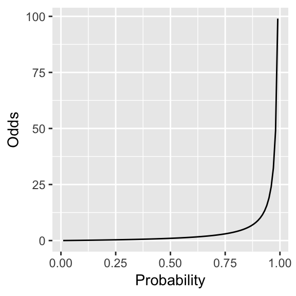
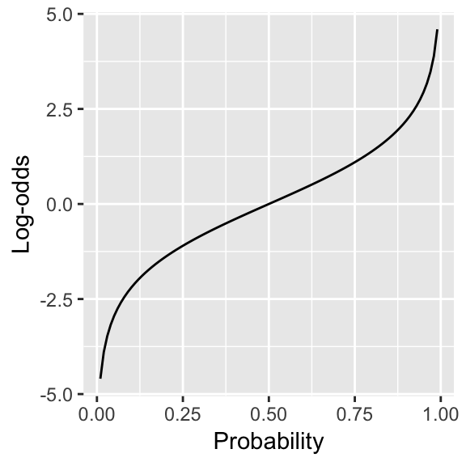
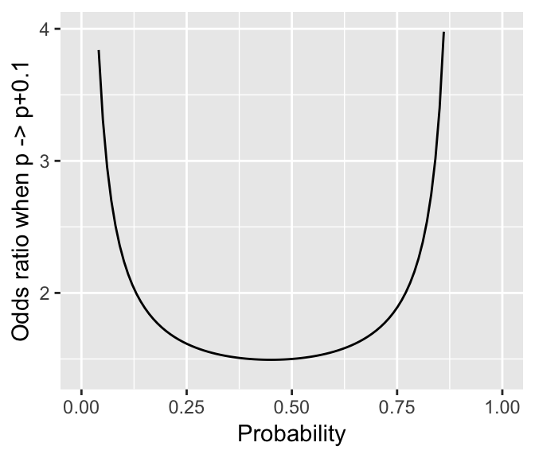

# Categorical data analysis: Preliminaries {#cda}

**Preliminary code**

This code is needed to make other code below work:


```r
library(gridExtra) # for grid.arrange() to print plots side-by-side
library(languageR)
library(ggplot2)
library(dplyr)
library(arm)
library(boot)

## loads alternativesMcGillLing620.csv from OSF project for Wagner (2016) 
## "Information structure and production planning"
alternatives <- read.delim(url("https://osf.io/6qctp/download"), stringsAsFactors = FALSE)
```

**Note**: Answers to some questions/exercises not listed in text are in [Solutions](#c3solns)

<script src="js/hideOutput.js"></script>

<!-- TODO FUTURE: actually complete solutions -->

## Introduction

So far in this book, we have mostly considered data analysis where the outcome is a continuous variable, like reaction time or vowel duration.  In linear regression, the outcome ($Y$) is modeled as a function of one or more categorical and continuous predictors ($X_i$).

We now turn to *categorical data analysis*, where the outcome being modeled is a categorical variable.  We assume that you have had some exposure to some basic categorical data analysis topics:

* *Contingency tables* (e.g. `xtabs` in R)

    * Including the notion of **observed** and **expected** values based on a contingency table, and "observed/expected ratios" (O/E ratios).

* *Tests of independence* of categorical variables

    * $\chi^2$ tests
    
    * Fisher's exact test

which we refresh briefly below. If you haven't seen these topics before, some places to read more are given [below](#cda-other-readings). 

### 2x2 contingency tables

<!-- TODO future: re-add this if we ever have an EDA chapter -->
<!-- As discussed in (TODO: update to Exploratory Data Analysis chapter once this exists),  -->

Contingency tables show the number of observations for each combination of values of categorical variables.  A 2x2 contingency table in particular shows the number of observations for each combination of two categorical variables, $X_1$ and $X_2$.

#### Example {-}

For this subset of [the `alternatives` data](#altdata):

  * `prominence` = `Adjective` or `Noun`
    
  * `context`= `Alternative` or `NoAlternative`

A contingency table showing the number of observations for each combination of `prominence` and `context`:


```r
alternatives.sub <- filter(alternatives, context%in%c('Alternative', 'NoAlternative') & 
                               prominence %in% c('Adjective', 'Noun'))
```

```
## Warning: package 'bindrcpp' was built under R version 3.4.4
```

```r
xtabs(~prominence + context, data=alternatives.sub)
```

```
##            context
## prominence  Alternative NoAlternative
##   Adjective         120            55
##   Noun               85           155
```

#### Observed and expected values {-}

In the contingency table above, it looks like prominence isn't independent of context: `Adjective` prominence is much more likely relative to `Noun` prominence in `Alternative` context.  We would like to formally test this hypothesis of non-independence.  We can do so using this  null hypothesis:

* $H_0$: `prominence` and `context` occur independently in this data.

Under $H_0$, we can work out:

1. The estimated P(`context` = `alternative`)

2. The estimated P(`prominence` = `adjective`)

3. The expected count in each cell, given the total number of observations $n$.

For example, for the contingency table above, we can calculate the probabilities #1 and #2:

```r
tab <- xtabs(~prominence + context, data=alternatives.sub)
## total number of observations
n <- sum(tab)

## P(context = alternative)
pAlt <- sum(tab[,'Alternative'])/n

## p(prominence = adjective)
pAdj <- sum(tab['Adjective',])/n

## print these probabilities
pAlt
```

```
## [1] 0.4939759
```

```r
pAdj
```

```
## [1] 0.4216867
```

The estimated count in the `context`=`Alternative` & `prominence`=`Adjective` cell is then:
\begin{align}
n \cdot P(`context` = `Alternative`) \cdot P(`prominence` = `Adjective`) & = 
415 \cdot 0.4939759 \cdot 0.4216867 \\
& = 86.4457831
\end{align}

#### Exercise 1 {-}

Calculate the estimated counts for the other three cells.

### The chi-squared test

For a 2x2 contingency table, we have:

* The *observed* counts in each cell, denoted $O_i$

* The *expected* counts in each cell, denoted $E_i$, calculated assuming independence ($H_0$).

We can then define *Pearson's test statistic*:
\begin{equation*}
  X^2 = \sum^n_{i = 1} \frac{(O_i - E_i)^2}{E_i}
    (\#eq:pearson)
\end{equation*}
which measures how much the observed and expected values differ, across the whole contingency table. $X^2$ is 0 when the observed and expected values are exactly the same, and increases the more the observed and expected values differ.

Pearson's test statistic **approximately** follows a $\chi^2$ distribution (pronounced "chi-squared") with one degree of freedom, denoted $\chi^2(1)$, under conditions described below.  Thus, we can test the null hypothesis that $X_1$ and $X_2$ are independent by comparing the value of $X^2$ to the $\chi^2(1)$ distribution.

The same methodology applies for testing independence of two categorical variables with any number of levels.  For $X_1$ and $X_2$ with $p$ and $q$ levels, $X^2$ can be calculated 
using Eq. \@ref(eq:pearson), and the null hypothesis tested using a $\chi^2((p-1)(q-1))$ distribution.
    
#### Examples {-}

1. Are `prominence` and `context` independent for the contingency table above?

```r
chisq.test(tab)
```

```
## 
## 	Pearson's Chi-squared test with Yates' continuity correction
## 
## data:  tab
## X-squared = 43.189, df = 1, p-value = 4.969e-11
```


2. Are `Regularity` and `Auxiliary` independent in the Dutch [`regularity` data](#dregdata)?


```r
xtabs(~Auxiliary + Regularity, regularity)
```

```
##          Regularity
## Auxiliary irregular regular
##   hebben        108     469
##   zijn           12       8
##   zijnheb        39      64
```


```r
chisq.test(xtabs(~Auxiliary + Regularity, regularity))
```

```
## Warning in chisq.test(xtabs(~Auxiliary + Regularity, regularity)): Chi-
## squared approximation may be incorrect
```

```
## 
## 	Pearson's Chi-squared test
## 
## data:  xtabs(~Auxiliary + Regularity, regularity)
## X-squared = 34.555, df = 2, p-value = 3.136e-08
```

---

Note that in the `regularity` example, there is a warning message, related to the "approximately" condition above.  The "$\chi^2$ approximation" (that the test statistic $X^2$ follows a $\chi^2$ distribution) is only valid when the expected count in each cell is "big enough"---otherwise, $p$ values are anti-conservative. Common rules of thumb for "big enough" are 5 or 10 observations per cell. 

It is common to have fewer than 10 observations in some cell in a contingency table, making $\chi^2$ tests frequently inappropriate.  Widespread use of the $\chi^2$ test is to some extent a holdover from when it was computationally difficult to compute "exact" tests (= no approximation to distribution of test statistic), which require simulation, and there is little reason to use the $\chi^2$ approximation today. For example, you can run a "chi-squared test" but without assuming the $\chi^2$ approximation by using the `simulate.p.value` flag to `chi.sq`:

```r
chisq.test(xtabs(~Auxiliary + Regularity, regularity), simulate.p.value=TRUE)
```

```
## 
## 	Pearson's Chi-squared test with simulated p-value (based on 2000
## 	replicates)
## 
## data:  xtabs(~Auxiliary + Regularity, regularity)
## X-squared = 34.555, df = NA, p-value = 0.0004998
```
which gets rid of the error.

It is still worth knowing about the $\chi^2$ test and its limitations because it is still frequently used, and in older literature is very widely used. For example, if you are reading a paper where the crucial result relies on a $\chi^2$ test with $p=0.02$ for a contingency table with 5 observations in one cell, you should be suspicious.  If the contingency table has 20+ observations per cell, you shouldn't be.

### Fisher's exact test

A good alternative to the $\chi^2$ test is *Fisher's exact test*, which as an "exact test" does not place any assumptions on counts per cell.  Fisher's test asks a slightly different question from a $\chi^2$ test: 

* Given the *marginal counts* (row and column totals) in the contingency table, if $X_1$ and $X_2$ were independent, how likely would an arrangement of the data at least this extreme be?
    
For example, for testing independence of `Auxiliary` and `Regularity` for the [Dutch `regularity` data](#dregdata):

```r
xtabs(~Auxiliary + Regularity, regularity)
```

```
##          Regularity
## Auxiliary irregular regular
##   hebben        108     469
##   zijn           12       8
##   zijnheb        39      64
```

Fisher's test asks: for 159 irregular verbs, assuming independence, how likely would we be to have $\geq$ 108 *hebben*, $\leq$ 12 *zijn*, $\leq$ 39 *zijnheb*, and so on.

To perform Fisher's exact test in R:

```r
fisher.test(xtabs(~Auxiliary + Regularity, regularity))
```

```
## 
## 	Fisher's Exact Test for Count Data
## 
## data:  xtabs(~Auxiliary + Regularity, regularity)
## p-value = 1.52e-07
## alternative hypothesis: two.sided
```
As expected, whether a verb is irregular and which `Auxiliary` it takes are not independent.

## Towards logistic regression

Intuitively, in logistic regression ([next chapter](#logistic-regression)) we will predict the probability that some event happens (e.g. tapping) as a function of predictors, given a bunch of data where each observation corresponds to observing whether the event happened or not, once ($Y=$ 0 or 1).  It would be tempting to just apply the tool we've learned so far---linear regression---to this task.  However, it's not obvious **what to predict** in such a model:

* We can't do a linear regression using $Y$ as the response, because $Y$ only takes on the values 0 and 1.  We want to model a **probability**.

* However, we can't do a linear regression using a probability as a response, because (among other reasons) probabilities are bounded by 0 and 1 and linear regression assumes that the response variable can be any number. (We don't want the model to be able to predict "probability = 2".)

In order to predict probabilities using a regression model, we need:

**Goal 1**: A way to think of probabilities on a continuous, unbounded scale.

**Goal 2**:  A way to estimate these probabilities, such that the sample statistic is normally distributed.

Goal 2 is necessary so that we can apply all the statistical inference machinery we have used so far to do things like conduct hypothesis tests.  
<!-- Roughly speaking: we will want our measure of probability to be approximately linear as a function of $p$, for it to make sense for us to apply similar machinery to that used for linear regression. -->
<!-- not sure that's true.. -->
     
The answer turns out to be to use "log-odds", for which we must first discuss "odds".

### Odds

*Odds* are a way of thinking about probability, as in "how likely is this event to happen versus not happen?"

> **Questions**: 
>
> Intuitively, what does it mean to say the odds are 3:1 ("three-to-one") that it will be sunny tomorrow?

The relationship between probabilities ($p \in [0,1]$) and odds are:
$$
\text{Odds}(p) = \frac{p}{1 - p}
$$

For the example above: if the probability that it is sunny tomorrow is 0.75, then the odds of it being sunny tomorrow are 3 ($0.75/(1-0.75) = 3$).  The odds of it *not* being sunny tomorrow are 1/3 ($0.25/(1-0.25)$), pronounced "one-to-three", or "three-to-one against sun tomorrow."

Figure \@ref(fig:odds1) shows odds as a function of probability. 
<div class="figure" style="text-align: center">

<p class="caption">(\#fig:odds1)Odds as a function of probability.</p>
</div>

Odds may be more intuitive than probabilities, but they do not meet Goal 1 (unbounded scale) because odds are always positive.

### Log-odds

The *log-odds*,  corresponding to a probability $p$ are:^[Note that $\log$ here is base $e$, where $e=2.718..$ is the base of the *natural logarithm*.]
$$
  \text{log-odds}(p) = \log \frac{p}{1-p}
$$
The following figure shows log-odds as a function of probability. 
<div class="figure" style="text-align: center">

<p class="caption">(\#fig:logodds)Log-odds as a function of probability</p>
</div>

Log-odds meet our goals: they range from $-\infty$ to $\infty$, and are nearly linear as a function of $p$, so long as $p$ isn't too close to 0 or 1.  It also turns out that log-odds satisfy our Goal 2 (normally-distributed sampling statistic), as discussed below.

Log-odds do have an important drawback: they are unintuitive, compared to odds or probability.  With some practice you can learn to think in log-odds.

#### Exercise 2: log-odds practice {-}

What are the log-odds corresponding to these probabilities?

* $p = 0.5$
    
* $p = 0.73$
    
* $p = 0.88$
    
* $p = 0.953$

<div class="fold o">

```
## [1] 0
```

```
## [1] 0.9946226
```

```
## [1] 1.99243
```

```
## [1] 3.009467
```
</div>

This example illustrates: 

* Probability space is contracted in log-odds, as we approach 0 or 1: a change of 1 in log-odds corresponds to a smaller and smaller change in $p$.

* Log-odds of -3 to 3 encompasses 90\% of probability space ($\approx p \in (0.05, 0.95)$).

Note that 4 is huge in log-odds ($p \approx 0.983$).

> **Questions**: 
>
> What is $p$ corresponding to log-odds of -4?

<div class="fold o">

```
## [1] 0.01798621
```
</div>

### Odds ratios

Let's start with an example from [the `tapping` data](#ctapdata), looking at how the likelihood of tapping depends on `syntax`:

* $Y =$ `tapped` (1 = yes, 0 = no)
    
* $X =$ `syntax` (1 = transitive, 0 = intransitive)
    
Suppose that the proportions of cases in each cell for our data are:

\begin{array}{c|cc}
& Y = 1 & Y = 0 \\
\hline
X = 1 & 0.462 & 0.037 \\
X = 0 & 0.43 & 0.07
\end{array}

We would like a measure of how much more likely tapping is when $X=1$ than when $X=0$. One way to do this is to calculate the odds of tapping in each case, then take their ratio:

* when $X = 1$: $\frac{0.462}{0.037} = 12.49$
    
* when $X = 0$: $\frac{0.43}{0.07} = 6.14$

* Ratio: $\frac{12.49}{6.14}=$ **2.03**

Thus, the odds of tapping are roughly doubled for transitive verbs, relative to intransitive verbs.

To define this *odds ratio* more generally, suppose that two binary random variables $X$ and $Y$ co-occur with these (population) probabilities:

\begin{array}{c|cc}
& Y = 1 & Y = 0 \\
\hline
X = 1 & p_{11} & p_{10} \\
X = 0 & p_{01} & p_{00}
\end{array}

The odds that $Y=1$ are then:

* When $X = 1$: $\frac{p_{11}}{p_{10}}$
    
* When $X = 0$: $\frac{p_{01}}{p_{00}}$

and the *odds ratio*, as a population statistic, is defined as:
$$
  OR = \frac{p_{11}/p_{10}}{p_{01}/p_{00}}
$$

The odds ratio describes how much the occurrence of one (binary) event depends on another (binary) event, and is often used as an intuitive measure:

* "Your odds of developing lung cancer are halved if you quit smoking."

* "Marie's odds of winning the election tripled from January to March."

Note that odds ratios are interpreted multiplicatively: it makes sense to say "$X$ raises the odds of $Y$ by a factor of 2", but not "$X$ raises the odds of $Y$ by 2".

Odds ratios are in part a way of thinking about changes in probability.  For the tapping example:
$$
P(\,\text{tapped}~|~\text{transitive}\,) = 0.926, \quad
  P(\,\text{tapped}~|~\text{intransitive}\,) = 0.86
$$    
Thus, the change in probability from intransitive to transitive sentences is 0.066.  However, odds ratios are *not* equivalent to changes in probability, because with odds ratios, what a change from $p$ to $p + \Delta p$ corresponds to depends on the probability ($p$) you start at.  For example, Figure \@ref(fig:oddsratio) shows the odds ratio corresponding to a change in probability of 0.1, as a function of the starting probability.

<div class="figure" style="text-align: center">

<p class="caption">(\#fig:oddsratio)Odds ratio when a probability ($p$) is increased by 0.1, as a function of $p$</p>
</div>

For a change in probability from 0.5 to 0.6, the odds increase by about 1.5x, while for a change in probability from 0.85 to 0.95 the odds increase by 3.35x.  

To summarize:

* Odds have a one-to-one relationship with probabilities

* **Changes** in odds don't straightforwardly correspond to **changes** in probabilities.

The non-equivalence between changes in odds and changes in probability is important to remember when interpreting logistic regressions, which are in log-odds space.

### Log odds: sample and population

The odds ratio is a useful *summary statistic* of the degree of dependence between two binary variables, analogous to correlations ($r$, $\rho$) for summarizing dependence between two continuous variables. 
<!-- TODO FUTURE: if a chapter including correlations ever added in, add cross-ref -->
Because we never actually observe the population value of the odds ratio---which is based on probabilities of each combination of $X$ and $Y$---we need a *sample statistic* to estimate it from observed counts for each $X$/$Y$ combination.
    
Suppose we observe the following counts:

\begin{array}{c|cc}
& Y = 1 & Y = 0 \\
\hline
X = 1 & n_{11} & n_{10} \\
X = 0 & n_{01} & n_{00}
\end{array}

To calculate the empirical odds ratio, we estimate each probability from the observed counts. For example:
\begin{align}
P(Y=1|X=1) \approx \frac{n_{11}}{n_{11}+n_{10}},  \quad P(Y=0|X=1) \approx\frac{n_{10}}{n_{11}+n_{10}} \\
\implies Odds(Y=1|X=1) = \frac{n_{11}}{n_{10}}
\end{align}
Similarly estimating $Odds(Y=1|X=1)$, then taking the logarithm of $Odds(Y=1|X=1)/Odds(Y=1|X=0)$, gives the sample change in log odds:
$$
  \hat{L} = \log \left[ \frac{n_{11}/n_{10}}{n_{01}/n_{00}} \right]
$$

It turns out that **$\hat{L}$ is normally distributed with mean $\log(OR)$**, where $OR$ is the population value of the odds ratio.  Thus, if we want to do inferential statistics on the effect of binary $X$ on binary $Y$, it makes sense to work with **log-odds**, rather than probabilities.  

#### Calculation and interpretation

* The function from probability to log-odds is called *logit* ($\text{logit}(p)$)

* The function from log-odds to probability is called *inverse logit* ($\text{logit}^{-1}(x)$), a.k.a. the "logistic function" ($1/(1+e^{-x})$).

Both can be calculated using R functions, such as `logit` and `invlogit` in the `arm` package.

Note that **adding** in the log-odds scale corresponds to **multiplying** in the odds scale, by a power of $e$.

For example, changing log-odds by 1 corresponds to multiplying the odds ratio by $e$:
\begin{eqnarray*}
\log(OR_1) = 0.69 & \implies & OR_1 = e^{0.69} = 2 \\
\log(OR_2) = 1.69 & \implies & OR_2 = e^{1.69} = 5.42 = 2{\cdot}e
\end{eqnarray*}


#### Exercise 3 {-}

Suppose that in the `tapping` data, one participant's tapping rate (i.e. probability of tapping) is 0.90 in fast speech and 0.70 in slow speech.
    
* What are the participant's **odds** of tapping in fast and slow speech (two numbers)?

<div class="fold o">

```
## [1] 9
```

```
## [1] 2.333333
```
</div>


* What is the **odds ratio** of tapping (in fast vs. slow speech) (one number)?

<div class="fold o">

```
## [1] 3.857143
```
</div>

* What is the equivalent **change in log-odds**?

<div class="fold o">

```
## [1] 1.349927
```
</div>

## Other readings {#cda-other-readings}

Most introductory statistics books cover contingency tables, chi-squared tests, and Fisher exact tests, including:

* General audience: @dalgaard2008introductory Ch. 8, @agresti2007 Ch. 1-2

* For psychologists and language scientists: @NavarroOnline Ch. 12, @johnson2008quantitative Ch. 3.1, 5.1-5.3

The Agresti book is a particularly good and accessible resource for categorical data analysis generally. (@agresti2003categorical is Agresti's more technical/comprehensive book, which is the reference on CDA.)

Some discussion of odds and odds ratios is given by @agresti2007 Ch. 2, @gelman2007data 5.2, @crawley2015statistics Ch. 14.


## Solutions {#c3solns}

### Solutions to Exercise 1:

Estimated Counts for:

* `Prominence` = `Noun`, `Context` = `Alternative` cell = 118.5542

* `Prominence` = `Adjective`, `Context` = `NoAlternative` cell = 88.55422

* `Prominence` = `Adjective`, `Context` = `NoAlternative` cell = 121.4458


