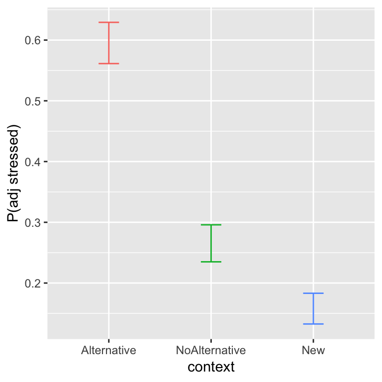

# Mixed-effects logistic regression

**Preliminary code**

This code is needed to make other code below work:


```r
library(gridExtra) # for grid.arrange() to print plots side-by-side
library(dplyr)
library(ggplot2)
library(arm)
library(languageR)
library(influence.ME)

## loads tappedMcGillLing620.csv from OSF project for Kilbourn-Ceron et al (2017) data
tapped <- read.csv(url("https://osf.io/pwdzx/download"))


## there is some missing data for 'tapped' variable -- exclude to avoid warnings later
tapped <- filter(tapped, !is.na(tapped))

tapped <- mutate(tapped, tapped.num=as.numeric(tapped)-1)
tapped$released <- factor(tapped$released, levels=c("Unreleased", "Released"))
tapped <- mutate(tapped, 
                 syntax.trans = arm::rescale(syntax),
                 speechrate.slow = arm::rescale(speechrate)
)
                

## loads alternativesMcGillLing620.csv from OSF project for Wagner (2016) data
alternatives <- read.csv(url("https://osf.io/6qctp/download"))


## loads givennessMcGillLing620.csv from OSF project for Wagner (2012) data
givenness <- read.csv(url("https://osf.io/q9e3a/download"))

givenness <- mutate(givenness,
                    conditionLabel.williams = arm::rescale(conditionLabel),
                    clabel.williams = arm::rescale(conditionLabel),
                    npType.pronoun = arm::rescale(npType),
                    npType.pron = arm::rescale(npType),
                    voice.passive = arm::rescale(voice),
                    order.std = arm::rescale(order),
                    stressshift.num = (as.numeric(stressshift) - 1)
)

## function for computing accuracy of a logistic regression model 
## (on the dataset used to fit the model)
## lrMod = fitted model
## responseVar = name of response variable for lrMod
## use.ranef = TRUE or FALSE (should we predict for grouping factor levels in this data, or for an "average" level? TRUE/FALSE)
##
## adapted from: https://www.r-bloggers.com/evaluating-logistic-regression-models/
lrAcc <- function(lrMod, responseVar, use.ranef=TRUE){
    ## convert response variable into a factor if it's not one
  if(!is.factor(model.frame(lrMod)[,responseVar])){
    model.frame(lrMod)[,responseVar] <- as.factor(model.frame(lrMod)[,responseVar])
  }

    ## model predictions in log-odds
  if(use.ranef){
    preds = predict(lrMod, newdata=model.frame(lrMod))
  } else{
    ## predict for average participant/item/other
        preds = predict(lrMod, newdata=model.frame(lrMod), re.form=NA)
  }
    ## transform to 0/1 prediction
    preds <- ((sign(preds)/2)+0.5)
    
    ## response variable values, transformed to 0/1
    respVarValues <- model.frame(lrMod)[,responseVar]
    ## if the response is already 0/1, just use it
    if(is.numeric(respVarValues)){
        y <- respVarValues
    } else{
        ## otherwise, transform to 0/1
        y <- (as.numeric(model.frame(lrMod)[,responseVar])-1)
    }
    
    ## how often is prediction the same as the actual response
    acc <- sum(preds==y)/length(preds)
    
    return(acc)
    
}

## baseline accuracy for a logisitic regression model lrMod
## with a given response variable
baselineAcc <- function(lrMod, responseVar){
    response <- model.frame(lrMod)[,responseVar]
    tab <- table(response)
    return(max(tab)/sum(tab))
}
```

<script src="js/hideOutput.js"></script>


**Note**: Answers to some questions/exercises not listed in text are in [Solutions](#c7solns).

## Preliminaries

*Mixed-effects logistic regression* (MELR) is to logistic regression as linear mixed-effects models are to linear regression.  MELRs combine pieces we have seen previously in chapters on [logistic regression](#logistic-regression) and [linear mixed-effects models](#lmem):

1. **Logistic regression**

    * Binary response $Y$
    
        * Ex: `tapped` = 1 or 0, in the `tapping` dataset.
    
    * Model log-odds that $Y$ happens.

2. **Fixed effects** 

    * "Predictors" from logistic regression, now called "fixed effects"
    
        * Ex: `speechrate`, `vowelduration`, `syntax`
        
    * Capture effect of each predictor across participants/items.
        
3. **Random effects**

    * Capture by-participant/item variability
    
    * Ex: in overall tapping rate ("random intercept"), in the effect of a predictor across participants ("random slope") or items.

Remember that logistic regression models the **log-odds** of a "hit" ($Y=1$) as a function of predictors. Not the number of hits, the probability of a hit, or anything else.


### Motivation

To get a sense of what kind of variability would be captured by the random effects in MELR models, we can examine by-participant and by-item variability in two datasets where the outcome is a binary (0/1) variable, just plotting the empirical data.

#### Tapping data {- #c7tapdata}

From the [`tapping` dataset](#tapdata), here are by-participant and by-item plots for the effect of `syntax`, the predictor of primary interest, on the probability of `tapping`:


```r
library(gridExtra)
day19Plot1 <- ggplot(aes(x=syntax, y=tapped.num), data=tapped) + 
  stat_summary(fun.data="mean_cl_boot", geom='line', aes(group=participant)) +
  coord_cartesian(ylim=c(0,0.6)) + 
  ylab("% tapped by speaker") 

day19Plot2 <- ggplot(aes(x=syntax, y=tapped.num), data=tapped) + 
  stat_summary(fun.data="mean_cl_boot", geom='line', aes(group=item)) + 
  coord_cartesian(ylim=c(0,0.6)) + 
  ylab("% tapped by item") 

grid.arrange(day19Plot1, day19Plot2, ncol = 2)
```


> **Questions**:
>
> * Does it look like there is by-participant variability in the intercept, slope, or both? What about by-item variability?

####  Givenness data {- #c7givedata}

For the [`givenness` dataset](#givedata), here are by-participant and by-item plots for the  Williams effect (the effect of `conditionLabel` on probability of `stressshift`), which was of primary interest:


```r
day19Plot3 <- ggplot(aes(x=conditionLabel, y=stressshift.num), data=givenness) +
  stat_summary(fun.data="mean_cl_boot", geom='line', aes(group=participant)) +
  coord_cartesian(ylim=c(0,1.0)) + 
  ylab("% shifted by speaker") 

day19Plot4 <- ggplot(aes(x=conditionLabel, y=stressshift.num), data=givenness) +
  stat_summary(fun.data="mean_cl_boot", geom='line', aes(group=item)) + 
  coord_cartesian(ylim=c(0,1.0)) + 
  ylab("% shifted by item") 

grid.arrange(day19Plot3, day19Plot4, ncol = 2)
```


> **Questions**:
>
> * Again, for participants and items: do you think there is variability in the intercept? Slope? Both?

## Basics

Formally, we assume that there are $n$ observations.  **Fixed effects** and **random effects** are defined in the same way as for linear mixed-effects models:

* $\beta_0$: the fixed-effect coefficient for the intercept
  
* $\beta_1, \ldots, \beta_k$: the fixed effect coefficients for $k$ predictors:

Random effects are defined with respect to one or more *grouping levels*. For example, there could be data from $J$ participants.

Mixed-effect logistic regressions are one kind of *generalized linear mixed model* (GLMM)---analogously to logistic regression being one kind of generalized linear model. To fit a MELR model in the `lme4` package, you use the `glmer()` function (**g**eneralized **l**inear **m**ixed **e**ffects **r**egression), with a `family=binomial()` argument, similarly to fitting a logistic regression using the `glm()` function.^[The `family='binomial'` argument specifies this regression uses a "logit link", as for logistic regressions (see @baayen2008analyzing).]  

All pieces of an MELR model are familiar from our units on linear mixed models (Chapter \@ref(lmem)) and logistic regression (Chapter \@ref(logistic-regression)), so we will dive right in to a realistic example model that uses:

* Crossed random effects (participants, items)
    
* Multiple predictors

### Model 1: `givenness` data, crossed random effects (intercepts + slopes) {#c7m1}

We again consider the `givenness` data, using the binary annotation by a research assistant for whether stress shifted from the noun phrase (1/0 = shifted/not shifted).

* The response is `stressshift`

The data is grouped by:

* participants ($1, ..., J$)
    
* items ($1, ..., K$)

We use these fixed effect terms, to build a relatively simple model (no interactions):

* `clabel.williams` (varies across participants and items)
    
* `npType.pron` (varies across participants and items)

* `voice.passive` (varies across participants, not across items)

[Recall](#types-of-predictors) that `clabel.williams` and `npType.pron` are observation-level (they vary across participants and items) while `voice.passive` is item-level (it varies across participants, but not items).
    
The random effects contain intercepts and all possible random slopes:

* Intercepts: by-participant, by-word
    
* Slopes:
    
    * Participant: `clabel.williams`, `npType.pron`, `voice.passive`
        
    * Item: `clabel.williams`, `npType.pron`
        
---

It may be helpful for your understanding to explicitly write out what the equation for this model is. To do so, we define:

* $\alpha_{0, j}$ : random intercept for participant $j$

* $\delta_{0, k}$ : random intercept for item $k$

* $\alpha_{\text{clabel}, j}$ : random slope of $\texttt{clabel}$ for participant $j$


* $\delta_{\text{clabel}, k}$ : random slope of $\texttt{clabel}$ for item $k$

* ... similar for other random slopes.

The model for observation $i$ is then:

\begin{align*}
  \text{logit}\left(P(y_i = 1)\right) &= \beta_0 + \alpha_{0,j[i]} + \delta_{0, k[i]} + \\
  &\hphantom{{}={==}} \left( \beta_{\texttt{clabel}} + \alpha_{\texttt{clabel},j[i]} + \delta_{\texttt{clabel},k[i]} \right) \cdot \texttt{clabel}_i + \\
  &\hphantom{{}={==}} \left( \beta_{\texttt{npType}} + \alpha_{\texttt{npType},j[i]} + \delta_{\texttt{npType},k[i]} \right) \cdot \texttt{npType}_i + \\
  &\hphantom{{}={==}} \left( \beta_{\texttt{voice}} + \alpha_{\texttt{voice}, j[i]} \right) \cdot \texttt{voice}_{k[i]}
\end{align*}

In this formula:

* $\beta_0 + \alpha_{0,j[i]} + \delta_{0, k[i]}$ is our **intercept** for participant $j[i]$ and item $k[i]$

* $\beta_{\texttt{clabel}} + \alpha_{\texttt{clabel},j[i]} + \delta_{\texttt{clabel},k[i]}$ is our **slope for `clabel.williams`** for participant $j[i]$, item $k[i]$

* $\beta_{\texttt{npType}} + \alpha_{\texttt{npType},j[i]} + \delta_{\texttt{npType},k[i]}$ is our **slope for `npType.pron`** for participant $j[i]$, item $k[i]$

* $\beta_{\texttt{voice}} + \alpha_{\texttt{voice}, j[i]}$ is our **slope for `voice.passive`** for participant $j[i]$

(Recall that observation $i$ is from participant $j[i]$ and item $k[i]$.)

---

The terms fitted in this model---and hence shown in the regression model output---are:

* 4 fixed-effect coefficients: $\beta_0$, $\beta_{\texttt{clabel}}$, $\beta_{\texttt{npType}}$, $\beta_{\texttt{voice}}$

    * For 3 predictors

* 7 variance components:
    
    * Random intercepts: 2 terms
        
    * Random slopes: 5 terms
        
    * No correlations
        
Note that unlike linear mixed-effects models, there is no residual error variance term, for the same reasons as for logistic regression (see Sec. \@ref(c4differences)).
    
#### Fitting the model

To fit this model in R:


```r
lrMod1 <- glmer(stressshift ~ clabel.williams + npType.pron + voice.passive + 
                  (1 + clabel.williams + npType.pron||item) +
                  (1 + clabel.williams + npType.pron + voice.passive||participant),
                data=givenness, 
                family="binomial", 
                control=glmerControl(optimizer = "bobyqa"))
```

Note that the `control=glmerControl(optimizer = "bobyqa")` option is not necessary, but often facilitates model convergence.^[This option changes the optimization function R uses to find the parameters that maximize likelihood.] 

The model output is:

```r
summary(lrMod1)
```

```
## Generalized linear mixed model fit by maximum likelihood (Laplace
##   Approximation) [glmerMod]
##  Family: binomial  ( logit )
## Formula: stressshift ~ clabel.williams + npType.pron + voice.passive +  
##     (1 + clabel.williams + npType.pron || item) + (1 + clabel.williams +  
##     npType.pron + voice.passive || participant)
##    Data: givenness
## Control: glmerControl(optimizer = "bobyqa")
## 
##      AIC      BIC   logLik deviance df.resid 
##    349.6    393.0   -163.8    327.6      371 
## 
## Scaled residuals: 
##     Min      1Q  Median      3Q     Max 
## -2.2442 -0.3174 -0.1881  0.4603  4.5955 
## 
## Random effects:
##  Groups        Name            Variance  Std.Dev. 
##  participant   voice.passive   1.648e+00 1.284e+00
##  participant.1 npType.pron     5.823e-01 7.631e-01
##  participant.2 clabel.williams 5.013e-15 7.080e-08
##  participant.3 (Intercept)     1.685e-01 4.105e-01
##  item          npType.pron     5.394e-01 7.344e-01
##  item.1        clabel.williams 1.619e+00 1.273e+00
##  item.2        (Intercept)     2.624e-14 1.620e-07
## Number of obs: 382, groups:  participant, 27; item, 16
## 
## Fixed effects:
##                 Estimate Std. Error z value Pr(>|z|)    
## (Intercept)      -1.1383     0.2076  -5.483 4.18e-08 ***
## clabel.williams   3.7711     0.5676   6.644 3.05e-11 ***
## npType.pron       0.7917     0.3987   1.986   0.0471 *  
## voice.passive     0.6496     0.4149   1.566   0.1174    
## ---
## Signif. codes:  0 '***' 0.001 '**' 0.01 '*' 0.05 '.' 0.1 ' ' 1
## 
## Correlation of Fixed Effects:
##             (Intr) clbl.w npTyp.
## clabl.wllms -0.458              
## npType.pron -0.141  0.174       
## voice.passv -0.036  0.082  0.028
```

#### Interpreting the model

The fixed-effect and random-effect terms are interpreted similarly to a linear mixed-effects model, with the difference that the model predicts changes in log-odds.

Some examples of fixed effects:

* The intercept is $\hat{\beta}_0 = -1.13$:
    
    * Interpretation: for an average subject and average item, with all predictors held at mean values:
        \begin{equation*}
          P(\text{shift stress}) = \text{logit}^{-1}(-1.13) = 0.24
        \end{equation*}
        
* The slope for `npType` is $\hat{\beta}_{\texttt{npType}} = 0.79$

    * Interpretation: for an average subject and item, the log-odds of shifting stress are 0.79 higher for pronouns than for full NPs.
        
    * (Alternatively: the odds of shifting stress are 2.20 times higher ($=e^{0.79}$) for pronouns than for full NPs.)

For the random effects, first considering random intercepts:

* By-participant random intercept  variance:  $\hat{\sigma}_{s,0} = 0.41$

    * 95% of participants have "baseline" log-odds of shifting stress in (-1.96, -0.31)

        * (= $\hat{\beta}_0  \pm 1.96 \cdot \hat{\sigma}_{s,0}$)
    
        * Alternatively, 95% of participants have baseline probability of shifting stress in (0.12, 0.42) (=invlogit(-1.96), invlogit(-0.31)).
        
* In contrast, there is basically no variability among *items* in "baseline" log-odds of shifting stress ($\hat{\sigma}_{w,0} \approx 0$).       
    
For random slopes, consider the condition label effect (i.e. the "Williams effect"). The degree of variability among participants and items in the `clabel.williams` slope is:
    $$
      \hat{\sigma}_{\texttt{clabel}, partic}, \quad
      \hat{\sigma}_{\texttt{clabel}, item}
    $$

To visualize the predicted Williams effect for different participants and items:

```r
particSlopes <- fixef(lrMod1)['clabel.williams'] + ranef(lrMod1)$participant$clabel.williams
itemSlopes <- fixef(lrMod1)['clabel.williams'] + ranef(lrMod1)$item$clabel.williams


lrMod1SlopeDf <- rbind(data.frame(type='participants', slope=particSlopes),
                       data.frame(type='items', slope=itemSlopes))

ggplot(aes(x=slope), data=lrMod1SlopeDf) + 
  geom_histogram(binwidth=0.25) + 
  facet_wrap(~type, scales="free") + 
  xlim(1,6) + 
  xlab("Predicted clabel slope")
```


The model predicts that the size of the Williams effect varies among items---but not participants---and is robust, in the sense of having the same direction across all participants and items.

Thus: participants (but not items) differ in the intercept, while items (but not participants) differ in the Williams effect (the `clabel.williams` slope).  

## Hypothesis testing

### Fixed effects

Recall that for linear mixed-effects models, there is not a consensus on how to calculate p-values and whether doing so is a good idea (see Sec. \@ref(c6fixedp)), so no test statistic or $p$-value is given by default in the `lmer` output. One rough method was to assume that the estimated coefficient value divided by its standard error was normally distributed, and use this to calculate a $p$-value (for a two-sided "Wald test").

For generalized linear mixed-effects models, this is a somewhat more kosher method, and `glmer()` shows by default:

* The test statistic  $z$ ($=\frac{\hat{\beta}}{SE(\hat{\beta})}$)

* The $p$-value for a two-sided Wald test.^[Meaning, how likely is it that $|z|$ would be at least this large, under the null hypothesis, assuming that $z$ is normally distributed?] 

However, these $p$-values are still  approximations---they are only correct in the limit of a large number of observations and large number of groups.  **These Wald-test based $p$-values are good enough for our purposes**, but better methods would be:

* A likelihood ratio (LR) test: slightly better, fast

* Parametric bootstrap: much better, very slow

See the discussion for linear mixed models in @baayen2008analyzing for more detail on both, and [Ben Bolker's GLMM page](https://bbolker.github.io/mixedmodels-misc/glmmFAQ.html#testing-hypotheses) for more recent discussion.  You may want to use a "better" method when reporting $p$-values in a paper.  Here are a few examples:

#### Likelihood ratio test for one term {-}

To calculate an LR test $p$-value for just the `npType.pron` fixed-effect term in [Model 1](#c7m1):

```r
lrMod1.sub <- update(lrMod1, . ~ . - npType.pron)
anova(lrMod1, lrMod1.sub)
```

```
## Data: givenness
## Models:
## lrMod1.sub: stressshift ~ clabel.williams + voice.passive + (1 + clabel.williams + 
## lrMod1.sub:     npType.pron || item) + (1 + clabel.williams + npType.pron + 
## lrMod1.sub:     voice.passive || participant)
## lrMod1: stressshift ~ clabel.williams + npType.pron + voice.passive + 
## lrMod1:     (1 + clabel.williams + npType.pron || item) + (1 + clabel.williams + 
## lrMod1:     npType.pron + voice.passive || participant)
##            Df    AIC    BIC  logLik deviance  Chisq Chi Df Pr(>Chisq)  
## lrMod1.sub 10 351.18 390.63 -165.59   331.18                           
## lrMod1     11 349.64 393.04 -163.82   327.64 3.5413      1    0.05986 .
## ---
## Signif. codes:  0 '***' 0.001 '**' 0.01 '*' 0.05 '.' 0.1 ' ' 1
```
The $p$-value ($p=0.059$) is slightly higher than for the Wald test used in `lrMod1` ($p=0.047$).  


#### Likelihood ratio test for each term {-} 

The `afex` package lets you quickly compute an LR-based $p$-value for each term:

```r
library(afex)

## fit model and get LR-based p-values:
lrMod1.lr <- mixed(stressshift ~ clabel.williams + npType.pron + voice.passive +  (1 + clabel.williams + npType.pron||item) +
                  (1 + clabel.williams + npType.pron + voice.passive||participant),
                data=givenness, 
                family="binomial", method='LRT',
                control=glmerControl(optimizer = "bobyqa"))
```

```
## Fitting 4 (g)lmer() models:
## [....]
```

```r
## see the results:
lrMod1.lr
```

```
## Mixed Model Anova Table (Type 3 tests, LRT-method)
## 
## Model: stressshift ~ clabel.williams + npType.pron + voice.passive + 
## Model:     (1 + clabel.williams + npType.pron || item) + (1 + clabel.williams + 
## Model:     npType.pron + voice.passive || participant)
## Data: givenness
## Df full model: 11
##            Effect df     Chisq p.value
## 1 clabel.williams  1 26.67 ***  <.0001
## 2     npType.pron  1    3.54 +     .06
## 3   voice.passive  1      2.36     .12
## ---
## Signif. codes:  0 '***' 0.001 '**' 0.01 '*' 0.05 '+' 0.1 ' ' 1
```

#### Parametric bootstrap (PB) test for each term {-}

This example uses a version of [Model 1](#c7m1) with random intercepts only, because using random slopes takes a very long time. Note this is only for pedagogical purposes---it is never a good idea to report a model where the only random effects are random intercepts!

```r
library(afex)

## use multiple cores, if your machine has them.
require(parallel)
(nc <- detectCores()) # number of cores
```

```
## [1] 8
```

```r
cl <- makeCluster(rep("localhost", nc)) # make cluster

## fit a *random-intercepts only* model (in general, not OK, but it would take much longer to fit the model with random slopes).  
## This still takes 5 minutes on my 8-core computer:

lrMod1.pb <- mixed(stressshift ~ clabel.williams + npType.pron + voice.passive + 
                  (1|item) + (1|participant),
                data=givenness, 
                family="binomial", method='PB', args_test=list(nsim=1000, cl=cl), 
                control=glmerControl(optimizer = "bobyqa"), cl=cl)
```

```
## Fitting 4 (g)lmer() models.
## Obtaining 3 p-values:
## [...]
```

```r
##  look at the p-values (nb: 0.001 = minimum p-value when nsim=1000)
lrMod1.pb
```

```
## Mixed Model Anova Table (Type 3 tests, PB-method)
## 
## Model: stressshift ~ clabel.williams + npType.pron + voice.passive + 
## Model:     (1 | item) + (1 | participant)
## Data: givenness
##            Effect df      Chisq p.value
## 1 clabel.williams  1 150.61 ***   .0010
## 2     npType.pron  1     5.06 *     .03
## 3   voice.passive  1    7.43 **    .009
## ---
## Signif. codes:  0 '***' 0.001 '**' 0.01 '*' 0.05 '+' 0.1 ' ' 1
```

### Random effects

It may also be of interest to test whether random-effect terms significantly improve the model. As for linear mixed models, in the large-sample limit the difference in deviance between the model with and without $k$ random effect terms is approximately $\chi^2(k)$ distributed. Thus, we can use a likelihood ratio test to assess the null hypothesis that (all of) the random effect terms have zero variance.
    
    
#### Example {-}

Do items significantly differ in the `clabel` effect (i.e. the Williams effect), in [Model 1](#c7m1)?


```r
lrMod1.1 <- glmer(stressshift ~ clabel.williams + npType.pron + voice.passive + 
                    (1 + npType.pron || item) +
                    (1 + npType.pron + voice.passive + clabel.williams || participant),
                  data=givenness, 
                  family="binomial",
                  control=glmerControl(optimizer = "bobyqa"))
anova(lrMod1, lrMod1.1)
```

```
## Data: givenness
## Models:
## lrMod1.1: stressshift ~ clabel.williams + npType.pron + voice.passive + 
## lrMod1.1:     (1 + npType.pron || item) + (1 + npType.pron + voice.passive + 
## lrMod1.1:     clabel.williams || participant)
## lrMod1: stressshift ~ clabel.williams + npType.pron + voice.passive + 
## lrMod1:     (1 + clabel.williams + npType.pron || item) + (1 + clabel.williams + 
## lrMod1:     npType.pron + voice.passive || participant)
##          Df    AIC    BIC  logLik deviance  Chisq Chi Df Pr(>Chisq)  
## lrMod1.1 10 352.24 391.69 -166.12   332.24                           
## lrMod1   11 349.64 393.04 -163.82   327.64 4.5994      1    0.03198 *
## ---
## Signif. codes:  0 '***' 0.001 '**' 0.01 '*' 0.05 '.' 0.1 ' ' 1
```

This result could be reported as: "A likelihood ratio test showed that items differed significantly in the effect of condition label ($\chi^2(1) = 4.6$, $p=0.031$)."

## Fixed and random effects

In a model with random slopes, it is not clear what the best way is to assess "does predictor $X$ significantly improve the model?"  Testing the fixed-effect only (as above) is the most common method---but this does not take into account variability in the effect among participants or items.  It is possible for a predictor to show no **overall** effect (across participants and items), but to show significant variability among participants or items---indeed, this may be **why** there is no significant overall effect.   

We can instead assess the contribution of predictor $X$ by doing model comparison (via a LR test) with a model where all terms involving $X$ are excluded (fixed and random effects). For example, to assess the contribution of `voice` to [Model 1](#c7m1), we would exclude the fixed effect and the by-participant random effect:


```r
## all terms involving `voice` excluded
lrMod1.1 <- glmer(stressshift ~ clabel.williams + npType.pron +
                    (1 + clabel.williams + npType.pron|| item) +
                    (1 +  npType.pron + clabel.williams || participant),
                  data=givenness, 
                  family="binomial",
                  control=glmerControl(optimizer = "bobyqa"))
anova(lrMod1, lrMod1.1)
```

```
## Data: givenness
## Models:
## lrMod1.1: stressshift ~ clabel.williams + npType.pron + (1 + clabel.williams + 
## lrMod1.1:     npType.pron || item) + (1 + npType.pron + clabel.williams || 
## lrMod1.1:     participant)
## lrMod1: stressshift ~ clabel.williams + npType.pron + voice.passive + 
## lrMod1:     (1 + clabel.williams + npType.pron || item) + (1 + clabel.williams + 
## lrMod1:     npType.pron + voice.passive || participant)
##          Df    AIC    BIC  logLik deviance  Chisq Chi Df Pr(>Chisq)  
## lrMod1.1  9 353.08 388.59 -167.54   335.08                           
## lrMod1   11 349.64 393.04 -163.82   327.64 7.4458      2    0.02416 *
## ---
## Signif. codes:  0 '***' 0.001 '**' 0.01 '*' 0.05 '.' 0.1 ' ' 1
```

So adding information about item voicing (the `voice` predictor) does significantly improve the model ($\chi^2(2)=7.4$, $p=0.024$)---even though there is no overall effect (fixed effect: $p=0.11$). This is because there is a lot of between-participant variability in the effect.

<!-- It is not standard (in 2018) to assess a predictor's contribution by excluding both fixed and random effects, but this option is worth keeping in mind, depending on your research questions. -->

## MELR Practice

This exercise gives practice fitting and interpreting mixed-effects logistic regression models.

### Exercise 1: tapping {#c7ex1}   

<!-- For this exercise, use the updated version of the `tapping` data, in `tapped2.txt`.   -->
For the `tapping` data, loaded and processed at the beginning of this chapter, the **response** is `tapped`. We will take the **predictors** to be:

* `syntax.trans`: whether `syntax` is *transitive* (0.5) or *intransitive* (-0.5)
    
* `speechrate.slow`: whether `speechrate` is *slow* (0.5) or *fast* (-0.5)

**Part 1**: Fitting

Fit an MELR model of this data, with:

* Fixed effects for both predictors

* By-participant and by-item random intercepts
    
* By-participant and by-item random slopes for both `syntax.trans` and `speechrate.slow`
    
(Make sure you understand: why is it OK to include these random-slope terms?  Is either `syntax.trans` or `speechrate.slow` participant-level or item-level?)

How does this model assume tapping rate depends on syntax and speech rate, intuitively?  

**Part 2**: Interpretation

* Do participants or items vary more in the intercept?
    
* How much do participants vary in the slope of `syntax.trans`?
    
* Do the model results for `syntax.trans` fit with what we saw in the [empirical data](#c7tapdata)?


<!-- TODO FUTURE: add this exercise back in, along with changes to dataset chapter to describe. -->

<!-- ### Exercise 2: t/d deletion {#c7ex2} -->

<!-- This exercise uses data in `td.csv`, from @sonderegger2017medium, on English t/d deletion: whether word-final /t/ or /d/ in a consonant cluster is deleted (ex: "best cake" pronounced as "bes' cake" or bes[t] cake").  A long sociolinguistic literature shows that the rate of t/d deletion depends on many factors, including three which are included in this dataset: -->

<!-- * The following phonological context: `following` has levels *vowel* and *consonant* -->

<!-- * Speaking rate: `speechrate` is a continuous variable (syllables/second) -->

<!-- * Morphological class: `morph` has levels *mono* (monomorphemes) and *past* (past-tense morphemes). -->

<!-- The morphological class effect is of primary interest, for understanding how variable speech phenomena are represented in the mind. The main research question is thus: is there a significant effect of `morph`, in the expected direction (*mono* words show more frequent deletion than *past* words)? -->

<!-- In this dataset: -->

<!-- * The response variable is `td` (1/0 if the word-final consonant is/isn't deleted)   -->

<!-- * The data is grouped by `speaker` and `word` -->

<!--     * This data is from a speech corpus and, like most corpus data, is very unbalanced: some speakers and words have many more observations than others. In particular, the number of observations for each level of `word` will be proportional to the word's frequency (ex: ~50% of the data is "and" and "just" observations). -->

<!-- **Part 1**: Data preparation, model fitting -->

<!-- What does "all possible random slopes" mean here? -->

<!-- * Hint: are there any word-level or speaker-level variables? -->

<!-- Code the data as "centered": -->

<!-- * Make numeric and centered versions of `following` and `morph` -->

<!-- * Make a standardized (centered+scaled) version of `speechrate` -->

<!-- Discard all but the first 2000 observations of the dataset. (This makes the dataset size comparable to most previous work on t/d deletion.) -->

<!-- Fit a mixed-effects logistic regression model, called `ex2.mod`, of `td` as a function of: -->

<!-- * Fixed effects: main effects for all three variables -->

<!-- * Random effects: -->

<!--     * All possible by-speaker and by-word random effects -->

<!--     * No correlations between random effects -->

<!-- **Part 2**: Interpretation -->

<!-- * Are the fixed effects in the expected direction? -->

<!-- Now, fit the same model but without any by-word random effects.  (This is close to the model fitted in most previous work.) -->

<!-- * How do the results change (esp. for `morph`)? -->

<!-- * Why do you think this is? -->

<!--     * (Hint: word frequency) -->

## Model criticism for mixed-effects logistic regression

Model criticism tools are mostly similar to those used for logistic regression (see discussion in Sec. \@ref(model-criticism-logistic-regression)),
<!-- (@baayen2008analyzing),  -->
with one addition for mixed-effects models: **examining random-effect distributions**, to address whether

* they are approximately normal

* they show evidence of outlier participants or items.


### Random-effect distributions

We use [Model 1](#c7m1) as an example.  Recall that the random effects are:

* By-participant: intercept, slopes of `clabel.williams`, `npType.pron`, `voice.passive`

* By-item: intercept, slopes of `clabel.williams` and `npType.pron`

In the pairwise plot of by-participant random effects:

```r
pairscor.fnc(ranef(lrMod1)$participant)
```


There are no obvious outliers. One possible outlier is the participant with the highest random intercept value (lower-right plot, right-most point).

In the pairwise plot of by-item random effects:

```r
pairscor.fnc(ranef(lrMod1)$item)
```


There are no obvious outliers.

All histograms in these two plots look roughly like normal distributions, suggesting no substantial deviations from the normality-of-random-effects assumption. This isn't surprising, given that the model is assuming random effects are normally distributed.  It would be better to check the distributions of participant and item empirical means, and of empirical slopes for each predictor. We leave this as an exercise.
<!-- (TODO: fill in example) -->

### Residual plots

<!-- TODO FUTURE: fill this part in. This is actually useful -->

We will skip these, for lack of time.  Residual plots for MELR are similar to logistic regression, and similar issues arise (see Sec. \@ref(residual-plots)).

* Raw residuals are uninformative, since the model predicts probabilities but observations are 0 or 1.

* Work-arounds exist: binned residuals (calculated using functions in the `arm` package) or deviance residuals.

### Influence

[For non-mixed-effects regression models](#logistic-regression-cooks-distance), we used **Cook's distance** as a measure of influence, roughly defined as "how much do the model coefficients ($\hat{\beta}$'s) change when observation $i$ is removed?"

Cook's distance can be similarly defined for mixed-effects models, at each "level" of the model:

* How much do the fixed-effect coefficients ($\hat{\beta}$'s) change when observation $i$ is removed?

* **or** `` `` when participant $j$ is removed?

* **or** `` `` when item $k$ is removed?

That is, there can be influential items, participants (etc.), or observations.

Unlike for non-mixed models, there is no formula to compute Cook's distance: you have to actually refit the model without a given observation/participant/item to check how much the model changes.  The `influence` function in the `influenceME` package does this for you. (It also works for linear mixed-effects models.) 

**Warning**: because `influence()` refits the model $J$ times for $J$ levels (e.g. participants), or $n$ times for $n$ observations, it can take a very long time.

#### Example: Compute influence of each participant for Model 1 {-}

```r
m1.influence.partic <-  influence(lrMod1, group="participant")

# Create data frame with cooks distance for each participant label:
cd=cooks.distance(m1.influence.partic)

# Histogram of cook's distance:
qplot(cd) + xlab("Histogram Cook's distance (participants)")
```


Two participants seem to have an unusual influence (as measured by cook's distance). How do you know which ones? 

* The row names in the object `cd` tell you the participant number. 
* You could just look at the individual values (type `cd` at R prompt), but it's easier if you sort these values in descending order (the command used here assures that we keep the row names with the the participant number):


```r
cd[order(-cd),,drop = FALSE]
```

```
##            [,1]
## 530 0.225778367
## 548 0.185550214
## 563 0.074174496
## 529 0.063628074
## 554 0.055073386
## 297 0.053395685
## 541 0.052571319
## 549 0.044627482
## 24  0.043046353
## 540 0.039707331
## 547 0.039506196
## 557 0.038630256
## 432 0.035733805
## 555 0.030503148
## 544 0.028093074
## 553 0.025852398
## 556 0.022235841
## 564 0.019375321
## 559 0.016134504
## 550 0.015203804
## 552 0.013620053
## 558 0.012093557
## 561 0.012054054
## 560 0.010068154
## 542 0.008765176
## 524 0.008675731
## 562 0.008593942
```

It's even easier if you plot the individual distances:


```r
# Cook's distance for each individual participant, ordred by distance:

cooksDistance=data.frame(participant=rownames(cd),CD=cd)

ggplot(data=cooksDistance,aes(x = reorder(participant,CD),y = CD)) + geom_point() + xlab('Cook\'s distance for each participant') + theme(axis.text.x = element_text(angle = 45, hjust = 1))
```


There are two very influential participants: 548 and (most influential) 530.  These turn out to be the two participants with the strongest `voice` effects.^[To see this, plot participant's Cook's distance values against their `voice` random slope values (`ranef(lrMod1)$participant[['voice.passive']]`).]

We could also examine the influence of each item or each observation:

```r
influence(lrMod1, group="item")
influence(lrMod1, obs=T)
```

#### Detour: What can an influential participant do? {-}

Participant 530 was noted above as a potential outlier---s/he has the highest Cook's distance. It is good practice to see what happens if influential participants (etc.) are omitted.


Compare the models fitted to the dataset with and without this participant:


```r
lrMod1.no530 <- update(lrMod1, . ~ ., data=filter(givenness, participant!=530))

summary(lrMod1)$coefficients
```

```
##                   Estimate Std. Error   z value     Pr(>|z|)
## (Intercept)     -1.1383258  0.2076053 -5.483124 4.178800e-08
## clabel.williams  3.7710505  0.5675843  6.644036 3.052075e-11
## npType.pron      0.7917211  0.3987366  1.985574 4.708063e-02
## voice.passive    0.6496316  0.4149409  1.565600 1.174422e-01
```

```r
summary(lrMod1.no530)$coefficients
```

```
##                   Estimate Std. Error   z value     Pr(>|z|)
## (Intercept)     -1.1848192  0.2138651 -5.540030 3.024197e-08
## clabel.williams  3.8105677  0.5956800  6.397005 1.584543e-10
## npType.pron      0.9129111  0.3427896  2.663182 7.740552e-03
## voice.passive    0.3137257  0.3848432  0.815204 4.149556e-01
```

We see that excluding this participant:

* Strengthens the effects of `clabel.williams` and `npType.pron` (higher effect size, lower $p$-value)

* Lessens the effect of `voice.passive` (much lower effect size, higher $p$-value)

Thus, excluding this participant makes the results a little clearer (the non-significant result is now very weak; the significant results are even stronger), but doesn't change any qualitative conclusion.  One could either exclude this participant or not in reporting the model, but the **existence** of this influential participant should be reported regardless. 

This example illustrates why examining influence can be beneficial, beyond simply checking whether model assumptions are satisfied: you may find that some participants or items  behave very differently from others, and are obscuring clearer results. 

## Evaluation measures

As [for logistic regression](#evaluating-logistic-regression-models), mixed-effects logistic regression models are evaluated by comparing **baseline** and **full** models.  We considered these comparison methods:

1. Likelihood ratio test
    
2. Classification accuracy

For mixed-effects models, the baseline model is usually taken to be the **intercepts-only model**, which contains random intercepts for each grouping factor (e.g. participant, item) and the fixed-effect intercept ($\beta_0$).

For our [Model 1](#c7m1), the baseline intercepts-only model would be:

```r
m0 <- glmer(stressshift ~ (1|item) + (1|participant), data=givenness, family="binomial")
```

This baseline can be interpreted as "participants and items vary in ($P$(shift stress))", or  "how well can the response (`stressshift`) be predicted, without adding any information about the predictors?""  Note that for **new data** (unseen participants or items), the baseline model will just predict the most common outcome---which is exactly what the baseline model for (non-mixed-effects) logistic regression does.

Comparing the baseline model to the full model asks: how much does the model improve by adding information about the predictors?  Note that this means both fixed-effect coefficients and random slopes---and either could significantly improve likelihood.
    
### Evaluation measure 1: Likelihood ratio test

As we've now seen in many cases, the difference in deviance between the baseline ($M_0$) and full ($M_1$) models:
\begin{equation*}
  \Delta D = -2 \log \frac{L(M_0)}{L(M_1)}
\end{equation*}
can be used for a hypothesis-test for large enough samples. If any set of $k$ terms (fixed-effects $\beta$'s and/or random-effect $\sigma$'s) are 0, $\Delta D$ follows a $\chi^2(k)$ distribution.  Thus, we can test the hypothesis that these $k$ terms are 0 using a likelihood ratio test.

For our [Model 1](#c7m1), a LR test comparing the full model to the baseline gives:

```r
anova(m0, lrMod1)
```

```
## Data: givenness
## Models:
## m0: stressshift ~ (1 | item) + (1 | participant)
## lrMod1: stressshift ~ clabel.williams + npType.pron + voice.passive + 
## lrMod1:     (1 + clabel.williams + npType.pron || item) + (1 + clabel.williams + 
## lrMod1:     npType.pron + voice.passive || participant)
##        Df    AIC    BIC  logLik deviance Chisq Chi Df Pr(>Chisq)    
## m0      3 502.24 514.08 -248.12   496.24                            
## lrMod1 11 349.64 393.04 -163.82   327.64 168.6      8  < 2.2e-16 ***
## ---
## Signif. codes:  0 '***' 0.001 '**' 0.01 '*' 0.05 '.' 0.1 ' ' 1
```

Thus, adding these three predictors significantly improves the model ($\Delta D = 168.8$, $df=8$, $p< 0.0001$).

### Evaluation measure 2: Classification accuracy

Classification accuracy is defined similarly to (non-mixed-effects) logistic regression. For each observation, the model is used to predict the probability that the response is 1 ($Y=1$) for observation $i$, and this probability is used to predict the value of $y_i$:
\begin{equation*}
      \hat{y}_i = 
      \begin{cases}
        1 & \text{if } \hat{p}_i > 0.5 \\
        0 & \text{if } \hat{p}_i \leq 0.5
      \end{cases}
\end{equation*}

*Classification accuracy* is the percent of these predictions that are the same as the observed responses $y_i$.

As for non-ME case, a model's classification accuracy must be compared against the baseline model's accuracy.

For our [Model 1](#c7m1):

```r
lrAcc(lrMod1, 'stressshift')
```

```
## [1] 0.8638743
```
classification accuracy is 86%, compared to 65% for the baseline model:

```r
baselineAcc(lrMod1, 'stressshift')
```

```
## [1] 0.6465969
```

Note that the 86% classification accuracy uses the random-effect estimates for the participants and items in this data. That means it does not give a good estimate of what the model's accuracy would be on *unseen* data (new participants and items), which is what we usually care about.  We can obtain this accuracy using model predictions for an "average" participant and item, which is equivalent to setting all random effect terms to zero.  The `use.ranef=FALSE` flag does this for the `lrAcc()` function.  Classification accuracy for an average participant/item is:

```r
lrAcc(lrMod1, 'stressshift', use.ranef=FALSE)
```

```
## [1] 0.7879581
```
Thus, classification accuracy still improves over the baseline (14% increase), but by less than if computed over the participants/items in this dataset.

Note that all these measures are **observation-level**: they give the percent of observations classified correctly.  This number is easy to report, but it should be remembered that we are usually interested in generalizing to new levels of the grouping factors (e.g. new participants and items)---not observations, per se.  It is also possible to examine accuracy by participant and item, to get a sense of how well the model will predict an unseen level. We leave an example for a future version of this book.
<!-- as shown in the Appendix of Sec. \@ref(c7classAppendix). -->
<!-- TODO FUTURE: the example already in slides... -->
    
## Miscellaneous mixed-effects regression topics

There are two important practical issues that arise frequently while fitting mixed-effects models:

1. Factors and random effects

    + The same issue arises for MELR models as for linear mixed-effects models, discussed in Sec. \@ref(c6factorsissue): problems arise if you want to use factors in models with uncorrelated random effects.  An example for MELR models is in [an appendix](#melr-random-slopes-for-factors).
    
2. Correlations among random effects

    + We discuss this issue next.

### Random-effect correlation issues {#c7m2}

Let's consider [Model 1](#c7m1) with correlations between random effects added, which we call  **Model 2**: 

```r
lrMod2 <- glmer(stressshift ~ clabel.williams + npType.pron + voice.passive +
                    (1 + clabel.williams + npType.pron|item) +
                    (1 + clabel.williams + npType.pron + voice.passive|participant),
                data=givenness, family="binomial",control=glmerControl(optimizer = "bobyqa"))
```
    
The model's random-effect terms are:

```r
summary(lrMod2)$varcor
```

```
##  Groups      Name            Std.Dev. Corr                
##  participant (Intercept)     0.67835                      
##              clabel.williams 1.19637  -0.726              
##              npType.pron     1.30652  -0.218  0.657       
##              voice.passive   1.32666  -0.141 -0.094 -0.796
##  item        (Intercept)     0.45694                      
##              clabel.williams 1.51394  -1.000              
##              npType.pron     0.85705   1.000 -1.000
```

Several correlations are 1 or -1, indicating perfect correlation between random-effect terms. This is highly unlikely to reflect reality (e.g. a speaker's William effect is 100% predictable from their rate of stress shifting). Instead, usually **correlations near 1 or -1 signal a problem** in fitting the model.  Models with **perfect** random-effect correlations (or where some random effect variances are 0, but this seems to be less of a problem) are "singular fits": see technical/practical discussion by Ben Bolker [here](https://bbolker.github.io/mixedmodels-misc/glmmFAQ.html#singular-models-random-effect-variances-estimated-as-zero-or-correlations-estimated-as---1)

(Near-)perfect random effect correlations can result from:

1. Uncentered or collinear predictors

2. A problem in how the model is specified

3. There not being enough data to estimate the correlation terms.

Case 1 is sometimes resolvable by transforming your data: centering continuous variables and using contrast-coding schemes where contrasts are sum-to-zero and orthogonal.  Case 2 means you did something wrong---such as trying to fit an uncorrelated random effect for a factor `X` using the formula `(1+X|participant)`, or using predictors that are linearly dependent in the random-effect formula.

In Case 3, the model is said to be *overparametrized*: the random-effect structure of the model is too complex for the amount of data---either in terms of observations, or the number of levels of a grouping factor. That is, too many random effect terms are being estimated given the dataset size. (Intuitively: if there are 10 speakers and 10 random effect terms, the model is roughly trying to fit 10 variables using 10 numbers---for which there will be no unique 'best' solution.) 

Overparametrization is very common (in 2018) in linguistic data, and is probably responsible for the perfect correlations in Model 2:

* There are 16 items, from which 6 by-item random-effect terms are being estimated (1 intercept, 2 slopes, 3 correlations).

* There are 27 participants, from which 10 by-participant `` `` (1 intercept, 3 slopes, 6 correlations).

The issue of high random effect correlations:

* occurs easily (in 2018) for the dataset sizes/number of grouping factor levels typical in linguistic data.

* is often problematic (e.g. can cause Type I errors), even if the model converges.

<!-- How to deal with this issue?   -->

It is not clear that there is a general solution to deal with this issue, without moving to Bayesian mixed-effects models (see [below](#bayesian-mems)).  One "backwards elimination" option, similar to that recommended by @barr2013random, is:

1. Iteratively remove correlations until remaining correlations are sensible.
        
2. Check using model comparison that the difference in likelihood ratio from the model with all correlations (even if it didn't converge)  isn't significant.

An alternative "forward" method is:

1.  Start with the no-correlations model (with all possible random slopes).
        
2. Add correlations iteratively, from examining pairwise plots of random effects, using model comparison.


Ben Bolker's FAQ [here](https://bbolker.github.io/mixedmodels-misc/glmmFAQ.html#singular-models-random-effect-variances-estimated-as-zero-or-correlations-estimated-as---1) gives some other possibilities.

The "backwards" and "forwards" strategies often work, but they are ad-hoc solutions.  We first give an example of the "backward" strategy, then show an alternative (fit a Bayesian MELR model) that is cleaner, at the expense of fitting a model whose architecture is quite different from the original (problematic) model.
        
#### Example: Dropping correlation terms

First, drop one of the perfect correlations:

```r
lrMod2.red1 <- update(lrMod2, . ~ . - (1+clabel.williams+npType.pron|item) + (1+clabel.williams|item) + (0+npType.pron|item))
```

The resulting model still has a perfect correlation among the by-item random effects:

```r
summary(lrMod2.red1)$varcor
```

```
##  Groups      Name            Std.Dev. Corr                
##  participant (Intercept)     0.60099                      
##              clabel.williams 1.05584  -0.642              
##              npType.pron     1.30842  -0.070  0.655       
##              voice.passive   1.29183  -0.201 -0.157 -0.827
##  item        (Intercept)     0.41505                      
##              clabel.williams 1.40683  -1.000              
##  item.1      npType.pron     0.70982
```

Next, drop this correlation:

```r
lrMod2.red2 <- update(lrMod2, . ~ . - (1+clabel.williams+npType.pron|item) + (1|item) + (0+clabel.williams|item) + (0+npType.pron|item))
```

The resulting model has no more near-perfect correlations:

```r
summary(lrMod2.red2)$varcor
```

```
##  Groups      Name            Std.Dev. Corr                
##  participant (Intercept)     0.54756                      
##              clabel.williams 1.02080  -0.549              
##              npType.pron     1.33817   0.007  0.644       
##              voice.passive   1.30948  -0.327 -0.082 -0.807
##  item        (Intercept)     0.00000                      
##  item.1      clabel.williams 1.13985                      
##  item.2      npType.pron     0.70400
```

Finally, do a likelihood ratio test comparing the models with and without the correlation terms:

```r
anova(lrMod2, lrMod2.red2)
```

```
## Data: givenness
## Models:
## lrMod2.red2: stressshift ~ clabel.williams + npType.pron + voice.passive + 
## lrMod2.red2:     (1 + clabel.williams + npType.pron + voice.passive | participant) + 
## lrMod2.red2:     (1 | item) + (0 + clabel.williams | item) + (0 + npType.pron | 
## lrMod2.red2:     item)
## lrMod2: stressshift ~ clabel.williams + npType.pron + voice.passive + 
## lrMod2:     (1 + clabel.williams + npType.pron | item) + (1 + clabel.williams + 
## lrMod2:     npType.pron + voice.passive | participant)
##             Df    AIC    BIC  logLik deviance  Chisq Chi Df Pr(>Chisq)
## lrMod2.red2 17 352.88 419.95 -159.44   318.88                         
## lrMod2      20 353.31 432.22 -156.66   313.31 5.5704      3     0.1345
```

The models do not differ significantly ($\Delta D = 5.6$, $df=3$, $p=0.13$), suggesting that removing the correlation terms cannot have made much difference.  Crucially, none of the fixed-effect terms---which are usually of primary interest---have qualitatively changed.

We don't give an example here of the "forward strategy".  What's crucial to remember when worrying about random-effect correlations is that **whether/which correlations added is less important than including random slopes**, as we discussed for LMEMs in Sec. \@ref(c6discuss).

#### Example: Bayesian MEMs {#bayesian-mems}

Another way to deal with overparametrized models is to fit a different class of model entirely: a *Bayesian mixed-effects model*.  In Bayesian regression models, each parameter  has a "prior distribution" specifying how likely different parameter values are thought to be, a priori; these distributions are updated using the actual data, resulting in a "posterior distribution", which describes how likely different parameter values are given the observed data *and* the prior.  These distributions can be summarized to give familiar-looking model output: a most-likely value for each parameter (the "fixed-effect estimate": usually the posterior mode (MAP)), a "$p$-value" of sorts  estimated by where 0 lies on the posterior distribution for a parameter, and so on.
<!-- ^[In fact, a (non-Bayesian) mixed-effects model can be thought of as a Bayesian model with an "uninformative" prior (TODO MORGAN: reference?)---different parameter values are almost equally likely, a priori, and the posterior distribution is mostly determined by maximizing likelihood given the data.] -->
<!-- MS in 2018: I don't think that's actually true, or if it is I can't find a source. The fact that models fit by ML or REML might mean that we can think of this as MAP inference with "flat" priors, but not sure. The fact that variance params are first fit to point estimates, then fixed-effect params estimated conditional on variance param estimates, makes me think it's not the same as actual inference over a Bayesian model where both variance and fixed-effect params have distributions. -->

The crucial aspect of Bayesian models for present purposes is that with properly chosen priors, they cannot give a non-nonsensical result due to overparametrization (perfect random-effect correlations)---having less data to estimate a parameter just means the prior will have more influence on the posterior distribution for that parameter (and hence its MAP estimate).^[That said, Bayesian MEMs can still be overparametrized (too complex for the data)---the resulting model will be more influenced by the priors, and will not generalize well to new data.  See @bates2015parsimonious for discussion.]

For Bayesian mixed-effects models, the standard prior (Wishart) used for the random-effects covariance matrix (all random effects variances + correlations) is an "informative" prior where correlation parameters closer to 0 are progressively more likely.  This pulls the estimates for these correlation parameters towards zero, and avoids perfect (1 or -1) values.

The [`blme` package](https://cran.r-project.org/web/packages/blme/index.html) extends the `lme4` package to fit Bayesian mixed-effects models (@Chung2013likelihood). The `lmer` and `glmer` functions (from the `lme4` package) become functions called `blmer` and `bglmer`.  Particular choices of prior for the fixed and random effects are made by default, and you can just use the same model formula as for your `lmer` and `glmer` model, adding a `b`.  For our [Model 2](#c7m2):


```r
library(blme)

lrMod2.bayesian <- bglmer(stressshift ~ clabel.williams + npType.pron + voice.passive +
                    (1 + clabel.williams + npType.pron|item) +
                    (1 + clabel.williams + npType.pron + voice.passive|participant),
                data=givenness, family="binomial",control=glmerControl(optimizer = "bobyqa"))
```

The resulting model has no near-perfect correlations:

```r
summary(lrMod2.bayesian)
```

```
## Cov prior  : participant ~ wishart(df = 6.5, scale = Inf, posterior.scale = cov, common.scale = TRUE)
##            : item ~ wishart(df = 5.5, scale = Inf, posterior.scale = cov, common.scale = TRUE)
## Prior dev  : -2.976
## 
## Generalized linear mixed model fit by maximum likelihood (Laplace
##   Approximation) [bglmerMod]
##  Family: binomial  ( logit )
## Formula: stressshift ~ clabel.williams + npType.pron + voice.passive +  
##     (1 + clabel.williams + npType.pron | item) + (1 + clabel.williams +  
##     npType.pron + voice.passive | participant)
##    Data: givenness
## Control: glmerControl(optimizer = "bobyqa")
## 
##      AIC      BIC   logLik deviance df.resid 
##    360.5    439.4   -160.3    320.5      362 
## 
## Scaled residuals: 
##      Min       1Q   Median       3Q      Max 
## -2.05023 -0.24401 -0.07532  0.29963  2.57711 
## 
## Random effects:
##  Groups      Name            Variance Std.Dev. Corr             
##  participant (Intercept)     1.1974   1.0943                    
##              clabel.williams 3.1481   1.7743   -0.62            
##              npType.pron     3.4775   1.8648   -0.18  0.50      
##              voice.passive   3.7961   1.9484    0.03  0.06 -0.68
##  item        (Intercept)     0.7312   0.8551                    
##              clabel.williams 4.6235   2.1502   -0.79            
##              npType.pron     1.9166   1.3844    0.56 -0.73      
## Number of obs: 382, groups:  participant, 27; item, 16
## 
## Fixed effects:
##                 Estimate Std. Error z value Pr(>|z|)    
## (Intercept)      -1.9235     0.5112  -3.763 0.000168 ***
## clabel.williams   5.8044     1.1396   5.093 3.52e-07 ***
## npType.pron       0.9937     0.6655   1.493 0.135425    
## voice.passive     1.2633     0.6879   1.836 0.066286 .  
## ---
## Signif. codes:  0 '***' 0.001 '**' 0.01 '*' 0.05 '.' 0.1 ' ' 1
## 
## Correlation of Fixed Effects:
##             (Intr) clbl.w npTyp.
## clabl.wllms -0.799              
## npType.pron  0.027  0.011       
## voice.passv -0.151  0.235 -0.199
```

This seems like a great solution---no need for hackily removing terms, as in the "backwards" method above.  You should just be aware that these (Bayesian) models are quite different from non-Bayesian ME models, and it's up to you whether you are comfortable using them without learning more about how they work. The resulting models are not simply `(g)lmer` fits with different correlation parameters---as you can see by comparing the fixed and random effects for `lrMod2.bayesian` (above) and `lrMod2`:


```r
print(summary(lrMod2), corr=FALSE)
```

```
## Generalized linear mixed model fit by maximum likelihood (Laplace
##   Approximation) [glmerMod]
##  Family: binomial  ( logit )
## Formula: stressshift ~ clabel.williams + npType.pron + voice.passive +  
##     (1 + clabel.williams + npType.pron | item) + (1 + clabel.williams +  
##     npType.pron + voice.passive | participant)
##    Data: givenness
## Control: glmerControl(optimizer = "bobyqa")
## 
##      AIC      BIC   logLik deviance df.resid 
##    353.3    432.2   -156.7    313.3      362 
## 
## Scaled residuals: 
##     Min      1Q  Median      3Q     Max 
## -2.1302 -0.2737 -0.1186  0.4182  3.7528 
## 
## Random effects:
##  Groups      Name            Variance Std.Dev. Corr             
##  participant (Intercept)     0.4602   0.6783                    
##              clabel.williams 1.4313   1.1964   -0.73            
##              npType.pron     1.7070   1.3065   -0.22  0.66      
##              voice.passive   1.7600   1.3267   -0.14 -0.09 -0.80
##  item        (Intercept)     0.2088   0.4569                    
##              clabel.williams 2.2920   1.5139   -1.00            
##              npType.pron     0.7345   0.8571    1.00 -1.00      
## Number of obs: 382, groups:  participant, 27; item, 16
## 
## Fixed effects:
##                 Estimate Std. Error z value Pr(>|z|)    
## (Intercept)      -1.5286     0.3601  -4.245 2.19e-05 ***
## clabel.williams   4.5928     0.8186   5.611 2.02e-08 ***
## npType.pron       0.8047     0.4997   1.610   0.1073    
## voice.passive     0.9398     0.4722   1.990   0.0466 *  
## ---
## Signif. codes:  0 '***' 0.001 '**' 0.01 '*' 0.05 '.' 0.1 ' ' 1
```


* Fixed effects estimates/SEs consistently larger/smaller in the Bayesian model

* Random effect variances/correlations consistently further/closer to 0 in the Bayesian model

It is possible that the Bayesian model is actually giving more accurate estimates---the point here is that it gives **different** estimates from the `(g)lmer` model. 

## Other readings

On MELR models: Ch. 14 of @gelman2007data is a good general reference, while @jaeger08 and Ch 7.4 of @johnson2008quantitative are shorter introductions for language scientists in particular.

To learn more about Bayesian MEMs: @sorensen2015bayesian and @nicenboim2016statistical give (longer/shorter) introductions for language scientists.
<!-- using [Stan](http://mc-stan.org/). -->
Bayesian MEMs are one type of Bayesian data analysis, a broader set of methods to which @kruschke2014doing and @mcelreath2015statistical give accessible introductions using R.

## Appendices

### Appendix: Random slopes for factors {#melr-random-slopes-for-factors}

<!-- * This is miscellaneous but important topic in practical applications -->

<!-- * Have so far only looked at factors with 2 levels in mixed models -->

<!--     * Factors with >2 levels a little tricker -->

How to deal with factors with more than 2 levels is an important issue in practical applications of MELR models. We show an example using the [`alternatives` dataset](#altdata). Recall [the basic results](#basic-interpretation-of-contrasts), for how the probability of shifting stress (to `prominence` = *Adjective*, from *Noun*) depends on `context`:



The probability of shifting stress decreases from *Alternative* to *NoAlternative* to *New*.
We previously examined this data using a logistic regression, and will now use a mixed-effects logistic regression model.

In this model:

* The response is `prominence` (*adjective* or *noun*)
    
* The predictor is `context` (*Alternative*, *NoAlternative*, *New*)
    
* We include all possible random slopes and intercepts (by-participant and by-item), **with** correlations


```r
summary(alternativesMod1)
```

```
## Generalized linear mixed model fit by maximum likelihood (Laplace
##   Approximation) [glmerMod]
##  Family: binomial  ( logit )
## Formula: prominence ~ context + (1 + context | item) + (1 + context |  
##     participant)
##    Data: alternatives
## Control: glmerControl(optimizer = "bobyqa")
## 
##      AIC      BIC   logLik deviance df.resid 
##    654.6    721.1   -312.3    624.6      607 
## 
## Scaled residuals: 
##     Min      1Q  Median      3Q     Max 
## -3.5691 -0.5550  0.2148  0.5648  2.5891 
## 
## Random effects:
##  Groups      Name        Variance  Std.Dev. Corr       
##  participant (Intercept) 0.6585734 0.81153             
##              context1    0.0917516 0.30291   0.06      
##              context2    0.0169077 0.13003  -0.24  0.95
##  item        (Intercept) 0.6781250 0.82348             
##              context1    0.0008455 0.02908  0.81       
##              context2    0.4283623 0.65449  0.62  0.96 
## Number of obs: 622, groups:  participant, 18; item, 12
## 
## Fixed effects:
##             Estimate Std. Error z value Pr(>|z|)    
## (Intercept)   1.2516     0.3652   3.427  0.00061 ***
## context1      0.8659     0.1492   5.803  6.5e-09 ***
## context2      0.8132     0.2662   3.054  0.00226 ** 
## ---
## Signif. codes:  0 '***' 0.001 '**' 0.01 '*' 0.05 '.' 0.1 ' ' 1
## 
## Correlation of Fixed Effects:
##          (Intr) cntxt1
## context1 0.092        
## context2 0.566  0.062
```
    

The random-effect correlations in this model have the issue [discussed above](#c7m2): some correlations are near perfect ($r \approx 0.95$), indicating that the model is probably overparametrized.  We can deal with this by omitting the correlation terms.

### Appendix: Multi-level factors and uncorrelated random effects {#c7appendix2}

(Only look through this section if you have a factor with multiple levels and you run into correlations that are too high.)

[As with linear mixed-effects models](#lmem-mwrec), in order to fit a model with no correlations between random effects, any factor must be converted into numeric variables corresponding to the contrasts (the notation `||` will not work when a factor has >2 levels!):


```r
alternatives$context1 <- model.matrix(~context, alternatives)[,2]
alternatives$context2 <- model.matrix(~context, alternatives)[,3]
```
which does manually what R does under the hood.

The model with uncorrelated random effects is then:

```r
alternativesMod2 <- glmer(shifted ~ context + 
                            (1+context1+context2||item) + 
                            (1+context1+context2||participant), 
                          data=alternatives, 
                          family="binomial",
                          control=glmerControl(optimizer = "bobyqa"))
summary(alternativesMod2)
```

```
## Generalized linear mixed model fit by maximum likelihood (Laplace
##   Approximation) [glmerMod]
##  Family: binomial  ( logit )
## Formula: shifted ~ context + (1 + context1 + context2 || item) + (1 +  
##     context1 + context2 || participant)
##    Data: alternatives
## Control: glmerControl(optimizer = "bobyqa")
## 
##      AIC      BIC   logLik deviance df.resid 
##    646.8    686.7   -314.4    628.8      613 
## 
## Scaled residuals: 
##     Min      1Q  Median      3Q     Max 
## -2.9286 -0.5564 -0.2484  0.5676  3.5763 
## 
## Random effects:
##  Groups        Name        Variance Std.Dev.
##  participant   context2    0.00000  0.0000  
##  participant.1 context1    0.06545  0.2558  
##  participant.2 (Intercept) 0.67379  0.8208  
##  item          context2    0.29399  0.5422  
##  item.1        context1    0.00000  0.0000  
##  item.2        (Intercept) 0.56035  0.7486  
## Number of obs: 622, groups:  participant, 18; item, 12
## 
## Fixed effects:
##             Estimate Std. Error z value Pr(>|z|)    
## (Intercept)  -1.1533     0.3199  -3.605 0.000312 ***
## context1     -0.8716     0.1375  -6.338 2.32e-10 ***
## context2     -0.7014     0.1909  -3.673 0.000240 ***
## ---
## Signif. codes:  0 '***' 0.001 '**' 0.01 '*' 0.05 '.' 0.1 ' ' 1
## 
## Correlation of Fixed Effects:
##          (Intr) cntxt1
## context1 0.054        
## context2 0.129  0.018
```

Comparing the models with and without correlations:

```r
anova(alternativesMod1, alternativesMod2)
```

```
## Data: alternatives
## Models:
## alternativesMod2: shifted ~ context + (1 + context1 + context2 || item) + (1 + 
## alternativesMod2:     context1 + context2 || participant)
## alternativesMod1: prominence ~ context + (1 + context | item) + (1 + context | 
## alternativesMod1:     participant)
##                  Df    AIC    BIC  logLik deviance  Chisq Chi Df
## alternativesMod2  9 646.83 686.73 -314.42   628.83              
## alternativesMod1 15 654.56 721.05 -312.28   624.56 4.2702      6
##                  Pr(>Chisq)
## alternativesMod2           
## alternativesMod1     0.6402
```

The difference in likelihood between the models is small and not significant ($\Delta D = 1.94$, $df=6$, $p=0.92$).  In addition, the fixed-effect estimates and standard errors are very similar in the two models.  Thus, it is reasonable to omit the random-effect correlations.

As discussed for linear mixed-effects models in Section \@ref(c6factorsissue):

* To include a random slope for any factor  (even if just 2 levels) in a model with uncorrelated random effects, you need to code as numeric variable(s).

* For a factor with 2 levels, you can just use a centered version (e.g. `arm::rescale`), which is essentially sum coding.

* For factors with more levels (or to use dummy coding for a two-level factor), you manually extract the contrasts to make numeric variables.

### Appendix: What can happen if a random slope isn't included?

We show an example illustrating the potential danger from not including a random slope term, using the [`givenness` data](#givedata).

Let's fit a logistic mixed-effects model for this data which only contains random intercept terms (no random slopes):


```r
mod1.3 <- glmer(stressshift ~ clabel.williams + npType.pron + voice.passive +
                  (1|item) +
                  (1|participant),
                data=givenness,
                family="binomial")
```
this model is the same as [Model 1](#c7m1), but without random slopes.

The fixed effect estimates are:

```r
summary(mod1.3)$coefficients
```

```
##                   Estimate Std. Error   z value     Pr(>|z|)
## (Intercept)     -1.0110841  0.1644734 -6.147402 7.876258e-10
## clabel.williams  3.1918034  0.3288389  9.706283 2.834878e-22
## npType.pron      0.6148035  0.2767721  2.221335 2.632827e-02
## voice.passive    0.7639485  0.2781885  2.746154 6.029846e-03
```

Compare these estimates to those from Model 1 (which includes random-slope terms):


```r
summary(lrMod1)$coefficients
```

```
##                   Estimate Std. Error   z value     Pr(>|z|)
## (Intercept)     -1.1383258  0.2076053 -5.483124 4.178800e-08
## clabel.williams  3.7710505  0.5675843  6.644036 3.052075e-11
## npType.pron      0.7917211  0.3987366  1.985574 4.708063e-02
## voice.passive    0.6496316  0.4149409  1.565600 1.174422e-01
```

**Questions**:

* What term(s) differ greatly in significance between the two models?

* What kind of variability does this suggest exists? 

     * (Among subjects, or items?) 


Let's look at the random effects for the two models:

1. Random effects for the random intercepts-only model:

```r
print(VarCorr(mod1.3),comp=c("Variance","Std.Dev."))
```

```
##  Groups      Name        Variance Std.Dev.
##  participant (Intercept) 0.039786 0.19946 
##  item        (Intercept) 0.000000 0.00000
```

2. Random effects for the model with random slopes (Model 1):

```r
print(VarCorr(lrMod1),comp=c("Variance","Std.Dev."))
```

```
##  Groups        Name            Variance   Std.Dev.  
##  participant   voice.passive   1.6482e+00 1.2838e+00
##  participant.1 npType.pron     5.8230e-01 7.6308e-01
##  participant.2 clabel.williams 5.0132e-15 7.0804e-08
##  participant.3 (Intercept)     1.6855e-01 4.1054e-01
##  item          npType.pron     5.3942e-01 7.3445e-01
##  item.1        clabel.williams 1.6193e+00 1.2725e+00
##  item.2        (Intercept)     2.6237e-14 1.6198e-07
```

The effects of adding random slopes to this model are:

* The standard errors for all fixed-effect terms increase

* **`voice.passive` loses signifiance**

To see why this effect loses significance, we examine an (empirical) by-participant plot of the `voice.passive` effect:


```r
ggplot(givenness,aes(x = voice,y = stressshift.num)) + stat_summary(fun.y=mean, geom="point",size=1, shape=1) + stat_summary(fun.data = "mean_cl_boot", geom="errorbar",size=0.3, width=.15) + stat_summary(aes(label=round(..y..,2)), fun.y=mean, geom="text", size=1.5,  position=position_dodge(width=0.9), hjust=-0.25)  + coord_cartesian(ylim = c(0, 1))  + facet_wrap(~participant) + theme_bw(base_size = 7) + ylab('% Stressshift') + xlab('Voice')
```


Participants vary greatly in the size and direction of the effect, and **no participant except 530** shows a robust effect.

The by-participant random slope for `voice` in the model with random slopes is $\hat{\sigma}_{\texttt{voice},partic} = 1.3$.  This is large, compared to the size of the fixed-effect for this variable ($\hat{\beta}_{\texttt{voice}} = 0.65$).


In other words: in this data, there is too much by-participant variability in `voice` effect to say with confidence that there is an **overall** significant effect (across participants).

But without a random slope term, the model was unduly influenced by one participant who does show an effect, leading us to spuriously conclude that there is a significant ($p<0.05$) $\hat{\beta}_{\texttt{voice}}$ effect---a Type I error.


<!-- TODO FUTURE: re-add this appendix -->
<!-- ## Appendix: By-participant and by-item classification accuracy {#c7classAppendix} -->

<!-- TODO (2018) (MORGAN - want to leave this appendix here incomplete? There is a refference to it in the chapter so it can either be populated or we'll have to remove the reference) -->


<!-- ((Q4M: I couldn't find the code for these figures and it was taking a bit too long to reverse engineer since I wasn't familiar with the dataset)) -->

<!-- --- -->

<!-- * More informative report of classification accuracy: -->

<!--     * "The model correctly predicted whether stress shifted for 88.0% of observations, compared to 62.7% for a baseline model including only by-participant and by-item intercepts. Within individual subjects, the model's classification accuracy ranged from 62.5-100%; within items, it ranged from 62.5-96.3%" -->

## Solutions {#c7solns}

**[Question about tapping data](#c7tapdata)**: Does it look like there is by-participant variability in the intercept, slope, or both? And by-item variability?

**A**: It looks like there is some by-participant variability in the intercepts, and also in the slopes; it looks like there is almost no variability in the by-item intercepts, there is quite a bit in the slopes.  

---

**[Question about givenness data](#c7givedata)**: Again, for participants and items: do you think there is variability in the intercept? Slope? Both? 

**A**: There is some variability in the by-participant intercept and very little in the slope; there is almost no variablity in the by-item intercept and some in the slope.

---

**[Exercise 1: tapping](#c7ex1)**:

The model is:

```r
ex1.mod <- glmer(tapped ~ speechrate.slow + syntax.trans + (1 + syntax.trans + speechrate.slow||participant) + (1+syntax.trans + speechrate.slow||item), data=tapped, family="binomial")
summary(ex1.mod)
```

```
## Generalized linear mixed model fit by maximum likelihood (Laplace
##   Approximation) [glmerMod]
##  Family: binomial  ( logit )
## Formula: tapped ~ speechrate.slow + syntax.trans + (1 + syntax.trans +  
##     speechrate.slow || participant) + (1 + syntax.trans + speechrate.slow ||  
##     item)
##    Data: tapped
## 
##      AIC      BIC   logLik deviance df.resid 
##    330.0    371.2   -156.0    312.0      706 
## 
## Scaled residuals: 
##     Min      1Q  Median      3Q     Max 
## -2.4530 -0.2026 -0.0697 -0.0302  4.1061 
## 
## Random effects:
##  Groups        Name            Variance  Std.Dev. 
##  participant   (Intercept)     2.011e+00 1.418e+00
##  participant.1 syntax.trans    0.000e+00 0.000e+00
##  participant.2 speechrate.slow 1.272e+01 3.566e+00
##  item          (Intercept)     3.174e-01 5.634e-01
##  item.1        syntax.trans    4.284e-01 6.545e-01
##  item.2        speechrate.slow 5.115e-10 2.262e-05
## Number of obs: 715, groups:  participant, 23; item, 8
## 
## Fixed effects:
##                 Estimate Std. Error z value Pr(>|z|)    
## (Intercept)      -4.3843     0.6155  -7.123 1.06e-12 ***
## speechrate.slow  -4.0897     1.0355  -3.950 7.83e-05 ***
## syntax.trans      1.0909     0.4209   2.592  0.00955 ** 
## ---
## Signif. codes:  0 '***' 0.001 '**' 0.01 '*' 0.05 '.' 0.1 ' ' 1
## 
## Correlation of Fixed Effects:
##             (Intr) spchr.
## spechrt.slw  0.419       
## syntax.trns -0.156 -0.068
```
Both `syntax.trans` and `speechrate.slow` are observation level: they both vary within participants and items, as you can check with e.g. `xtabs(~syntax + participant, data=tapped)`

The model assumes that the log-odds of tapping depend on both speech rate and syntax, and that the slope of both predictors can vary between participants and items, who also differ in their "baseline" tapping rates. It does not assume that there may be an interaction between syntax and speech rate.

Participants vary more than items in the intercept (random effect $\sigma$ = 0.56 versus 1.4).

The variance component for the by-participant `syntax.trans` random slope, $0$, is how much participants are predicted to vary in the slope of `syntax.trans`.

In the [empirical plots](#c7tapdata), it looked like:

* with respect to `syntax`, participants vary in intercept, maybe in slope.

* items vary little in intercept (less than participant) if at all, but vary a lot in slope.

* Across participants and items, there is a positive effect of `syntax`---many more participants/items show a positive slope than a negative one.

The model results are mostly consistent with this data:

* By-participant random intercept variance $>$ by-item random intercept variance

* There is substantial by-item variation the `syntax.trans` effect---the by-item $\sigma$ for the random slope (0.65) is comparable to the fixed effect size (1.09).  However, there is no by-participant variation predicted in the `syntax.trans` effect, which seems odd.

<!-- TODO FUTURE: fill in exercise 2 (also part giving exercise in text)  -->

<!-- --- -->

<!-- [**Exercise 2**](#c7ex2) -->

<!-- Data prep and fitting the two models: -->

<!-- ```{r, cache=TRUE} -->
<!-- td <- read.csv("datasets/td.csv") -->

<!-- ## take the first 2000 observations -- a typical sample size for previous work on t/d deletion -->
<!-- td <- td[1:2000,] -->

<!-- ## make numeric versions of morph, following (two-level factors) that are centered -->
<!-- td$morph.num <- arm::rescale(td$morph) -->
<!-- td$following.num <- arm::rescale(td$following) -->

<!-- ## make centered + divided by 2 SD version of speech rate -->
<!-- td$speechrate.rs <- arm::rescale(td$speechrate) -->

<!-- ## fit model with all possible random effects (uncorrelated) -->
<!-- mod.td <- glmer(td ~ following.num + speechrate.rs + morph.num + (1+following.num+speechrate.rs||Word) + (1+morph.num+speechrate.rs + following.num||Speaker), family='binomial', control=glmerControl(optimizer = "bobyqa"), data=td) -->

<!-- mod.td.nowordranef <- glmer(td ~ following.num + speechrate.rs + morph.num + (1+morph.num+speechrate.rs + following.num||Speaker), family='binomial', control=glmerControl(optimizer = "bobyqa"), data=td) -->
<!-- ``` -->

<!-- Interpretation is left as an exercise. -->

<!-- TODO FUTURE: fill in solutions...-->
<!-- <!-- Interpretation: (No solutions yet!) (TODO MORGAN) --> 
